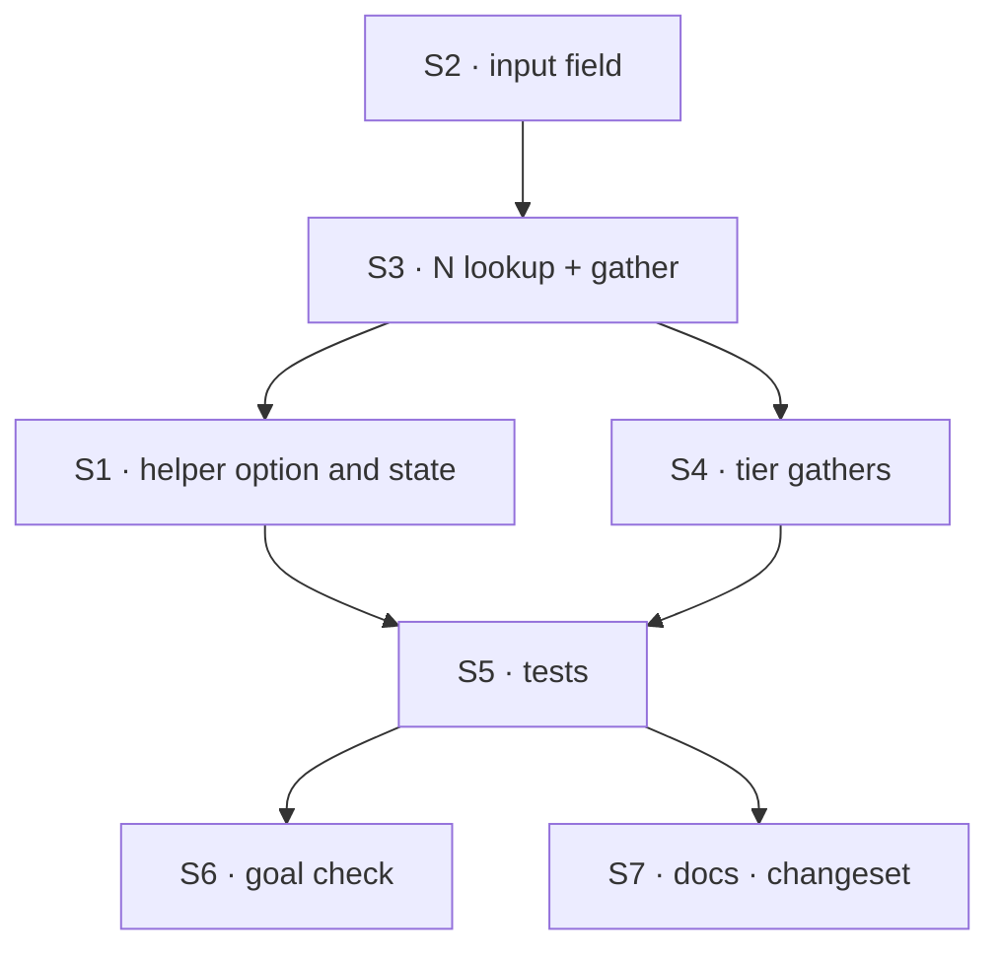

# FIX-1595 · Plan

[Spec](SPEC.md) · [Decisions](DECISIONS.md) · [Rules](BUSINESS-RULES.md) · **Plan** · [Docs](DOCS.md) · [Evolution](EVOLUTION.md)

Written for the implementing agent. IDs cross-reference [BUSINESS-RULES.md](BUSINESS-RULES.md)
(BR-n) and [DECISIONS.md](DECISIONS.md) (D-n). `tdd`. One PR.

## Surfaces

| ID | Package · role | Change | Rules |
|---|---|---|---|
| S1 | `orchestration` · `skillEvaluator` helper (`src/skills/skill-evaluator.ts`) | Takes `options?: { recentMessages?: number }`. Validates it at the call. Records N where the tier can read it. N > 0: `state` returns `{ recentMessages, message }` from the input; otherwise today's `(input) => input.message` | BR-1 BR-2 BR-3 |
| S2 | `orchestration` · `SkillEvaluatorInput` and its schema | Optional `recentMessages: { role: "user" \| "assistant"; text: string }[]` | BR-2 BR-13 |
| S3 | `orchestration` · a small module both S1 and S4 import, with no core evaluator values | Holds "how many exchanges this block asked for" (a `WeakMap` keyed by block, or equivalent) and the gather: last N completed prior requests from the session, same visibility and window as generator history, flattened to user/assistant text | BR-4 to BR-8 |
| S4 | `orchestration` · the evaluator tier (`src/skills/skill-evaluator-tier.ts`) | After the catalog is listed and non-empty, and only if the block asked for N > 0, gather and add `recentMessages` to the evaluator's input. Never from the action input | BR-7 BR-9 BR-10 BR-11 BR-15 |
| S5 | `orchestration` · tests | `test/skills/skill-activator-evaluator.test.ts` gains the V-checks; the type test gains the options overload | all |
| S6 | `goals/skill-activator/follow-up-uses-recent-turns/` | New goal check (goal.md, run.mts, fixtures), modelled on its sibling `evaluator-picks-a-skill` | VG |
| S7 | Docs · changeset | Per [DOCS.md](DOCS.md); one `patch` changeset for `@flow-state-dev/orchestration` | — |

Nothing is removed.

## Sequence



## Checks

| ID | Runs after | Passes when |
|---|---|---|
| V1 | S1 S4 | In a session with prior exchanges, `skillEvaluator(model)` and `{ recentMessages: 0 }` hand the evaluation model the bare message string, deep-equal to today's; no history read. **Must fail** if the tier gathers regardless of N |
| V2 | S4 | N = 2 over three prior exchanges: the recorded evaluation call's state is `{ recentMessages: [the last two, oldest first], message }`. First turn: `recentMessages: []`. Red on `main` |
| V3 | S4 | Prior turns with a tool call, tool result, reasoning, a `history: false` message and a transient item: only user/assistant text survives (BR-5, BR-6) |
| V4 | S4 | A block ahead of the activator emits a history-kept message this request: absent from `recentMessages`; the current message appears once (BR-7) |
| V5 | S1 | `-1`, `1.5`, `NaN`, `"3"` each throw at the helper call, naming `recentMessages` |
| V6 | S4 | Slash hit, keyword hit, empty catalog: no evaluator call and no history read with N > 0 (spy on the session view) |
| V7 | S4 | A hand-built `skillQuestions` evaluator gets `{ message, skills }` only; an action input carrying `recentMessages` is ignored |
| V8 | S4 | `historyWindow: { turns: 1 }` with N = 5 yields one exchange |
| V9 | S4 | The evaluator's trace row input carries the turns |
| V10 | S5 | The existing import-invariant test passes **unchanged**: only `skill-evaluator.ts` imports core's evaluator values, and the tier imports it by type only |
| VG | S6 | [The goal](SPEC.md#the-goal-and-how-well-know-its-met): `pnpm tsx goals/skill-activator/follow-up-uses-recent-turns/run.mts` PASSES on both models, after the same run FAILED under `GOAL_CONTROL=no-recent`. Prior exchanges are written by running earlier turns through the engine in the same session, never injected into the input |

The second path (BP-035): V1 is the off state of the new option; V4 is the in-flight path; V6 the
paths that must not pay for it.

## Pinned names

| Where | Name | Why pinned |
|---|---|---|
| Helper option | `recentMessages` | The owner's call on the issue. Public |
| Input and state field | `recentMessages` | Public on `SkillEvaluatorInput`; a hand-built evaluator's author may read it |
| Element shape | `{ role: "user" \| "assistant"; text: string }` | Public, and what the model reads ([D2](DECISIONS.md#d2)) |
| Goal control | `GOAL_CONTROL=no-recent` | Cited by `SPEC.md` |

Everything else is yours to name.

## Guardrails

| Rule | Because |
|---|---|
| Don't pass `ctx.session.items.history({ limit })` through as is | It appends the in-flight request's items regardless of limit (`loadLLMHistory` in `packages/engine/src/context/history.ts`), which breaks BR-7, and returns tool traffic, which breaks D2. Select completed prior requests, then flatten |
| One gather, in the tier; the helper's `state` never reads `ctx` | The issue locks gathering in the activator, and one reader keeps the trace honest (tenet 5) |
| The tier keeps importing `./skill-evaluator` by type only | An activator built without an evaluator must never build one (FIX-1559 V-invariant) |
| No read of any kind when N is 0 or the evaluator won't run | Apps that don't opt in pay nothing (BP-030); an empty catalog stays visibly empty (FIX-1372) |
| Turns come from the session, never the action input | Caller-controllable input decides nothing here (BP-031) |

## Docs

Reconcile [DOCS.md](DOCS.md) against the shipped behaviour after V1–V9 pass, then publish it to
its two destinations. No new page.

## Sketch · pseudocode, illustrative, react to the shape

```
helper(model, { recentMessages = 0 } = {}):
    refuse unless recentMessages is a non-negative integer
    block ← evaluator(… state: N > 0 ? input → { recentMessages: input.recentMessages ?? [], message } : input → input.message)
    remember block → N                     ← the shared module
tier, after listing a non-empty catalog:
    N ← asked(block)
    if N > 0: turns ← last N completed prior requests, history-visible, user/assistant text only
    evaluator input ← { message, skills, …(N > 0 ? { recentMessages: turns } : {}) }
```

**POC:** none. The one premise the design rests on, that the history view mixes in the
in-flight turn, was read from the engine source and is pinned as a guardrail.

## At implement time

- Check whether core has gained a history option that excludes the in-flight request; if so, use
  it instead of selecting prior requests yourself.
- Re-check that `mockEvaluationModel` records the state it was called with; V1 to V4 read it.
- FIX-1372 may have landed; BR-11 holds either way.

## Follow-ups

- The same option for the default generator classifier, if wanted (issue's out of scope).
