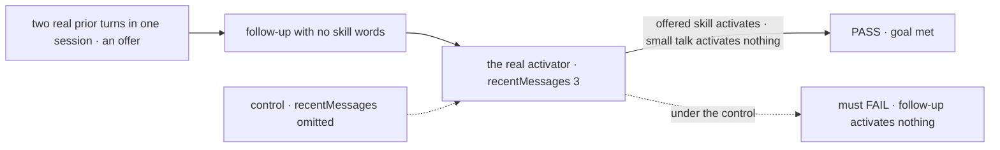
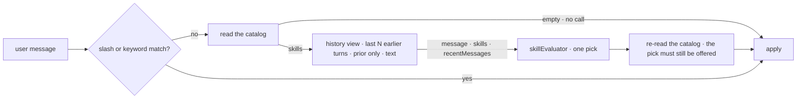

# FIX-1595 · skillEvaluator: optional recentMessages context for activation

**Spec** · [Decisions](DECISIONS.md) · [Rules](BUSINESS-RULES.md) · [Plan](PLAN.md) · [Docs](DOCS.md) · [Evolution](EVOLUTION.md)

Feature · `orchestration`, plus one generic history option in `core`/`engine` · small · 1 PR · epic [FIX-1553](../../epics/FIX-1553/SPEC.md) (done; a
follow-on) · extends [FIX-1559](../FIX-1559/SPEC.md) (shipped)

## Five people, before and after

| Someone who… | Today | After |
|---|---|---|
| **replies "yes, do that" to an assistant's offer** | The evaluator sees only "yes, do that" and picks no skill | With `skillEvaluator(model, { recentMessages: 3 })`, it also sees the offer, and picks the skill the offer was about |
| **writes `skillEvaluator(model)` and nothing else** | One message in, one pick out | The same, byte for byte. Nothing extra is read or sent |
| **is on the first turn of a session** | Message only | Message only: there are no earlier turns to add, and nothing stands in for them |
| **used tools in earlier turns** | n/a | The evaluator sees what was said, not the tool calls and results behind it ([D2](DECISIONS.md#d2)) |
| **runs the built-in agent kind, or the default classifier** | Unchanged | Unchanged. The option exists only on `skillEvaluator` |

A follow-up only makes sense against what came before it, and today the third tier never sees it.

## The goal, and how we'll know it's met

**A follow-up that only makes sense with the last few turns, like "yes, go ahead" after the
assistant offered a skill's work, activates that skill, and small talk after the same offer
still activates nothing.**

| Is it the right goal? | |
|---|---|
| **The real need** | The owner's customization: `skillEvaluator(model, { recentMessages: 3 })` so "yes, do that" and "use the skill for what I just asked" stop missing ([FIX-1595](https://linear.app/fixpoint-labs/issue/FIX-1595)) |
| **Smaller, and rejected** | "The evaluator's input contains the earlier turns." Provable with a mock while the pick on a real model is unchanged, so nobody would feel it |
| **Bigger, and not this issue's** | The same context for the default generator classifier, and several skills per turn. Both named out of scope on the issue |
| **Not done if** | The suite is green and the goal check never ran on a real model · the follow-up names the skill or trips a keyword · the earlier turns reached the evaluator through the action input rather than the session · it activates on small talk too |



The check reads which skill the turn activated, on a real model. The dashed path is the same run
without the option, and it must fail.

| How we verify | |
|---|---|
| **Goal check** | `goals/skill-activator/follow-up-uses-recent-turns/` · real model (`typesafe-ai/jev` and `openai/gpt-5.4-mini` as an evaluation model, via the AI Gateway, as its sibling goal) · run by the implementer at completion · verdict in the implementation PR |
| **Signal** | On both models: each targeted follow-up activates exactly the skill its prior offer was about, and the turn has an evaluator row; the small-talk follow-up activates nothing |
| **Input** | A three-skill catalog; per case, one prior turn (a user ask and an assistant offer) then a follow-up with no skill name, keyword or slash. Different offers and follow-ups must pass too |
| **Anti-game** | Don't assert on the evaluator's input alone, and don't pass the prior turns in the action input. A follow-up that names the skill or a keyword is refused by the run |
| **Control that must fail** | `GOAL_CONTROL=no-recent` builds `skillEvaluator(model)` with no option. Both targeted follow-ups must activate nothing, on both models, before the PASS counts |

## What changes


Same catalog, same message. The only difference is the column of earlier turns on the right.

**What an app writes:**

```diff
  export const skillActivator = createSkillActivator({
    initialSkills,
-   evaluator: skillEvaluator("typesafe-ai/jev"),
+   evaluator: skillEvaluator("typesafe-ai/jev", { recentMessages: 3 }),
  });
```

## How a turn reaches the evaluator



The activator gathers the turns only when the evaluator will run, and hands them over as a typed
field beside the message and the skills. It reads them through the session's history view, with a
new generic option that leaves out the request in flight ([D3](DECISIONS.md#d3)). After the pick,
the catalog is read again, as today, so a skill removed while the model was answering can't activate.

## What stays as it is

- Slash and keyword tiers, the offered catalog and its cap, one pick or none, and the pick being
  final ([FIX-1559 D1, D2](../FIX-1559/DECISIONS.md#d1)).
- The default generator classifier and the built-in agent kind.
- An evaluator built by hand from `skillQuestions`: it is handed `{ message, skills }` as today.
- An empty catalog still makes no call ([FIX-1372](https://linear.app/fixpoint-labs/issue/FIX-1372)).
- The catalog re-read after the pick: a skill removed or disabled mid-call never activates.
- `items.history()` without the new option: the in-flight request is still appended, as today.

## Sign off

**[The goal](#the-goal-and-how-well-know-its-met), at that size:** a real follow-up activates the
offered skill on a real model, and small talk still doesn't. If wrong: we ship a field the
evaluator receives but whose effect nobody can feel.

1. **[D1](DECISIONS.md#d1) · `recentMessages: 3` counts the last three earlier turns, not three
   single messages.** A turn is one earlier request: what the user said and everything the
   assistant said back, which in a flow that replies in several steps can be more than one
   message. I recommend turns: it's how the framework's history already counts, and it never
   hands over an answer without its question. If wrong: an author who pictured three messages
   sends more context, and cost, than they counted, and changing the unit after release silently
   changes every app that set it.
2. **[D2](DECISIONS.md#d2) · The evaluator sees what was said: user and assistant text, oldest
   first, never tool calls, tool results or reasoning.** If wrong: a follow-up whose referent
   lived only in a tool result ("use that on the file it found") still misses.

Also decided, not asked: the in-flight turn is left out by a generic option on the core/engine
history view, not by orchestration rebuilding history itself ([D3](DECISIONS.md#d3)).

**Open: none.** Number 1 is the one to weigh. Reasoning and what lost:
[DECISIONS.md](DECISIONS.md). The cases: [BUSINESS-RULES.md](BUSINESS-RULES.md).
