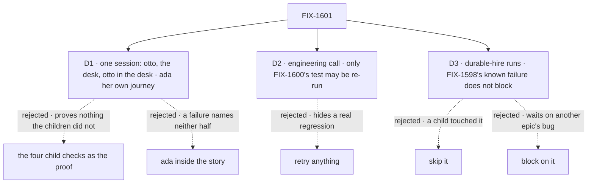

# FIX-1601 · Decisions

[Spec](SPEC.md) · **Decisions** · [Rules](BUSINESS-RULES.md) · [Plan](PLAN.md) · [Docs](DOCS.md) · [Evolution](EVOLUTION.md)

The [closure rule](../../../docs/contributing/orchestration.md#the-closure-issue-every-epic-ends-in-qa)
fixes what the plan contains and in what order. These cards are the calls it leaves open. D1 and
D3 are the sign-off; D2 is an engineering call, recorded so nobody decides it on the day.

## The tree

Solid edges are what was chosen. Dashed edges lost, and the label says why.

## D1 · The goal check is one person's session: talk to otto, post to the desk, read otto's answer there. Ada is a second journey in the same script

| | |
|---|---|
| **Instead of** | (a) The four child checks as the proof, as the epic first wrote ("no proof issue"). (b) One story that also sends ada a note between the otto message and the post |
| **Because** | (a) passes whenever each piece works alone, which the children already showed. Only one session reaches the seams between them: the post landing in otto's direct chat, otto's desk line waking iris. Otto is the one seat in all three legs, so the story is his. (b) Ada answers in her own conversation and a post never runs her, so she is not a step in the story. A separate leg d keeps a failure naming which half broke |
| **Locks in** | Part 3 still re-runs all four children's goal checks: one rule, no judgement about what the session already covers. Leg d is part 2's one journey, since legs a to c walk the other people-table rows. The script is committed under `goals/` so it outlives the wrap |

**What would change my mind:** a second agent seat that holds `post-to-channel`. Then the story
should run on it too.

## D2 · Engineering call, not asked: only FIX-1600's otto test may be re-run, and the goal check never is

| | |
|---|---|
| **Instead of** | Every check passes first time, or retries allowed anywhere, as CI's `retries: 1` does |
| **Because** | Two flakes are known, and neither is this epic's regression. [FIX-1600](https://linear.app/fixpoint-labs/issue/FIX-1600): the otto test in `talk-from-page.spec.ts` failed once on a locator, then passed. The `devtool-reflects-request` / `background-work` pair shows each other's reply in parallel; serially the suite passed 18 of 18 on [#2283](https://github.com/fixpoint-labs/flow-state-dev/pull/2283). Retrying anything waves real regressions through |
| **Locks in** | The suite runs serially, which removes the pair's cross-talk. FIX-1600's test alone may be re-run up to twice; a pass on re-run is reported with the attempt count and FIX-1600's link. Any other retry is a finding. The end-to-end goal check is never retried. If FIX-1600 merges first, the allowance lapses |

## D3 · `durable-hire-survives-redeploy` runs; failing in FIX-1598's known way does not block the closure, and any other failure does

| | |
|---|---|
| **Instead of** | Skip it as unrelated, or block the closure until [FIX-1598](https://linear.app/fixpoint-labs/issue/FIX-1598) is fixed |
| **Because** | It has been red on `main` since kitchen-sink went single-org: its `acme` and `bravo` admin tokens are refused, `workforce-admin` answers `Unknown flow`, and leg 4 finds no roster rows for `support.bo`. FIX-1598 owns that, under another epic. But FIX-1589 edited this check to run on the scripted model and grade the desk tag, so skipping it leaves a child's change unproven |
| **Locks in** | The report quotes the failure and names FIX-1598. The control leg FIX-1589 recorded as green must still be green. Any other failure is a finding. If FIX-1598 has merged by the run, the check must pass |

## Decided, not asked

- **The run starts only when all four children are merged and CI is green**, on one commit.
- **Part 2 is one journey**, leg d. Kitchen-sink has one team, `support`, so "per team
  configuration" gives the same count.
- **Part 4 covers only what parts 1 to 3 don't grade**, against the cross-spec review's C1 to C7
  ([PLAN.md → Part 4](PLAN.md#part-4--gap-sweep)).
- **Everything is graded on the page.** No leg or sweep row reads the CLI.
- **Docs get a smoke-follow along legs a to d.** A gap blocks only when it breaks those flows;
  corpus-wide compliance is `polish-docs`' at wrap.

## Considered and dropped

| Alternative | Why not |
|---|---|
| A live-model leg | Epic D3 keeps it out of the proof |
| Skip FIX-1590's and FIX-1594's checks because legs b and c cover them | Saves a run, but "covers" becomes a judgement nobody can check |
| A second post in the goal check | FIX-1590's own held-out, re-run in part 3, already proves it lands in the same conversation |
| Fix a small gap inside the closure PR | A gap is a child of the epic, with its own route |

## Open / Settled

**Open: none.** Settled: none.

## How it got here

- **Draft** — the epic's missing proof: the four children together, in one browser, on one
  commit, with stated rules for known flakes and one pre-existing red check.
- **Review round 1** — part 3 re-runs all four child checks; part 4 narrowed to what the rest
  doesn't grade, page-only, with a docs smoke instead of a full docs audit; the seams use the
  cross-spec review's own C1 to C7; the flake rule became an engineering call.
