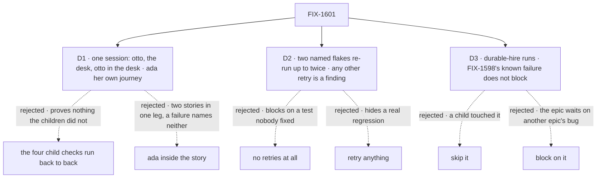

# FIX-1601 · Decisions

[Spec](SPEC.md) · **Decisions** · [Rules](BUSINESS-RULES.md) · [Plan](PLAN.md) · [Docs](DOCS.md) · [Evolution](EVOLUTION.md)

The closure rule ([orchestration.md](../../../docs/contributing/orchestration.md#the-closure-issue-every-epic-ends-in-qa))
fixes what the plan contains and in what order. These three cards are the calls it leaves open:
how the story is walked, how much flake the bar tolerates, and what to do with a check that was
red before this epic started.

## The tree

Solid edges are what you're signing. Dashed edges lost, and the label says why.

## D1 · The goal check is one person's session: talk to otto, post to the desk, read otto's answer there. Ada is a second journey in the same script

| | |
|---|---|
| **Instead of** | (a) The four child checks run back to back as the proof, which is what the epic first wrote ("no proof issue"). (b) One story that also sends ada a note between the otto message and the post |
| **Because** | (a) passes whenever each piece works alone, which the children already showed; the closure exists for what they didn't. Only one session reaches the seams that matter: the post landing in otto's direct chat instead of a desk conversation, otto's desk line waking iris, the direct chat changing after the channel activity. Otto is the one seat in all three legs, so the story is his. (b) Ada's row in the epic's people table is not a leg of the story; she answers in her own conversation and a post never runs her. A separate leg d keeps a failure naming which half broke. One script, one build and one server serve both |
| **Locks in** | Legs a to c carry FIX-1590's and FIX-1594's signals and controls in full, so part 3 does not re-run those two checks ([BUSINESS-RULES QR-9](BUSINESS-RULES.md#the-plan)). If either can't be carried verbatim, that child's check re-runs instead. Leg d is part 2's one journey: every other people-table row is walked by legs a to c. The script is committed under `goals/` so it outlives the wrap |

**What would change my mind:** a second agent seat that holds `post-to-channel`. Then the story
should run on it too, as a held-out.

## D2 · Two named flakes may be re-run up to twice and still count as a pass, reported with their issue. Any other retry is a finding

| | |
|---|---|
| **Instead of** | Every check passes first time, or the run is red · or retries allowed anywhere, as CI's `retries: 1` does |
| **Because** | Two flakes are known and filed, and neither is this epic's regression. [FIX-1600](https://linear.app/fixpoint-labs/issue/FIX-1600): the otto test in `talk-from-page.spec.ts` failed once on a locator and passed on re-run. The `devtool-reflects-request` / `background-work` pair shows each other's reply when run in parallel; serially the suite passed 18 of 18 on FIX-1589's branch ([#2283](https://github.com/fixpoint-labs/flow-state-dev/pull/2283)). A release bar that trips on these blocks the epic on work nobody scheduled. A bar that retries anything is how a real regression gets waved through as "flaky" |
| **Locks in** | The Playwright suite runs serially (`--workers=1`), which removes the pair's cross-talk instead of retrying it. The FIX-1600 test may be re-run alone up to twice; a pass on re-run is reported with the attempt count and FIX-1600's link. Three failures, or a failure anywhere else, is a finding. **The goal check itself is never retried**: it is the release bar, and a flake there is a finding against the check |

**What would change my mind:** FIX-1600 merging first. Then the allowance lapses and the test
must pass first time.

## D3 · `durable-hire-survives-redeploy` runs; failing in FIX-1598's known way does not block the closure, and any other failure does

| | |
|---|---|
| **Instead of** | Skip it as unrelated · or block the closure until [FIX-1598](https://linear.app/fixpoint-labs/issue/FIX-1598) is fixed |
| **Because** | It has been red on `main` since kitchen-sink went single-org: the check's `acme`/`bravo` admin tokens are refused, `workforce-admin` answers `Unknown flow`, and leg 4's setup finds no roster rows for `support.bo`. FIX-1598 owns it, under the durable-hire epic (FIX-1455), not this one. But FIX-1589 edited this check to run on the scripted model and still grade the desk tag, so skipping it leaves a child's change unproven. Running it and matching the failure against FIX-1598's signature proves the desk-tag part while not holding this epic for another epic's bug |
| **Locks in** | The report quotes the failure and names FIX-1598. The control leg FIX-1589 recorded green must still be green. A failure outside FIX-1598's signature is a finding. If FIX-1598 has merged by the run, the check must simply pass |

## Decided, not asked

- **The run starts only when all four children are merged**, on one commit picked after the last
  merge. FIX-1589 is [#2283](https://github.com/fixpoint-labs/flow-state-dev/pull/2283), waiting
  on merge; FIX-1590 and FIX-1594 are being built.
- **Part 2 is one journey**, leg d. The epic's people table has four rows; legs a to c walk rows
  1, 3 and 4. Kitchen-sink has one team, `support`, so reading "per team" as "per team
  configuration" gives the same count; its other two channels are covered in the gap sweep.
- **The seams swept are the epic's six plus C1 to C7**, merged into one table where they overlap
  ([PLAN.md → Part 4](PLAN.md#part-4--gap-sweep)).
- **The docs are followed by an agent that has not read the specs.**
- **The committed artifact is the goal check under `goals/`.** Each child already adds its leg to
  the CI Playwright suite; the integrated story adds no CI case, since goals stay out of CI.

## Considered and dropped

| Alternative | Why not |
|---|---|
| A live-model leg | Epic D3 rules it out of the proof. It grades a reply's quality, which no leg asserts |
| Hand the whole browser run to `fsd-qa` | The rule is: try here first, hand over only if no browser runs |
| Fix a small gap inside the closure PR | The Architect's invent-kill, and the rule: a gap is a child with its own route |

## Open / Settled

**Open: none.** Settled: none; no claim here was disputed.

## How it got here

- **Draft** — framed as the epic's missing proof: the four children proven together, in one
  browser, on one commit. One session walks otto through all three legs; ada is a second journey
  in the same script; the children's checks and the seams run on that commit; two known flakes
  and one pre-existing red check get a stated rule instead of a judgement on the day.
