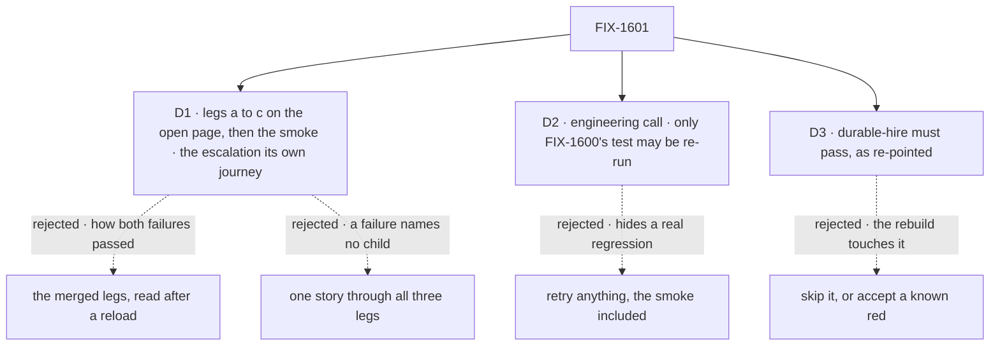

# FIX-1601 · Decisions

[Spec](SPEC.md) · **Decisions** · [Rules](BUSINESS-RULES.md) · [Plan](PLAN.md) · [Docs](DOCS.md) · [Evolution](EVOLUTION.md)

The [closure rule](../../../docs/contributing/orchestration.md#the-closure-issue-every-epic-ends-in-qa)
fixes what the plan contains and in what order, and the epic's
[ER-17](../../epics/FIX-1592/BUSINESS-RULES.md#the-proof) fixes the legs. These cards are the
calls left open. D1 and D3 are the sign-off; D2 is an engineering call, recorded so nobody
decides it on the day.

## The tree

```mermaid
flowchart TD
  I["FIX-1601"] --> D1["D1 · legs a to c on the open page, then the smoke · the escalation its own journey"]
  D1 -.->|"rejected · how both failures passed"| X1a["the merged legs, read after a reload"]
  D1 -.->|"rejected · a failure names no child"| X1b["one story through all three legs"]
  I --> D2["D2 · engineering call · only FIX-1600's test may be re-run"]
  D2 -.->|"rejected · hides a real regression"| X2["retry anything, the smoke included"]
  I --> D3["D3 · durable-hire must pass, as re-pointed"]
  D3 -.->|"rejected · the rebuild touches it"| X3["skip it, or accept a known red"]
```

Solid edges are what was chosen. Dashed edges lost, and the label says why.

## D1 · The goal check is the epic's legs a to c, each read on the open page before any reload, then one real-model smoke. The escalation is part 2's journey

| | |
|---|---|
| **Instead of** | (a) The merged plan: one session through otto, the desk and otto's answer, each leg read after a reload, with the clerk as leg d. (b) One story walking a, b and c in a single session. (c) The smoke as a gated leg |
| **Because** | Both failures the owner met on 2026-09-26 passed every check that reloaded first ([epic D3](../../epics/FIX-1592/DECISIONS.md#d3)). (a) proves a roster that is gone, the way that let them through. (b) fails without naming which child broke; separate legs each name one, and each control points at one. (c) A real model's choices can't be scripted keyless; the smoke is where they are seen |
| **Locks in** | A reload only at a leg's end, to check that what showed persisted. Leg a's script never calls the post tool, so its answer lands by FIX-1610's rule alone. Leg c adds a follow-up that needs the earlier turn, so [FIX-1612](https://linear.app/fixpoint-labs/issue/FIX-1612) blocks this issue. The person who needs a human ([epic ER-25](../../epics/FIX-1592/BUSINESS-RULES.md#what-a-person-gets)) is the one people-table row no leg walks, so part 2 is that journey. Part 3 still re-runs every child's check |

**What would change my mind:** a second team or routed channel on the page. Then part 2 walks
each.

## D2 · Engineering call, not asked: only FIX-1600's test may be re-run. The goal check and the smoke never are

| | |
|---|---|
| **Instead of** | Every check passes first time, or retries allowed anywhere, as CI's `retries: 1` does |
| **Because** | Two flakes are known, and neither is this epic's regression. [FIX-1600](https://linear.app/fixpoint-labs/issue/FIX-1600): the otto test in `talk-from-page.spec.ts` failed once on a locator, then passed. The `devtool-reflects-request` / `background-work` pair shows each other's reply in parallel; serially the suite passed 18 of 18 on [#2283](https://github.com/fixpoint-labs/flow-state-dev/pull/2283). A retry waves real regressions through, and a missing smoke answer is the very failure the owner met |
| **Locks in** | The suite runs serially. FIX-1600's test, as FIX-1611 re-points it, alone may be re-run up to twice; a pass on re-run is reported with the attempt count and FIX-1600's link. Any other retry is a finding. The goal check and the smoke are never retried. If FIX-1600 merges first, the allowance lapses |

## D3 · `durable-hire-survives-redeploy` must pass, as FIX-1611 re-points it

| | |
|---|---|
| **Instead of** | Skip it as another epic's check, or let it fail in a known way without blocking |
| **Because** | It was red on `main` until [FIX-1598](https://linear.app/fixpoint-labs/issue/FIX-1598) fixed it. The rebuild removes the `desk` setting it grades, so FIX-1611 moves it to another hire-time value on the real app ([epic D8](../../epics/FIX-1592/DECISIONS.md#d8), ER-27). Skipping it, or accepting a known red, leaves that change unproven |
| **Locks in** | Any failure of the check is a finding, with no signature carve-out |

## Decided, not asked

- **The run starts only when FIX-1609, FIX-1610, FIX-1611, FIX-1612 and this amendment are
  merged and CI is green**, on one commit.
- **Each control, today's `main` among them, fails the legs [PLAN.md → Controls](PLAN.md#controls)
  names** at their own signal, not at setup, and leaves the rest green.
- **Everything is graded on the page.** No leg or sweep row reads the CLI.
- **Docs get a smoke-follow** along legs a to c and the smoke. A gap blocks only when it breaks
  those flows; corpus-wide compliance is `polish-docs`' at wrap.

## Considered and dropped

| Alternative | Why not |
|---|---|
| A live-model gated leg | Epic D3 keeps the gate keyless; the smoke is where a real model is seen |
| Skip a child's check because a leg covers it | "Covers" becomes a judgement nobody can check |
| Read leg b's routing from the route records | They are hidden from the page; FIX-1610's own check counts evaluator calls in part 3 |
| Fix a small gap inside the closure PR | A gap is a child of the epic, with its own route |

## Open / Settled

**Open: none.** Settled: none.

## How it got here

- **Draft** — the epic's missing proof: the four children together, in one browser, on one
  commit, with stated rules for known flakes and one pre-existing red check.
- **Review rounds 1 and 2** — part 3 re-runs every child check; part 4 narrowed, page-only; the
  flake rule became an engineering call; D3 lost its carve-out.
- **Epic amendment #2294** — FIX-1602 joins as a fifth child; part 4 adds a stock-routing check.
- **Amendment, 2026-09-27** — the epic's routed-desk rebuild
  ([#2310](https://github.com/fixpoint-labs/flow-state-dev/pull/2310)): legs a to c on the open
  page, the real-model smoke, D7's names, the escalation as part 2, and FIX-1612 blocking. The
  otto, clerk, followups and digest legs retired; D1 rewritten, D2 and D3 re-pointed.
- **Amendment review round 1** — one run order; the control map only in PLAN; the layer fence
  allows a session-wide stream; a clear smoke post fails only when it is misrouted.
