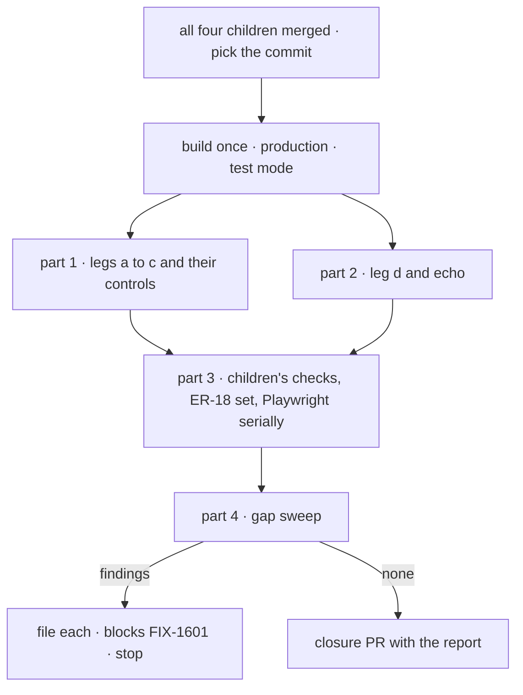

# FIX-1601 · Plan

[Spec](SPEC.md) · [Decisions](DECISIONS.md) · [Rules](BUSINESS-RULES.md) · **Plan** · [Docs](DOCS.md) · [Evolution](EVOLUTION.md)

Written for the closure worker. IDs cross-reference [BUSINESS-RULES.md](BUSINESS-RULES.md)
(QR-n), [DECISIONS.md](DECISIONS.md) (D-n) and the epic's rules (ER-n). The only code it adds is
the goal check. **Starts when all four children are merged** (QR-1).

## Surfaces

| ID | Where | Change | Rules |
|---|---|---|---|
| S1 | `goals/kitchen-sink-talk/a-person-talks-to-a-seat-a-channel-and-back/` | `goal.md` from [SPEC.md's goal](SPEC.md#the-goal-and-how-well-know-its-met) and `run.mts`: one real browser against the production build it builds, legs a to d in order, graded after reloads. Reuse the children's page helpers where they exist (FIX-1585's server start, route and build steps; FIX-1590's woken-turn reader); no second harness | QR-4 QR-5 QR-9 QR-10 |
| S2 | S1's `fixtures/input.json` | The seats, channel, port, and the pinned markers below. Tokens are minted per run | QR-9 |
| S3 | S1's controls | `drop-user-message` acts at the network, as FIX-1585's does. `name-only-notify`, `no-author-filter`, `post-without-author` and `echo` are the children's own test-mode switches, set on the server's environment for that run. The script adds none of its own. Each control must redden exactly its leg set, and nothing else | QR-9 QR-10 |
| S4 | S1's `goal.md` verdict log | One row per run: the commit, PASS or FAIL, the evidence; one `FAIL (expected)` row per control | QR-3 QR-19 |
| S5 | The closure PR | Only after a run that files nothing: S1 to S4, and the report as its body (QR-19). No changeset: nothing published changes | QR-19 |

## Sequence

S1 is written once, on a branch from the closure commit. Parts may run in any order on it.

## Checks

| ID | Part | Passes when |
|---|---|---|
| P1a | 1 | **Leg a, talk to otto:** "New conversation" on `support.otto`, send `[scenario:talk-to-seat]` + token A. Reload, reopen: A is the `user` turn, a reply carrying `[reply:talk-to-seat]` is under it. Under `drop-user-message`, a fails and nothing else does |
| P1b | 1 | **Leg b, the post reaches its agents:** open `support.desk`, post `[scenario:reply-in-channel]` + token B; the line shows labelled `devuser`. Reload. `support.otto` and `support.iris` each list exactly one `support.desk` conversation, holding `devuser in support.desk: …B` once as the seat's turn, with one reply. `support.ada`, `support.grace`, `support.wren` hold nothing with B. **Otto's leg-a conversation holds nothing with B.** Under `name-only-notify`, b fails (and c with it), a and d do not |
| P1c | 1 | **Leg c, otto answers in the desk:** after a reload, `support.desk` shows exactly one line labelled `support.otto` carrying B and the scenario's line marker; iris and otto still hold exactly one woken turn each. Under `no-author-filter`, the woken-once half fails; under `post-without-author`, the label half fails (the line reads `devuser`); neither reddens a, b's first half, or d |
| P1h | 1 | **Held-out:** a second post with token B2 lands in the same desk conversation of iris and otto (two heard turns each), otto's second line appears once, and otto's leg-a conversation is unchanged after a final reload |
| P2d | 2 | **Leg d, the clerk:** new conversation on `support.ada`, send `[scenario:clerk-answer]` + token D1: after a reload D1 is the `user` turn and the reply carries `[clerk:answered]` and not D1. Send `[scenario:clerk-file]` + D2: the reply carries `[clerk:filed]`, and the team panel's `escalations` column shows exactly one row with D2. Then post `[scenario:wake]` + token D3 to `support.desk`: ada's conversations hold nothing with D3 and the `escalations` row count is unchanged. The server log shows the unattended-`escalations` boot warning. Under `echo`, d fails and a to c do not |
| P3.1 | 3 | `goals/kitchen-sink-talk/keeps-both-sides-across-a-reload/run.mts` PASS, and PASS again with `GOAL_CHANNEL=support.ada-wren GOAL_SEAT=support.iris`; `no-post-item` and `drop-user-message` each FAIL their own leg |
| P3.2 | 3 | `goals/kitchen-sink-talk/answers-a-clerk-note-or-files-it/run.mts` PASS, held-out (`support.grace`, `followups`) PASS, `echo` FAILs both legs |
| P3.3 | 3 | FIX-1590's and FIX-1594's goal checks are **not** re-run when P1b, P1c and P1h passed with all their controls (QR-9). Otherwise each runs here in full |
| P3.4 | 3 | ER-18: `goals/workforce-conventions/a-channel-holds-the-work-a-seat-drains/` PASS; `code-comes-from-files-alone` PASS, with its planted registration still failing leg (c); `durable-hire-survives-redeploy` per [D3](DECISIONS.md#d3) |
| P3.5 | 3 | The kitchen-sink Playwright suite, `--workers=1`, on the build from B: all green, the workforce-shell VGs among them, FIX-1600's test under QR-7. CI is green on the closure commit (unit, typecheck, e2e) |
| P4 | 4 | Every row of the two tables below holds |

### Part 4 · gap sweep

**Seams.** The epic's six coordination seams ([epic PLAN](../../epics/FIX-1592/PLAN.md#coordination-seams-to-watch))
and the seven cross-spec resolutions C1 to C7, merged where they are the same seam. The
cross-spec review's own list was not written into the repo; C1 to C7 below are rebuilt from what
the child specs record, and C2 and C3 match the labels FIX-1589's PR cites. Each row is exercised
from **both** sides.

| Seam | Between | One side | The other side |
|---|---|---|---|
| **C1** · `seatId`, one carrier | FIX-1589 builds, FIX-1594 reads | Ada's filed row is authored `support.ada` (P2d, read in the panel) | Otto's line is labelled `support.otto` (P1c). Then hire another `desk-clerk` seat from the rail and send it `[scenario:clerk-file]`: refused `author-not-a-member`, no row, because its `seatId` is its roster id and it is not a member |
| **C2** · the files-alone scan | FIX-1589's narrowing, the names module FIX-1585 made and FIX-1590 and FIX-1594 extend | `code-comes-from-files-alone` PASS on the closure commit, after FIX-1590's wake column and FIX-1594's tool wiring landed | Its planted-registration control still fails leg (c) |
| **C3** · one scripted model (epic ER-7) | FIX-1589 owns the dispatcher fix; FIX-1590, FIX-1594 add scenarios | Iris and otto run the same generator on one post and both start at step 0 (P1b) | Run the goal check twice against one server: the second run passes too. `grep` finds one test resolver and one script file |
| **C4** · in-process dispatch only | FIX-1589's filing, FIX-1594's post | FIX-1589's external-dispatcher flow test green on the commit; the reply says nothing was filed | FIX-1594's external-dispatcher test green; the call fails with the refusal. Both READMEs say so as written |
| **C5** · the heard turn `<writer> in <channel>: <body>` | FIX-1590 pins, FIX-1594 reads | The page shows it as the seat's turn (P1b) | Otto posts to the channel it names (P1c). A post to `support.noticeboard` wakes nobody and otto posts nothing there |
| **C6** · the author filter and its control (epic D2) | FIX-1590 builds, FIX-1594's control consumes | `no-author-filter` reddens only leg c (P1c) | A CLI post to `support.desk` with `author: support.iris` runs no seat; the page shows it labelled `support.iris` |
| **C7** · the `channel-post` line (epic seam: the channel panel) | FIX-1585's post item, FIX-1594's dispatched post | Otto's line shows in the panel after a reload (P1c) | `fsdev run` of `support.desk`'s `read` returns the same line once, author `support.otto` |
| **E1** · `agent-worker-flow.ts` | FIX-1585's kept message, FIX-1590's receiver | A direct message is kept as the user turn (P1a) | A heard post is kept as the seat's turn (P1b), in a different conversation |
| **E2** · the clerk and the notify stub | FIX-1589, FIX-1590 | Ada answers and files (P2d) | A desk post gives ada the name-only line and runs nothing (P2d, P1b) |
| **E5** · the boards | FIX-1589 files, FIX-1591 held | An `escalations` row waits and the boot warning stays (P2d) | A `followups` row filed through grace is assigned `followup-runner`, and `support.wren`'s existing drain, called from the CLI, runs it |
| **Other channels** | FIX-1585, FIX-1590 | A post to `support.ada-wren` wakes nobody (no agent member) | A post to `support.noticeboard` shows unattributed and wakes nobody |

E3 (the notify slot) is C6 and E4 (the scripted model) is C3; E6 (the channel panel) is C7.

**Docs, followed as written**, on the closure commit, by an agent that has not read any spec. On
the page, do what the prose says and compare; for a code example, paste it into a scratch app
outside the repo and run it the way the page says. A step that doesn't work as written is a
finding against the page.

| Page | Sections the set published |
|---|---|
| `apps/kitchen-sink/README.md` | The opening's two ways of talking (FIX-1585, FIX-1589, FIX-1594) · posting reaches members (FIX-1590) · the `escalations` sentence and the model-key sentence (FIX-1589) · the web app section (FIX-1585) |
| `apps/docs/docs/workforce/channels.md` | Showing a channel on screen (FIX-1585) · filing through a dispatcher tool (FIX-1589) · waking members with `onChannelPost` (FIX-1590) · a seat answering in the channel (FIX-1594) |
| `packages/workforce/README.md` | The agent kind's `run` and `onChannelPost` · the `seatId` key · posting to a channel from a seat |
| `apps/docs/docs/workforce/workers-on-disk.md` | `seatId` in the refused keys and what a record carries |

Then walk the *not done if* table in [BUSINESS-RULES.md](BUSINESS-RULES.md#not-done-if--each-state-the-gap-sweep-shows-absent)
and the *not done if* rows of the epic and each child, and mark each absent with its evidence.

## Pinned names

| Where | Name | Why pinned |
|---|---|---|
| Goal check | `goals/kitchen-sink-talk/a-person-talks-to-a-seat-a-channel-and-back/` | The epic and the report cite it |
| Legs | `a`, `b`, `c`, `d` | Each control's expected leg set names them |
| Consumed, pinned elsewhere | `[scenario:talk-to-seat]` · `[reply:talk-to-seat]` (FIX-1585) · `[scenario:clerk-answer]` · `[scenario:clerk-file]` · `[clerk:answered]` · `[clerk:filed]` · `echo` (FIX-1589) · `[scenario:wake]` · `name-only-notify` · `no-author-filter` · the heard turn (FIX-1590) · `[scenario:reply-in-channel]` · `post-without-author` (FIX-1594) · `drop-user-message` (FIX-1585) | Used as those specs pin them. A name that shipped differently is read off the merged code, and the report says so |

## Guardrails

| Rule | Because |
|---|---|
| No product change, no new control switch, no new messaging path | The closure proves what shipped; a switch added here is tested by nothing but itself |
| Grade after a reload, by this run's tokens | Other tests share the channel, and the page before a reload can show its own copy |
| Every check on the one commit | A pass elsewhere proves nothing about the assembled set |
| Findings are filed, never fixed here; FIX-1591's ground is out | The closure rule; the owner holds that call ([epic D1](../../epics/FIX-1592/DECISIONS.md#d1)) |

## Docs

No reader-facing docs change: [DOCS.md](DOCS.md). Part 4 checks the docs the children published.

## At implement time

- **Linear today:** FIX-1601 is only *related* to the four children, not blocked by them. The
  closure rule needs blocked-by; the coordinator wires it (QR-1).
- **Read names off the merged code**, not the specs: FIX-1590 and FIX-1594 were in development
  when this was written, and a control or marker may have shipped under another name.
- **Build once**; restart `next start` per server-side control. One port per goal fixture.
- **FIX-1600** may merge first; then QR-7's allowance lapses ([D2](DECISIONS.md#d2)).
- **FIX-1598** may merge first; then durable-hire must pass ([D3](DECISIONS.md#d3)).
- **FIX-1599** (`.rescue()` on a generator tool) is not this epic's; a failure tracing to it is filed normally.

## Follow-ups

- `verify.mjs` has no scenario for a closure run that files findings and is re-dispatched
  (orchestration.md says so). Not this issue's.
