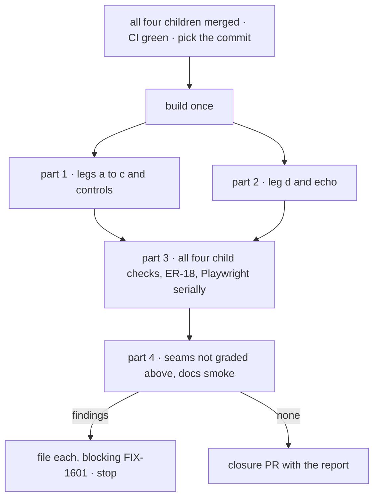

# FIX-1601 · Plan

[Spec](SPEC.md) · [Decisions](DECISIONS.md) · [Rules](BUSINESS-RULES.md) · **Plan** · [Docs](DOCS.md) · [Evolution](EVOLUTION.md)

Written for the closure worker. This plan owns the leg definitions; the other documents point
here. It starts when all four children are merged (QR-1), and adds only the goal check.

## Surfaces

| ID | Where | Change |
|---|---|---|
| S1 | `goals/kitchen-sink-talk/a-person-talks-to-a-seat-a-channel-and-back/` | `goal.md` from [SPEC.md's goal](SPEC.md#the-goal-and-how-well-know-its-met), and `run.mts`: one real browser on the production build it builds, legs a to d in order, graded after reloads. Lift page helpers and leg assertions from the children's merged goal checks; no second harness |
| S2 | S1's controls | `drop-user-message` acts at the network, as FIX-1585's does. The other four are the children's own test-mode switches, set on the server for that run. Each must redden exactly its legs |
| S3 | The closure PR | Only after a run that files nothing: S1 and S2 with their verdict log, and the report as its body. No changeset |

## Sequence

## Checks

| ID | Passes when |
|---|---|
| P1a | **Leg a, talk to otto.** "New conversation" on `support.otto`, send `[scenario:talk-to-seat]` and token A. After a reload, A is the `user` turn with a `[reply:talk-to-seat]` reply under it. `drop-user-message` fails a only |
| P1b | **Leg b, the post reaches its agents.** Post `[scenario:reply-in-channel]` and token B to `support.desk`; it shows labelled `devuser`. After a reload, otto and iris each list one `support.desk` conversation holding `devuser in support.desk: …B` once, with one reply. Ada, grace, wren and otto's leg-a conversation hold nothing with B. `name-only-notify` fails b and c, not a or d |
| P1c | **Leg c, otto answers in the desk.** After a reload, `support.desk` shows exactly one line labelled `support.otto` carrying B, and iris and otto still hold one woken turn each. `no-author-filter` fails the woken-once half; `post-without-author` fails the label half. Neither reddens a, d or b's post |
| P2d | **Leg d, the clerk.** Send ada `[scenario:clerk-answer]` and token D1: after a reload the reply carries `[clerk:answered]`, not D1. Send `[scenario:clerk-file]` and D2: the reply carries `[clerk:filed]`, and the team panel's `escalations` column has one row with D2. Post `[scenario:wake]` and D3 to the desk: ada holds nothing with D3 and the row count is unchanged. The server log shows the unattended-`escalations` warning. `echo` fails d only |
| P3.1 | All four children's goal checks under `goals/kitchen-sink-talk/` pass with their held-outs, and each named control fails its own leg |
| P3.2 | ER-18: `a-channel-holds-the-work-a-seat-drains` passes. `code-comes-from-files-alone` passes, and its planted registration still fails leg (c). `durable-hire-survives-redeploy` follows [D3](DECISIONS.md#d3) |
| P3.3 | The kitchen-sink Playwright suite passes with `--workers=1`, including FIX-1594's leg-c scenario in `talk-from-page.spec.ts`. FIX-1600's test follows QR-7 |
| P4 | Every row of part 4 holds |

## Part 4 · gap sweep

Part 4 covers only what P1 to P3 do not grade. C1 to C7 are the cross-spec review's original
list, not a reconstruction. Where each is graded:

| Seam | Graded by |
|---|---|
| C1 · `seatId` is the record id `members:` lists, stamped by the hire | P1c, P2d, and the runtime hire below |
| C2 · files-alone leg (c) narrowed to registration routes | P3.2 |
| C3 · one scripted-model dispatcher: latest user turn, per-request cursor | P1b: two seats run one generator on one post |
| C4 · `no-author-filter` in FIX-1590; `post-without-author` in kitchen-sink | P1c, and containment below |
| C5 · FIX-1590's README fan-out paragraph | The docs smoke below |
| C6 · heard turn `<writer> in <channel>: <body>`, the channel as its session id | P1b |
| C7 · FIX-1594's scenario in FIX-1585's talk spec | P3.3 |
| Epic seams: `agent-worker-flow.ts`, the clerk and the notify stub, the channel panel | P1a with P1b, P2d, P1c |
| Epic seam: the boards | P2d only. The followups drain is FIX-1591's, which is held |

What part 4 adds:

| Check | Passes when |
|---|---|
| **Runtime hire (C1)** | Hire another `desk-clerk` seat from the rail and send it `[scenario:clerk-file]` with a token. After a reload, no `escalations` row carries the token, because the channel refused a seat that is not a member |
| **Control containment (C4)** | Nothing under `packages/` reads `GOAL_CONTROL`, and each kitchen-sink control is read only under `KITCHEN_SINK_TEST_MODE=1` |
| **In-process dispatch** | FIX-1589's and FIX-1594's external-dispatcher tests pass on the commit |
| **Channels with no agent** | Posts to `support.ada-wren` and `support.noticeboard` run no seat |
| **Docs smoke** | An agent that has not read the specs follows the kitchen-sink README and `apps/docs/docs/workforce/channels.md` along the flows legs a to d use, C5's paragraph included, and they work as written |

A doc gap blocks this issue only when it breaks one of those flows. Any other doc gap is filed as
`relates-to` the epic. Corpus-wide doc compliance belongs to `polish-docs` at wrap.

## Pinned names

| Where | Name |
|---|---|
| Goal check | `goals/kitchen-sink-talk/a-person-talks-to-a-seat-a-channel-and-back/` |
| Legs | `a`, `b`, `c`, `d` |
| Consumed | Markers and controls as the children shipped them |

## Guardrails

| Rule | Because |
|---|---|
| No product change, no new control switch, no new messaging path | The closure proves what shipped |
| Grade the page after a reload, by this run's tokens. Nothing is graded from the CLI | Other tests share the channel, and a person reads the page |
| Every check runs on the one commit | A pass elsewhere proves nothing about the assembled set |
| Findings are filed, never fixed here | The closure rule |

## At implement time

- Read markers and controls off the merged code; two children were unbuilt when this was written.
- Build once, and restart `next start` for each server-side control.
- If FIX-1600 merges first, its re-run allowance lapses ([D2](DECISIONS.md#d2)). If FIX-1598
  merges first, durable-hire must pass ([D3](DECISIONS.md#d3)).
