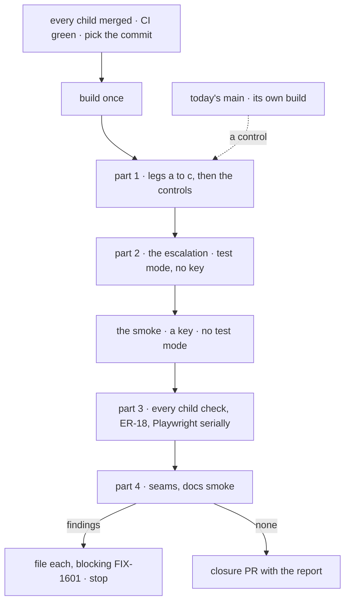

# FIX-1601 · Plan

[Spec](SPEC.md) · [Decisions](DECISIONS.md) · [Rules](BUSINESS-RULES.md) · **Plan** · [Docs](DOCS.md) · [Evolution](EVOLUTION.md)

Written for the closure worker; it owns the leg definitions. It starts when every other child
has merged (QR-1) and adds only the goal check. The roster is [epic D7](../../epics/FIX-1592/DECISIONS.md#d7)'s.
`no-live`, the stream route and its goal path are [FIX-1609's](../FIX-1609/PLAN.md#pinned-names).
FIX-1610's names, in review as [#2314](https://github.com/fixpoint-labs/flow-state-dev/pull/2314),
bind once it merges.

## Surfaces

| ID | Where | Change |
|---|---|---|
| S1 | `goals/kitchen-sink-talk/a-person-talks-to-a-seat-a-channel-and-back/` | `goal.md` from [SPEC.md's goal](SPEC.md#the-goal-and-how-well-know-its-met); `run.mts`: one real browser on the production build it builds, in the [Sequence](#sequence)'s order: legs a to c, the controls and part 2, keyless; then `GOAL_LIVE=1` runs the smoke. Names are inputs. Page helpers lifted from the children's checks |
| S2 | S1's controls | `drop-user-message` acts at the network on leg c's reads, as FIX-1585's does. The rest are the children's server switches. Today's `main` is its own build |
| S3 | The closure PR | Only after a run that files nothing: S1 with its verdict log, the report as its body. No changeset |

## Sequence

```mermaid
flowchart TD
  M["every child merged · CI green · pick the commit"] --> B["build once"]
  B --> P1["part 1 · legs a to c, then the controls"]
  T["today's main · its own build"] -.->|"a control"| P1
  P1 --> P2["part 2 · the escalation · test mode, no key"]
  P2 --> S["the smoke · a key · no test mode"]
  S --> P3["part 3 · every child check, ER-18, Playwright serially"]
  P3 --> P4["part 4 · seams, docs smoke"]
  P4 -->|"findings"| F["file each, blocking FIX-1601 · stop"]
  P4 -->|"none"| PR["closure PR with the report"]
```

## Checks

Each leg asserts on the open page, then reloads once at its end and asserts again.
`[route:<member>]` picks that member, and a post without one fails the scripted evaluation
(FIX-1610 BR-23). Other markers and the working row's text are read off the merged code.

| ID | Passes when |
|---|---|
| P1a | **Leg a, ask `support`.** Post `[route:support.devices]`, a scenario that answers in text and never calls the post tool and holds a few seconds first, so the working row has time to show (`[scenario:wake-after-a-hold]` today), and token A. `support.devices` shows working, then one line answering A under its name within 15 s, and the row clears. Nobody else works or answers |
| P1b | **Leg b, one per post.** Three posts, each after the previous answer shows, else FIX-1610's hold applies: `[route:support.devices]` B1, `[route:support.accounts]` B2, B3 unmarked for the fallback. Each answers through the post tool after the same hold (`[scenario:reply-after-a-hold]` today). `devices`, `accounts` and `general` each work once and land one line with their token; nobody else works. Each one's `support` conversation holds only its posts: `devices` A and B1, `accounts` B2, `general` B3 |
| P1c | **Leg c, direct talk.** **c1:** "New conversation" on `support.devices`, `[scenario:talk-to-seat]` and C1: C1 is the person's turn, a reply under it. **c2:** there, send the recall scenario, which answers with the tokens its model was sent from earlier turns: the reply names C1 and no token from legs a or b. `support` shows neither C1 nor a reply |
| P1s | **The smoke** (`GOAL_LIVE=1`). Five posts or more to `support`, each after the previous answer: device, account, FSD and unclear questions, and a follow-up leaning on an earlier line (FIX-1610 D4). FIX-1610's `poc/route-choice` posts are the default text. Each gets exactly one answer line within two minutes, and a clearly worded post reaches the specialist its purpose names. The follow-up's answer comes from its antecedent's specialist and names that subject; the report quotes both |
| P2e | **The escalation ([epic ER-25](../../epics/FIX-1592/BUSINESS-RULES.md#what-a-person-gets)).** Ask `support` with FIX-1611's needs-a-person scenario and token E. The specialist's line says it filed; the `escalations` list shows one row carrying E. Nobody drains it; the unattended-`escalations` warning still logs |
| P3.1 | Every child's check passes with its held-outs, each control failing its own leg: FIX-1585, 1589, 1590 and 1594's in `goals/kitchen-sink-talk/`, as re-pointed by FIX-1611; FIX-1602's `goals/workforce-channels/a-fresh-host-wakes-its-member-agents/`; FIX-1609's `goals/kitchen-sink-talk/shows-the-reply-without-a-reload/`; FIX-1610's `goals/workforce-channels/a-routed-post-gets-one-answer/`, where `no-transcript` and `no-context` fail its follow-up and context legs, live leg on the smoke's key; FIX-1611's own; FIX-1612's regression test; FIX-1594's external-dispatcher test |
| P3.2 | ER-18, as re-pointed by FIX-1611: `goals/workforce-conventions/a-channel-holds-the-work-a-seat-drains/`; `goals/workforce-conventions/code-comes-from-files-alone/`, its planted registration still failing leg c; `goals/workforce-conventions/durable-hire-survives-redeploy/` ([D3](DECISIONS.md#d3)); `goals/cli-principal/runs-in-the-apps-organization/`, on the smoke's key |
| P3.3 | `apps/kitchen-sink/e2e/`, as re-pointed by FIX-1611, passes with `--workers=1`, FIX-1609's no-reload case included. FIX-1600's test follows QR-7 |
| P4 | Every row of part 4 holds |

## Controls

Each must fail its legs at their own signal and leave the rest green. One that fails at setup,
reddens another leg, or is missing from the commit is a finding.

| Control | Removes | Must fail | Stays green | Named by |
|---|---|---|---|---|
| Today's `main` | The live view and the route (QR-5b) | a · b | c1 | Epic ER-17 |
| `GOAL_CONTROL=no-live` | The panel's live view | a · b | c | FIX-1609 |
| `no-landing` | Landing without a tool call | a | b · c | FIX-1610 |
| `no-route` | `support`'s routing line | a · b | c | FIX-1610 |
| `drop-user-message` | Leg c's person turns | c | a · b | FIX-1585 |
| The no-history control | The seat sending its earlier turns | c2 | a · b · c1 | FIX-1612; its kitchen-sink switch ships with FIX-1611 |
| The filing control | Filing onto `escalations` | Part 2 | a to c | FIX-1611 |

`no-live` and `no-route` each break a and b on their own: without the live view, a's answer never
shows unreloaded and b waits on each answer; without the route, every member wakes (ER-2),
failing a's "nobody else works" and b's one per post.

`no-landing` and `no-route` act in FIX-1610's fixture host. FIX-1611 brings them, the no-history and
filing controls, and the recall and needs-a-person scenarios to kitchen-sink (ER-7).

## Part 4 · gap sweep

Only what P1 to P3 don't grade:

| Check | Passes when |
|---|---|
| **Stock routing (ER-18)** | Read off the source: `apps/kitchen-sink` builds no router, evaluator, dispatcher or seat loop for routing or notify; its route is `routeByPurpose`, its notify `wakeMemberSeats`, thinly wrapped at most. Allowed: FIX-1611's one `escalate` filing tool ([D2](../FIX-1611/DECISIONS.md#d2)) and the app's test-mode controls |
| **Layer fence (ER-8)** | The set's changes to `core`, `engine`, `client` and `react` name no seat, channel, post, notify or member routing. A session-wide stream, as FIX-1609's `GET /api/flows/sessions/:sessionId/stream`, is allowed |
| **No poll (ER-9)** | The channel panel sets no timer, interval or remount |
| **One script file (ER-7)** | Every scripted evaluation and scenario the legs use is in kitchen-sink's one script file |
| **Control containment** | Nothing under `packages/` reads `GOAL_CONTROL`; kitchen-sink reads each only under `KITCHEN_SINK_TEST_MODE=1` |
| **Segmentation (FIX-1612)** | After leg c, `support.devices`'s `support` conversation holds nothing carrying C1 |
| **Docs smoke (ER-19)** | An agent that hasn't read the specs follows the kitchen-sink README and the channels guide's routing and on-screen sections along the legs and the smoke, as written. The README keeps FIX-1606's key |

A doc gap follows [QR-14a](BUSINESS-RULES.md#what-happens-to-a-finding).

## Pinned names

| Where | Name |
|---|---|
| Goal check | `goals/kitchen-sink-talk/a-person-talks-to-a-seat-a-channel-and-back/` |
| Legs | `a`, `b`, `c` with `c1` and `c2`, the smoke, the escalation |
| Roster ([epic D7](../../epics/FIX-1592/DECISIONS.md#d7)) | `support.help` (the legs' `support`), `support.devices`, `support.accounts`, `support.fsd`, `support.general`, `escalations` |
| Tokens | Minted per run, shaped `/[a-z]+-token-[a-z0-9]+/`: what the recall scenario names ([FIX-1611](../FIX-1611/PLAN.md#pinned-names)) |
| The smoke's switch | `GOAL_LIVE=1`, FIX-1610's live-leg switch (its PLAN S9, #2314). `goals/README.md` has none yet |

## Guardrails

| Rule | Because |
|---|---|
| No product change, no new control switch, no new messaging path | The closure proves what shipped |
| Assert on the open page before any reload, by this run's tokens, never the CLI | A reload hid both failures the owner met |
| Every check on the one commit; today's `main` only as a control | A pass elsewhere proves nothing about the set |
| Findings are filed, never fixed here | The closure rule |

## At implement time

- Build once and run in the [Sequence](#sequence)'s order. Restart `next start` for each
  server-side control, then with a key and no test mode for the smoke.
- The smoke needs FIX-1611's route model, one that can evaluate (FIX-1610's POC).
- If FIX-1600 merges first, its re-run allowance lapses ([D2](DECISIONS.md#d2)).
