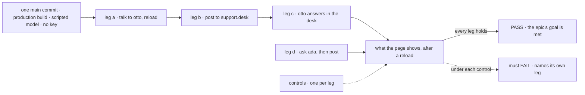

# FIX-1601 · Closure: talk to a seat, a channel, and back

**Spec** · [Decisions](DECISIONS.md) · [Rules](BUSINESS-RULES.md) · [Plan](PLAN.md) · [Docs](DOCS.md) · [Evolution](EVOLUTION.md)

Improvement · closure (QA) · kitchen-sink + `goals/` · medium · 1 PR after a clean run · epic
[FIX-1592](https://linear.app/fixpoint-labs/issue/FIX-1592), closure · required · runs after
all five children (FIX-1602 included), FIX-1598, #2289 and #2294 merge

## Five people, before and after

| Someone who… | Today | After this closes |
|---|---|---|
| **decides whether the epic is done** | Four checks, each green on its own commit | One report on one `main` commit: each PASS, each control's FAIL, each finding and its retest |
| **talks to `support.otto`, then posts to `support.desk`** | Each step proven alone | Proven in one browser sitting: otto remembers, the post reaches iris and otto once each, otto answers in the channel |
| **asks `support.ada`, then posts to the desk** | Each proven alone | Proven together: the clerk answers or files, and a post never wakes it |
| **follows the kitchen-sink README or the channels guide** | Checked by the child that wrote it | Followed as written, on that commit |
| **changes kitchen-sink after the wrap** | Nothing covers the whole story | A committed goal check re-runs it |

## The goal, and how we'll know it's met

**On one `main` commit with all five children merged, a person in the kitchen-sink browser talks
to a seat and keeps the conversation, posts to a channel that each agent in it hears once, and
reads an agent's answer in that channel, with no model key, and every child's own check still
passes on that commit.**

| Is it the right goal? | |
|---|---|
| **The real need** | The [epic's goal](../../epics/FIX-1592/SPEC.md#the-goal-and-how-well-know-its-met), proven on the assembled set, as the [closure rule](../../../docs/contributing/orchestration.md#the-closure-issue-every-epic-ends-in-qa) asks |
| **Smaller, and rejected** | "All five child checks are green." Each can pass alone while the pieces break together, say a post landing in otto's direct chat |
| **Bigger, and not this issue's** | The boards drained (FIX-1591, held). Agents answering each other. A live-model check |
| **Not done if** | The checks ran on different commits. One needed a key. One read a return value or the CLI instead of the page. A control never failed. A finding was deferred |

The check reads the page after reloads. Each control removes one child's behaviour and must fail
that child's leg.

| How we verify | |
|---|---|
| **Goal check** | `goals/kitchen-sink-talk/a-person-talks-to-a-seat-a-channel-and-back/`, a real browser on the production build. Legs a to c are the epic's goal; leg d is the clerk journey. The closure worker runs it; the verdict goes in the closure PR |
| **Model** | Scripted, keyless ([epic D3](../../epics/FIX-1592/DECISIONS.md#d3)). The run fails if a provider key is set |
| **Signal** | Read after a reload. Each leg's pass condition is in [PLAN.md → Checks](PLAN.md#checks) |
| **Input** | A fresh token per leg, so another run's lines never count |
| **Anti-game** | Nothing is graded on a reply's wording, a return value or a CLI run. Only this run's tokens count |
| **Control that must fail** | `drop-user-message` fails a. `name-only-notify` fails b, and c with it. `no-author-filter` and `post-without-author` each fail c. `echo` fails d. None may redden another leg. `name-only-notify` can't tell Workforce's stock seat-wake routing from kitchen-sink glue, so part 4's **stock routing** check does: it fails if kitchen-sink still carries its own `notifyFor` |

Part 3 re-runs all five children's goal checks; part 4 covers what the rest doesn't. Both run on
the same commit ([PLAN.md](PLAN.md)).

## What changes

Read the commit line. Today each check sits on a different commit. After, everything sits on
one, and a finding sends the whole stack round again, not only its own repro.

## What stays as it is

- **No feature work.** A gap becomes a child of the epic, fixed on its own route.
- **FIX-1591 is outside the done bar.** Nobody drains `escalations`.
- **The children's checks and controls** run as their specs pinned them.

## Sign off

**[The goal](#the-goal-and-how-well-know-its-met), at that size:** the whole talk loop, proven
in one browser on one commit, keyless, with every child still green there. If wrong: the epic
wraps on four green checks that never met, or waits on a bar nobody asked for.

1. **[D1](DECISIONS.md#d1) · The goal check is one person's session: otto directly, then the
   desk, then otto's answer in the desk. The clerk is its own journey in the same script.** If
   wrong: a seam between ada and the rest goes unwalked.
2. **[D3](DECISIONS.md#d3) · The durable-hire check must pass, so FIX-1598 blocks this
   issue.** If wrong: the epic waits on another epic's bug.

**Open: none.** The flake rule is an engineering call
([D2](DECISIONS.md#d2)), not asked.
