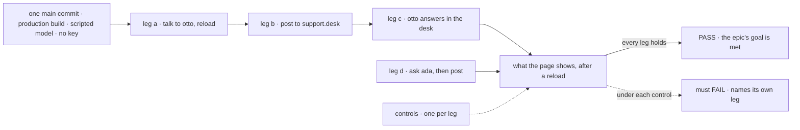
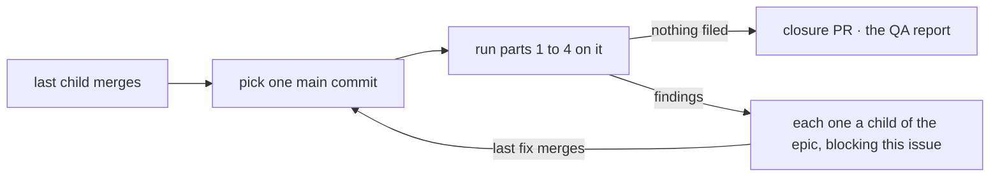

# FIX-1601 · Closure: talk to a seat, a channel, and back

**Spec** · [Decisions](DECISIONS.md) · [Rules](BUSINESS-RULES.md) · [Plan](PLAN.md) · [Docs](DOCS.md) · [Evolution](EVOLUTION.md)

Improvement · closure (QA) · kitchen-sink + `goals/` · medium · 1 PR after a clean run · epic
[FIX-1592](https://linear.app/fixpoint-labs/issue/FIX-1592), closure · required · runs after
FIX-1585, FIX-1589, FIX-1590 and FIX-1594 all merge

## Five people, before and after

| Someone who… | Today | After this closes |
|---|---|---|
| **decides whether the epic is done** | Four checks, each green on its own commit, never run together | One report on one `main` commit: each PASS, each control's FAIL, each finding and its retest |
| **talks to `support.otto`, then posts to `support.desk`** | Each step proven alone, by a different child | The whole story proven in one browser sitting: otto remembers, the post reaches iris and otto once each, otto answers in the channel, the direct chat stays separate |
| **asks `support.ada`, then posts to the desk** | The clerk and the post each proven alone | Proven together: the clerk answers or files, and a desk post never wakes it |
| **follows the kitchen-sink README or the channels guide** | Each page checked by the child that wrote it | Every page the set published followed as written, on that commit |
| **merges a kitchen-sink change after the wrap** | Nothing covers the assembled story | A committed goal check that re-runs it |

Nothing yet uses the finished whole the way a person would, so a hand-off nobody owns reaches
the wrap unseen.

## The goal, and how we'll know it's met

**On one `main` commit with all four children merged, a person in the kitchen-sink browser talks
to a seat and keeps the conversation, posts to a channel that each agent in it hears once, and
reads an agent's answer in that channel, with no model key, and every child's own check still
passes on that commit.**

| Is it the right goal? | |
|---|---|
| **The real need** | The epic's goal ([FIX-1592 SPEC](../../epics/FIX-1592/SPEC.md#the-goal-and-how-well-know-its-met)), in Jake's words: *"if you talk to a channel, it sends it to the agents, and if you talk to the agents, then you're just talking to the agent … if you talk to an agent through a channel, the agent can respond back to that channel."* The closure rule ([orchestration.md](../../../docs/contributing/orchestration.md#the-closure-issue-every-epic-ends-in-qa)): prove the assembled set does it |
| **Smaller, and rejected** | "All four child checks are green," the epic's first wording. Each can pass alone while the pieces break together: a post landing in otto's direct chat, a clerk a post wakes, otto's line waking iris |
| **Bigger, and not this issue's** | The boards drained and `escalations` served (FIX-1591, held) · agents answering each other (epic D2 reversed) · a live-model quality check (epic D3) |
| **Not done if** | The checks ran on different commits · one needed a key · one read a return value or the CLI instead of the page · a control never failed · a finding was deferred · a flake was retried past [D2](DECISIONS.md#d2) |

The check reads the page after reloads, in one person's order, so only what the pieces kept
together can pass. Each control strips one child's behaviour and must fail on that child's leg.

| How we verify | |
|---|---|
| **Goal check** | `goals/kitchen-sink-talk/a-person-talks-to-a-seat-a-channel-and-back/`, a real browser on the production build. Legs a to c are the epic's goal (part 1); leg d is the clerk journey (part 2). Run by the closure worker; to `fsd-qa` only if no browser runs here. Verdict in the closure PR |
| **Model** | Scripted, keyless ([epic D3](../../epics/FIX-1592/DECISIONS.md#d3)). The run asserts no provider key is set |
| **Signal** | After a reload. **a:** otto keeps the message as the person's turn, the reply under it. **b:** otto and iris each hold one `support.desk` conversation with the post heard once; ada, grace, wren and otto's direct chat hold nothing with it. **c:** one `support.desk` line labelled `support.otto`, and no second woken turn. **d:** ada's reply carries its marker, not the note; the filed row is on `escalations`; a desk post runs no clerk |
| **Input** | A fresh token per leg, and the scenario markers the children pinned. A second post must land in the same desk conversations and pass too |
| **Anti-game** | Nothing on a reply's wording, a return value, a dispatch handle, a CLI run or a package test. Only this run's tokens count |
| **Control that must fail** | `drop-user-message` fails a · `name-only-notify` fails b (and c, which rides it) · `no-author-filter` and `post-without-author` each fail c · `echo` fails d. None may redden another leg. The commit before FIX-1589 merged, `081f6fe83`, fails b to d |

Parts 3 and 4, the children's checks and a sweep of seams and docs, run on the same commit
([PLAN.md](PLAN.md)).

## What changes

Read the commit line. Today each check sits on a different commit; after, everything sits on
one, and a finding sends the whole stack round again, not only its own repro.

## How a run goes

A run that files findings opens no PR. The epic's wake re-dispatches this issue when the last
fix merges, and the whole plan runs again on a fresh commit.

## What stays as it is

- **No feature work.** A gap is a child of the epic, fixed on its own route.
- **FIX-1591 is out of the done bar**: nobody drains `escalations`; the boot warning stays.
- **The children's checks and controls** run as their specs pinned them.

## Sign off

**[The goal](#the-goal-and-how-well-know-its-met), at that size:** the whole talk loop, proven
in one browser on one commit, keyless, with every child still green there. If wrong: the epic
wraps on four green checks that never met, or waits on a bar nobody asked for.

1. **[D1](DECISIONS.md#d1) · The goal check is one person's session: otto directly, then the
   desk, then otto's answer in the desk. The clerk is its own journey in the same script.** If
   wrong: a seam between ada and the rest goes unwalked, or the check grows a leg nobody needed.
2. **[D2](DECISIONS.md#d2) · Two named flakes may be re-run up to twice and still pass, reported
   with their issue. Any other retry is a finding.** If wrong: a real regression hides behind a
   known flake, or the closure blocks on a test nobody has fixed.
3. **[D3](DECISIONS.md#d3) · The durable-hire check runs, but fails without blocking only in
   FIX-1598's known way.** If wrong: the epic wraps with a red check a child touched.

**Open: none.** Number 2 is the one to weigh: it sets how much flake the release bar tolerates.
Reasoning: [DECISIONS.md](DECISIONS.md). The run's rules: [BUSINESS-RULES.md](BUSINESS-RULES.md).
