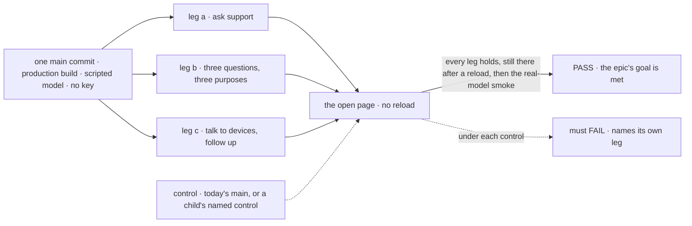

# FIX-1601 · Closure: talk to a seat, a channel, and back

**Spec** · [Decisions](DECISIONS.md) · [Rules](BUSINESS-RULES.md) · [Plan](PLAN.md) · [Docs](DOCS.md) · [Evolution](EVOLUTION.md)

Improvement · closure (QA) · kitchen-sink + `goals/` · medium · 1 PR after a clean run · epic
[FIX-1592](https://linear.app/fixpoint-labs/issue/FIX-1592), closure · required · amended
2026-09-27 for the routed desk ([EVOLUTION](EVOLUTION.md)) · runs after FIX-1609 to FIX-1612

## Six people, before and after

| Someone who… | Today | After this closes |
|---|---|---|
| **decides whether the epic is done** | Each child's check green on its own commit, most read after a reload | One report on one `main` commit: each leg read before any reload, each control's FAIL, the smoke, each finding |
| **asks `support` a question** | Sees nothing until they reload | Proven on the open page: the routed specialist works, then answers under its name |
| **asks about a device, an account, then something unclear** | Every agent ran on every post | Proven: `devices`, `accounts`, `general` once each, no one else |
| **needs a person** | A clerk, now cut, filed it | Proven: the specialist files onto `escalations` and says so |
| **talks to `support.devices`, then follows up** | The seat forgot the first message | Proven: kept across a reload, out of the channel, the follow-up answered from the first |
| **follows the kitchen-sink README** | Checked by the child that wrote it | Followed as written, on that commit |

## The goal, and how we'll know it's met

**On one `main` commit with every child merged, the epic's goal holds in a real browser: a person
asks `support` a question and, without reloading, sees the one specialist whose purpose fits
start work and then answer, and each specialist keeps only its own cases. Gated legs are
keyless, a real-model smoke gets one answer per post, and every child's check still passes.**

| Is it the right goal? | |
|---|---|
| **The real need** | The [epic's goal](../../epics/FIX-1592/SPEC.md#the-goal-and-how-well-know-its-met) on the assembled set, as the [closure rule](../../../docs/contributing/orchestration.md#the-closure-issue-every-epic-ends-in-qa) asks, read as the owner met the failures: without a reload |
| **Smaller, and rejected** | "Keep the merged plan, rename the seats." It reads after a reload and its script always calls the post tool: how both failures passed |
| **Bigger, and not this issue's** | Draining `escalations` (FIX-1591) · a hired specialist in the channel (FIX-1415) · word-by-word answers · the smoke in CI |
| **Not done if** | A leg is read only after a reload · leg a's script calls the post tool · one post runs two specialists · the smoke is skipped, or a missing answer called flake · checks on different commits · a control never failed · a finding deferred |

```mermaid
flowchart LR
  B["one main commit · production build · scripted model · no key"] --> A["leg a · ask support"]
  B --> P["leg b · three questions, three purposes"]
  B --> C["leg c · talk to devices, follow up"]
  A --> R["the open page · no reload"]
  P --> R
  C --> R
  R -->|"every leg holds, still there after a reload, then the real-model smoke"| PASS["PASS · the epic's goal is met"]
  X["control · today's main, or a child's named control"] -.-> R
  R -.->|"under each control"| F["must FAIL · names its own leg"]
```

Each leg reads the open page first and reloads only at its end. Under a control, the legs it
names must fail and the rest must hold.

| How we verify | |
|---|---|
| **Goal check** | `goals/kitchen-sink-talk/a-person-talks-to-a-seat-a-channel-and-back/`, a real browser on the production build: legs a to c, then the smoke. Verdict in the closure PR |
| **Model** | Scripted and keyless for gated legs; the run fails if a key is set. The smoke alone has a key, outside CI ([epic D3](../../epics/FIX-1592/DECISIONS.md#d3)) |
| **Signal** | Before any reload, then after one at the leg's end: [PLAN.md → Checks](PLAN.md#checks) |
| **Input** | A fresh token per post; names are inputs, so others must pass too |
| **Anti-game** | No reload before an assertion. Leg a's script never calls the post tool. Nothing graded on wording, a return value or a CLI run |
| **Control that must fail** | Today's `main`, `no-live` and `no-route` each fail a and b. `no-landing` fails a alone. `drop-user-message` fails c. What each leaves green: [PLAN.md → Controls](PLAN.md#controls) |

Part 2 walks the person who needs a human; part 3 re-runs every child's check; part 4 sweeps
what the rest miss. All on the same commit.

## What changes

Read the commit line. Today each check sits on its own commit and reads after a reload. After,
all sit on one, read the open page first, and a finding sends the whole stack round again.

## What stays as it is

- **No feature work.** A gap becomes a child of the epic, fixed on its own route.
- **FIX-1591 is outside the done bar.** Nobody drains `escalations`.
- **Verdicts recorded under the merged plan** stand as history; none counts toward a clean run.

## Sign off

**[The goal](#the-goal-and-how-well-know-its-met), at that size:** the epic's legs, read as a
person reads them, on one commit, then once on a real model. If wrong: the epic wraps on checks
that pass only after a reload, or waits on a bar nobody asked for.

1. **[D1](DECISIONS.md#d1) · The epic's three legs, each read on the open page before any
   reload, then the smoke. The escalation is its own journey; leg c's follow-up makes FIX-1612
   block this issue.** If wrong: a seam between the children goes unwalked, or a forgetful
   specialist ships.
2. **[D3](DECISIONS.md#d3) · `durable-hire-survives-redeploy` must pass, as FIX-1611 re-points
   it.** If wrong: the hire value the rebuild removes goes unproven.

**Open: none.** Which leg each control fails is an engineering call
([PLAN.md → Controls](PLAN.md#controls)); the flake rule is [D2](DECISIONS.md#d2).
