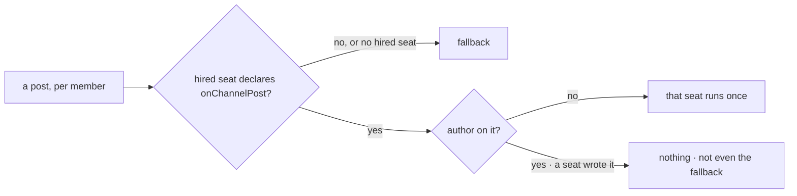

# FIX-1602 · Business rules

[Spec](SPEC.md) · [Decisions](DECISIONS.md) · **Rules** · [Plan](PLAN.md) · [Docs](DOCS.md) · [Evolution](EVOLUTION.md)

The cases, as rules. *Proved by* is the check the plan runs. Most rows are FIX-1590's, now owned by
the package.

## Who a post wakes

| # | When | Then | Proved by |
|---|---|---|---|
| BR-1 | A post with no `author` reaches a member whose hired seat declares `onChannelPost` | That seat runs once on it, through that entry. The member is matched on the seat's logical id (its `seatId` setting), and the dispatch goes to the seat's address | Goal check · V1 |
| BR-2 | The member's seat declares no `onChannelPost` (a clerk, a runner, any kind with only public actions) | Nothing runs for it. It gets the fallback | Goal check · V1 |
| BR-3 | A post carries an `author` | No seat runs. A member whose seat would have woken gets nothing, not even the fallback. Every other member gets the fallback exactly as on an ordinary post, so a claimed `author` can only withhold wakes. Kitchen-sink's fallback still skips the writer (FIX-1476 V14) | Goal check · V1 · FIX-1594's check |
| BR-4 | A member has no seat among those passed: it failed to load, was hired after boot, or was never hired | It gets the fallback. Never an error. A hired seat in no channel is never chosen | V1 |
| BR-5 | A seat hired at runtime is re-minted by the boot reload, with address `<org>.<seatId>` | It wakes like any other: `members:` and the post name its logical `seatId`, and the dispatch goes to the address | V1, on the reload path |
| BR-6 | An app's own kind declares `onChannelPost` taking `ChannelNotifyInput` | Its seats wake like agent seats. Nothing to register | V1 · POC P2 |
| BR-7 | A kind's `onChannelPost` takes an input the post doesn't match | That member's delivery fails and is recorded; the others still run | V1 |

Two questions per member, in this order. The first replaces kitchen-sink's `wake` column; the
second is the epic's rule against agents answering each other. The order keeps a forged `author`
from making the fallback run for anyone it wouldn't reach anyway.

## Where a woken seat runs

| # | When | Then | Proved by |
|---|---|---|---|
| BR-8 | A seat is woken in a channel for the first time | It runs in a new conversation keyed `channel:<channelId>` | Goal check · V1 |
| BR-9 | A second post reaches the same seat in the same channel | Same conversation | Goal check · V1 |
| BR-10 | The same seat is in two channels | Two conversations, one per channel | V1 |
| BR-11 | Kitchen-sink restarts on the helper with seat conversations from before the move | The next post lands in the existing conversation. The key is unchanged | V3 |

## What a host controls

| # | When | Then | Proved by |
|---|---|---|---|
| BR-12 | A host passes no `fallback` | A member who isn't woken gets nothing: no item, no line | V1 |
| BR-13 | A host passes a `fallback` block | It runs for exactly the members BR-2 and BR-4 name, on every post, authored or not, with the same input. Never for a member the wake would have run | V1 · V3 |
| BR-14 | A host passes a channel's member ids where seats are expected | A type error. Past that the helper trusts the instances it is given: it reads addresses only off them, never off a channel's stored members (BP-031) | A type test on a string list · V1 |
| BR-15 | A host passes an empty seat list | Everyone gets the fallback. Not an error | V1 |

## Kitchen-sink on the helper

| # | When | Then | Proved by |
|---|---|---|---|
| BR-16 | A person posts to `support.desk` | Exactly FIX-1590's outcome: iris and otto run once each, ada, grace and wren get the name-only line | FIX-1590's goal check · V3 |
| BR-17 | `support.otto` answers in `support.desk` | FIX-1594's outcome: the line wakes nobody. Ada, grace and wren get the name-only line; iris, an agent member, now gets nothing (BR-3) | FIX-1594's goal check · V3 |
| BR-18 | `GOAL_CONTROL=name-only-notify` | The helper is not installed; the name-only line goes to everyone. FIX-1590's check FAILS | V3 |
| BR-19 | `GOAL_CONTROL=no-author-filter` | The app strips `author` before the helper, so otto's line wakes iris. FIX-1594's check FAILS on the woken-once half | V3 |
| BR-20 | Kitchen-sink's source is read | Its notify module builds no dispatcher or router. Its kind map has no `wake` column | V4 |

## Failure taxonomy

FIX-1590's taxonomy, unchanged. Nothing is fatal to a post. A failed wake or fallback degrades to
"that member did not hear it", recorded on the fan-out, and the rest are still attempted.

## Acceptance criteria this issue owns

[The goal](SPEC.md#the-goal-and-how-well-know-its-met), with each control seen to fail. The
workforce-shell checks and FIX-1476 leg V14 stay green (epic ER-18), less the `wake` column's cases.
