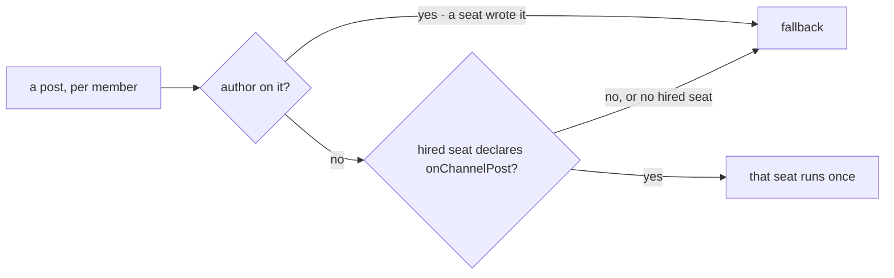

# FIX-1602 · Business rules

[Spec](SPEC.md) · [Decisions](DECISIONS.md) · **Rules** · [Plan](PLAN.md) · [Docs](DOCS.md) · [Evolution](EVOLUTION.md)

The cases, written as rules. Each says what a host, a person or the system does and what happens.
The *proved by* column is the check the plan runs. Most rows are FIX-1590's rules, now owned by
the package instead of kitchen-sink; the new ones are about who is woken and how a host wires it.

## Who a post wakes

| # | When | Then | Proved by |
|---|---|---|---|
| BR-1 | A post with no `author` reaches a member whose hired seat declares `onChannelPost` | That seat runs once on it, through that entry | Goal check · V1 |
| BR-2 | The member's seat declares no `onChannelPost` (a clerk, a runner, any kind with only public actions) | Nothing runs for it. It gets the fallback | Goal check · V1 |
| BR-3 | A post carries an `author` | No seat runs, whoever the member is. Every member gets the fallback, the writer included; kitchen-sink's fallback skips the writer itself (FIX-1476 V14) | Goal check · V1 · FIX-1594's check |
| BR-4 | A member has no hired seat: it failed to load, was hired at runtime, or was never hired | It gets the fallback. Never an error | V1 |
| BR-5 | A hired seat is in no channel's members | It has a dispatcher that is never chosen. Nothing runs | V1 |
| BR-6 | A kind of the app's own declares `onChannelPost` taking `ChannelNotifyInput` | Its seats wake exactly like agent seats. Nothing else is registered | V1 · POC P2 |
| BR-7 | A kind declares `onChannelPost` with an input the post doesn't match | That member's delivery fails, is recorded on the fan-out, and the other members still run | V1 |

Two questions per member, in this order. The first is the epic's rule against agents answering
each other; the second replaces kitchen-sink's `wake` column.

## Where a woken seat runs

| # | When | Then | Proved by |
|---|---|---|---|
| BR-8 | A seat is woken in a channel for the first time | It runs in a new conversation keyed `channel:<channelId>` | Goal check · V1 |
| BR-9 | A second post reaches the same seat in the same channel | Same conversation | Goal check · V1 |
| BR-10 | The same seat is in two channels | Two conversations, one per channel | V1 |
| BR-11 | Kitchen-sink restarts on the helper with seat conversations from before the move | The next post lands in the existing conversation. The key is unchanged | V3 |

## What a host controls

| # | When | Then | Proved by |
|---|---|---|---|
| BR-12 | A host passes no `fallback` | A member who isn't woken gets nothing: no item, no line | V1 |
| BR-13 | A host passes a `fallback` block | It runs for exactly the members BR-2, BR-3 and BR-4 name, with the same input | V1 · V3 |
| BR-14 | A host passes seats built from anything but `hireWorkforce`'s result, such as a channel's stored members | The types refuse it. The helper reads ids and entries off real seats only (BP-031) | V1, a type test |
| BR-15 | A host passes an empty seat list | Everyone gets the fallback. Not an error | V1 |

## Kitchen-sink on the helper

| # | When | Then | Proved by |
|---|---|---|---|
| BR-16 | A person posts to `support.desk` | Exactly FIX-1590's outcome: iris and otto run once each, ada, grace and wren get the name-only line | FIX-1590's goal check · V3 |
| BR-17 | `support.otto` answers in `support.desk` | Exactly FIX-1594's outcome: the line wakes nobody | FIX-1594's goal check |
| BR-18 | `GOAL_CONTROL=name-only-notify` | The helper is not installed; the name-only line goes to everyone. FIX-1590's check FAILS | V3 |
| BR-19 | `GOAL_CONTROL=no-author-filter` | The app strips `author` before the helper, so otto's line wakes iris. FIX-1594's check FAILS on the woken-once half | V3 |
| BR-20 | Kitchen-sink's source is read | Its notify module builds no dispatcher or router. Its kind map has no `wake` column | V4 |

## Failure taxonomy

Nothing here is fatal to a post, which is FIX-1590's taxonomy unchanged. A refused or failing wake
degrades to "that seat did not hear it", recorded on the fan-out request, with the other members
still attempted. The fallback is best-effort in the same way. The only start-time failure is a
type error in the host's own wiring.

## Acceptance criteria this issue owns

[The goal](SPEC.md#the-goal-and-how-well-know-its-met): the fresh-host goal check passes on the
built-in agent kind and fails under each of its controls, and FIX-1590's and FIX-1594's goal checks
pass on the thinned kitchen-sink, each failing under its own control. The workforce-shell checks
and FIX-1476 leg V14 stay green (epic ER-18), less the `wake` column's cases, which go with it.
