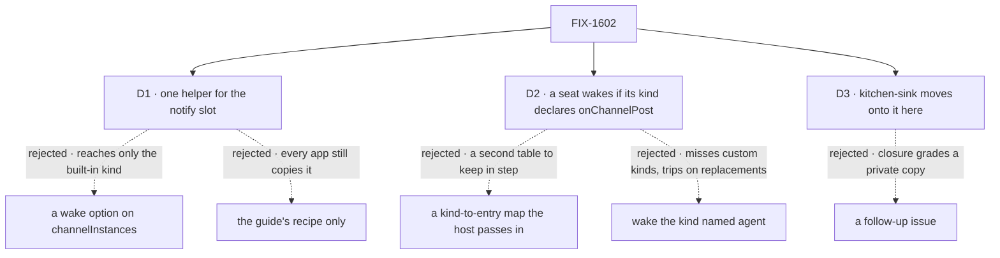

# FIX-1602 · Decisions

[Spec](SPEC.md) · **Decisions** · [Rules](BUSINESS-RULES.md) · [Plan](PLAN.md) · [Docs](DOCS.md) · [Evolution](EVOLUTION.md)

FIX-1590 decided who a post wakes and how a seat hears it; the epic decided a seat's post wakes no
seat ([epic D2](../../epics/FIX-1592/DECISIONS.md#d2)). These cards decide where that lives and who
calls it.

## The tree

Solid edges are what you're signing. Dashed edges lost, and the label says why.

## D1 · One exported helper, `wakeMemberSeats(seats, { fallback? })`, returns the block a host hands to the existing notify slot

| | |
|---|---|
| **Instead of** | A `wake: seats` option on `channelInstances` that rebuilds the built-in kind for the host · or leaving FIX-1590's recipe in the guide as the only way |
| **Because** | The slot's contract is that the package carries the policy and the host supplies the addresses (FIX-1476). A helper keeps both. A binder option would reach only the built-in kind; an app's own channel kind builds its own notify and would need the helper anyway, so the option is a second way to do one thing. The recipe is the copy Jake flagged. Nothing reaches core or engine (tenet 2: a small surface over the slot that exists) |
| **Locks in** | A public Workforce export (`patch`: additive). Its behaviour becomes a package promise: the author rule, one conversation per seat per channel, and the key that finds it. Changing the key later strands every app's seat conversations |

## D2 · A seat wakes if its kind declares the internal `onChannelPost` entry, read off the hired seat itself. No kind table, in the package or the host

| | |
|---|---|
| **Instead of** | A kind-to-entry map the host passes in, which is kitchen-sink's `wake` column moved into an argument · or waking every seat of the kind named `agent` |
| **Because** | A hired seat carries its kind's internal entries, so the answer is already on the seat ([POC P1](poc/wake-by-entry/README.md)). A kind that can hear a post says so where it defines how. That removes the second table FIX-1590 rejected a package helper for ([EVOLUTION](EVOLUTION.md)). A name check misses a custom kind with the entry, and dispatches to a kind registered as `agent` without it |
| **Locks in** | `onChannelPost`, taking `ChannelNotifyInput`, becomes the convention every wakeable kind uses. Renaming it, or changing that input, breaks every app kind that declared it. Kitchen-sink's `wake` column and its drift test go |

**What would change my mind:** a second way to wake a seat, say a board post or a timer, that
wants its own entry. Then the helper should take the entry name, still reading presence off the
seat.

## D3 · Kitchen-sink moves onto the helper in this issue · decided by the owner, 2026-09-26

| | |
|---|---|
| **Instead of** | Shipping the helper now and moving kitchen-sink in a follow-up, as the issue first said |
| **Because** | The closure ([FIX-1601](../FIX-1601/SPEC.md)) proves the epic in kitchen-sink. If kitchen-sink keeps its own router, the closure grades code no other app runs |
| **Locks in** | FIX-1602 blocks FIX-1601, so the epic's wrap waits on it. Kitchen-sink's name-only line becomes the helper's fallback, and its two wake controls wrap the helper in the app. FIX-1590's and FIX-1594's checks must pass unchanged |

## Decided, not asked

- **The author rule has no off switch.** A host that wants agents to hear each other writes its
  own block. An option would put kitchen-sink's test control in the package, which the issue rules
  out.
- **The fallback defaults to silence**, like a channel with no notify slot. Kitchen-sink passes
  its name-only line.
- **The addresses are the hired seats, never the channel's stored members** (BP-031). The helper
  takes only what `hireWorkforce` returned, so a host has to hire before it builds channels.
- **The seats passed at boot.** Members match on the logical `seatId`, so a runtime hire the boot
  reload re-mints at `<org>.<seatId>` wakes. One hired after boot gets the fallback until the next.
- **The conversation key stays `channel:<channelId>`**, and each dispatcher stays named
  `wake-<seatId>`. Kitchen-sink's conversations and traces read the same after the move.
- **Authorship stays unverified** until FIX-1493. A claimed `author` withholds that post's wakes
  and nothing more: a member that would have woken gets silence, not the fallback.

## Considered and dropped

| Alternative | Why not |
|---|---|
| The name-only line as the package's default fallback | Kitchen-sink's teaching line. It writes an item on the fan-out request a real app may not want |
| Export the dispatcher-per-seat builder and leave the router to the host | Leaves the author rule in every host, which is the rule most worth not copying |
| Put the helper in `@flow-state-dev/core` | Seats and channels are Workforce concepts |

## Settled

- **A hired seat exposes its kind's internal entries, and a notify block built only from them
  wakes each declaring member once, per channel conversation, and nobody on a seat's post** —
  **CONFIRMED** on an in-process host with no kitchen-sink code, run on FIX-1594's branch. Dropping
  the author rule fails the seat-post leg. ([poc/wake-by-entry](poc/wake-by-entry/README.md),
  [evidence](poc/wake-by-entry/evidence.txt))

## How it got here

- **Draft** — framed as promoting kitchen-sink's wake into Workforce; one helper over the notify
  slot, seats chosen by the entry they declare, kitchen-sink moved onto it in the same PR; POC run
  first.

**Open: none.**
