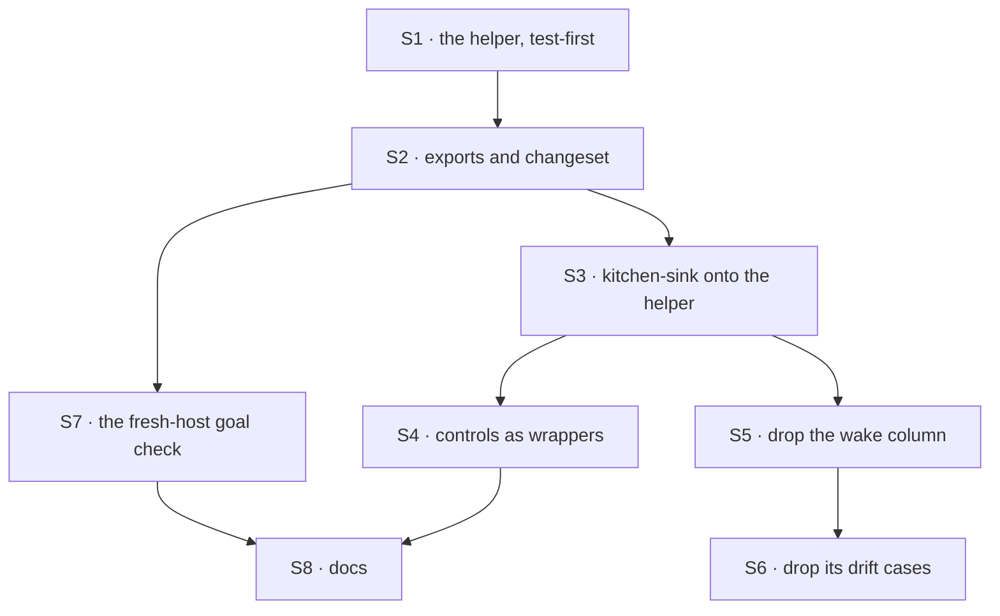

# FIX-1602 · Plan

[Spec](SPEC.md) · [Decisions](DECISIONS.md) · [Rules](BUSINESS-RULES.md) · **Plan** · [Docs](DOCS.md) · [Evolution](EVOLUTION.md)

For the implementing agent. IDs cite [BUSINESS-RULES.md](BUSINESS-RULES.md) (BR-n) and
[DECISIONS.md](DECISIONS.md) (D-n). `tdd`. One PR, from `main` after FIX-1590 and FIX-1594 merge.

## Surfaces

| ID | Package · role | Change | Rules |
|---|---|---|---|
| S1 | `workforce` · a new module beside the channel flow | `wakeMemberSeats(seats, { fallback? })`: one dispatcher per seat whose `internal.actions` owns `onChannelPost`, addressed to `seat.id`, keyed `channel:<channelId>`, named `wake-<seatId>`; a router keyed on each seat's logical `seatId` setting, matched against `member`; an authored post sends wakeable members to a silent path, never the fallback; a silent fallback by default (D1, D2) | BR-1 to BR-10, BR-12 to BR-15 |
| S2 | `workforce` · exports | Export S1 from the channel barrel and the package root. `patch` changeset | — |
| S3 | kitchen-sink · `workforce/channel-notify.ts` | **Remove** `notifyFor`'s router, its dispatchers and `HiredSeatAddress`. Keep `notifyMember` as the name-only fallback. The notify block becomes `wakeMemberSeats(seats, { fallback: notifyMember })`, wrapped by S4's controls | BR-16, BR-17, BR-20 |
| S4 | kitchen-sink · `lib/channel-wake-control.ts` and its caller | Both controls stay in the app. `name-only-notify` installs `notifyMember` alone. `no-author-filter` wraps the helper with an input adapter that drops `author` | BR-18, BR-19 |
| S5 | kitchen-sink · `lib/workforce-shell.ts` | **Remove** the `wake` column, `SeatWake` and `seatWakeFor`. `SEAT_ASKS` otherwise unchanged | BR-20 |
| S6 | kitchen-sink · `test/workforce-shell.test.ts` | **Remove** the "each seat kind's wake names a channel receiver" cases; nothing is left to drift | BR-20 |
| S7 | `goals/workforce-channels/a-fresh-host-wakes-its-member-agents/` | New goal check: fixture tree, a host module that imports only `@flow-state-dev/*`, `run.mts` grading it, controls `no-wake` and `no-author-filter` | the goal |
| S8 | Docs | Per [DOCS.md](DOCS.md) | — |

Nothing in `core`, `engine`, `client` or `react` (epic ER-8).

## Sequence



## Checks

| ID | Runs after | Passes when |
|---|---|---|
| V1 | S1 | Unit tests on a real in-process host, not a mocked dispatcher: BR-1 to BR-10, BR-12 to BR-15. Seats from `hireWorkforce`: a kind with the entry, one without, the built-in agent. BR-5 with a seat minted from a stored roster row, as the boot reload does. BR-3 with an effectful fallback that must not run for wakeable members |
| V2 | S2 | `wakeMemberSeats` resolves from `@flow-state-dev/workforce` in a consumer outside the package |
| V3 | S4 | Kitchen-sink's `channel-wake` and `channel-reply` tests pass, changed only for removed imports and BR-17's seat-post case. BR-11: a seat conversation created before the move receives the next post. BR-18 and BR-19 each flip the check they name |
| V4 | S6 | BR-20 by reading source: `channel-notify.ts` calls neither `dispatcher(` nor `keyedRouter(`; `SEAT_ASKS` has no `wake`. The workforce-shell suite otherwise green |
| VG | S7 | [The goal](SPEC.md#the-goal-and-how-well-know-its-met): `goals/workforce-channels/a-fresh-host-wakes-its-member-agents/run.mts` PASSES, including its source leg over kitchen-sink's notify module, after the same run FAILED under `GOAL_CONTROL=no-wake` (woken leg) and under `GOAL_CONTROL=no-author-filter` (seat-post leg). Then FIX-1590's `a-post-runs-each-member-agent-once` and FIX-1594's `agent-replies-in-the-channel` PASS on the thinned kitchen-sink, each after its own control FAILED |

One check per decision: D1 is V2 with VG's leg 0; D2 is V1's BR-2 and BR-6 cases; D3 is V3 with
VG's kitchen-sink half. The second path (BP-035) is BR-11, an existing conversation, BR-4, a seat
hired after boot, and BR-5, a runtime hire re-minted at boot.

## Pinned names

| Where | Name | Why pinned |
|---|---|---|
| Package export | `wakeMemberSeats` | Public. Every host types it |
| Option | `fallback` | Public. Matches `keyedRouter`'s own word for the same thing |
| Entry | `onChannelPost` | Already public (FIX-1590). D2 makes it the convention |
| Conversation key | `channel:<channelId>` | Kitchen-sink's existing conversations are found by it (BR-11, BP-030) |
| Goal path | `goals/workforce-channels/a-fresh-host-wakes-its-member-agents/` | The closure and this spec cite it |

Everything else is yours to name, including the module file.

## Guardrails

| Rule | Because |
|---|---|
| Choose seats by the entry on the seat, never by kind name or a table | D2. A table is the drift this issue removes |
| Match on the seat's logical `seatId`, dispatch to `seat.id`, never an address from `members:` | A reloaded seat's address is `<org>.<seatId>`. A target read from stored data is caller-reachable (BP-031) |
| The author check lives in the package, after the seat check, with no option | The rule most worth not copying (epic D2). After the seat check, a forged `author` can't widen the fallback |
| No kitchen-sink control, `SEAT_ASKS`, goal harness or e2e script in the package | The issue's invent-kill. Controls wrap the helper from the app |
| Keep the key and the dispatcher names byte for byte | Existing conversations and traces continue (BP-030) |
| No change below Workforce | Layer 2 owns seats and channels |

## Docs

Reconcile and publish [DOCS.md](DOCS.md) after V3 passes, against what shipped. It replaces
FIX-1590's recipe rather than adding beside it.

## Sketch · pseudocode, illustrative, react to the shape

```
wakeMemberSeats(seats, { fallback = silent }):
    wakes = {}
    for seat in seats where seat's internal entries own "onChannelPost":   ← D2, the whole selection
        wakes[seat's seatId setting] = dispatcher to seat.id · onChannelPost · keyed "channel:" + channelId
    per post and member:
        member not in wakes  → fallback
        post.author set      → silent                                          ← epic D2
        otherwise            → wakes[member]
```

**POC:** [`poc/wake-by-entry/`](poc/wake-by-entry/README.md). A hired seat carries its kind's
internal entries, and a block built from them wakes each declaring member once per post, one
conversation per channel, nobody on a seat's post. The premise held. No counted factual base needs
a checker: "about fifty lines" is kitchen-sink's notify module less comments (47) plus the column.

## At implement time

- Re-read `channel-notify.ts`, `hire.ts` and `workforce-shell.ts` on `main`: FIX-1594 may have
  moved them since this was written. The removals in S3 and S5 are against what is there then.
- Check the published channels guide for FIX-1590's "Waking an agent seat" section; DOCS.md
  replaces it, so it must exist first.
- Compare [Evolution](EVOLUTION.md)'s predecessor claims with the code on `main`.

## Follow-ups

- Seats hired after boot join the wake at the next boot. A live roster read is its own issue.
- Verified authorship (FIX-1493) would let the author check compare a verified principal.
