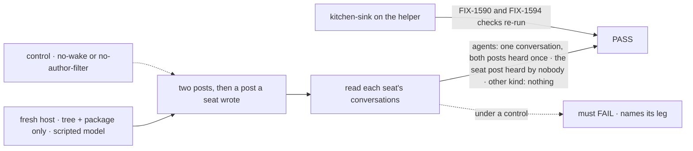
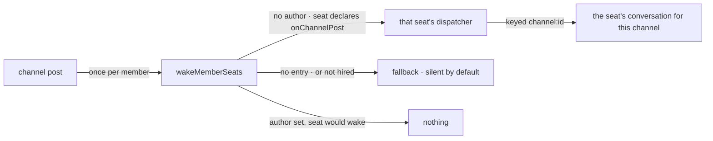

# FIX-1602 · Workforce: stock channel→agent notify fan-out (promote out of kitchen-sink)

**Spec** · [Decisions](DECISIONS.md) · [Rules](BUSINESS-RULES.md) · [Plan](PLAN.md) · [Docs](DOCS.md) · [Evolution](EVOLUTION.md)

Feature · `workforce` + kitchen-sink + `goals/` · medium · 1 PR · epic
[FIX-1592](https://linear.app/fixpoint-labs/issue/FIX-1592) · after FIX-1590 and FIX-1594 ·
blocks the closure, FIX-1601

## Four people, before and after

| Someone who… | Today (FIX-1590 and FIX-1594 merged) | After |
|---|---|---|
| **builds a new app with a channel of agents** | Copies about fifty lines of kitchen-sink's wake | Writes `notify: wakeMemberSeats(seats)`. Each agent member runs once per post |
| **writes a kind that should hear posts** | Adds it to their copied kind table, or it never wakes | Declares the `onChannelPost` entry. Nothing to register |
| **lets an agent answer in the channel** | Wakes nobody, if the copy kept the author rule | Wakes nobody. The rule ships in the package, with no off switch |
| **grades the epic's closure** | Grades kitchen-sink's private copy | Grades the helper every app calls |

Jake, on [#2290](https://github.com/fixpoint-labs/flow-state-dev/pull/2290): kitchen-sink installs
too much for a stock integration.

## The goal, and how we'll know it's met

**A host with none of kitchen-sink's code wakes each member agent seat once per post, and never on
a seat's own post, by calling one Workforce helper, and kitchen-sink runs on that same helper.**

| Is it the right goal? | |
|---|---|
| **The real need** | The issue, on Jake's call: the host glue *"will be copied by every real app"*. His follow-up: kitchen-sink moves onto it here, so the closure tests what users copy |
| **Smaller, and rejected** | "The guide has a recipe." That recipe is the copy. "The helper is exported" falls short too: kitchen-sink could keep its own router, and FIX-1601 would grade code nobody else runs |
| **Bigger, and not this issue's** | Runtime hires waking without a reboot · verified authorship ([FIX-1493](https://linear.app/fixpoint-labs/issue/FIX-1493)) · agents waking each other |
| **Not done if** | The fresh host builds its own router · the check reads the router, not the seats · only a custom kind passes · kitchen-sink still builds its own wake · a control never failed |



The check reads what each seat heard. Each control removes one half of the promise and must fail
that half.

| How we verify | |
|---|---|
| **Goal check** | `goals/workforce-channels/a-fresh-host-wakes-its-member-agents/`, in-process, run by the implementer at completion, verdict in the implementation PR. Kitchen-sink's leg: FIX-1590's and FIX-1594's checks, re-run on the thinned app and at closure |
| **Model** | Scripted, keyless ([epic D3](../../epics/FIX-1592/DECISIONS.md#d3)) |
| **Signal** | Each agent member holds one conversation for the channel: both person posts heard once, a reply to each. The seat's post adds no turn anywhere. The other member holds nothing. The host file imports only `@flow-state-dev/*` and builds no dispatcher or router. Kitchen-sink's notify module calls the helper and builds neither |
| **Input** | A tree: two agent seats, one seat whose kind has only a public action, one channel. Renamed folders must still pass |
| **Anti-game** | Not the router's output, a dispatch handle or a unit test |
| **Control that must fail** | `GOAL_CONTROL=no-wake`: no notify block; the woken leg fails. `GOAL_CONTROL=no-author-filter`: the host strips `author` before the helper; the seat-post leg fails. Today's `main` fails leg 0: nothing to import |

## What changes


Read the dashed line. Above it is what each app writes. After, that is one call, and kitchen-sink
points at the same helper as a new app.

**What a host writes:**

```diff
  const seats = hireWorkforce(workers, { kinds });
- const notify = notifyFor(seats)   // ~50 lines copied from kitchen-sink
+ const notify = wakeMemberSeats(seats)   // or wakeMemberSeats(seats, { fallback })
  channelInstances(channels, { kinds: { channel: defineChannelFlow({ notify }) } });
```

**What a kind author writes, to be woken:**

```diff
  defineFlow({ kind: "triager", actions: { run },
+   internal: { actions: { onChannelPost: { inputSchema: channelNotifyInputSchema, block: triage } } },
  });
```

## How a post reaches a seat



The package already runs the fan-out. The helper decides, per member, who wakes.

## What stays as it is

- The notify slot, the post contract and the fan-out. No core or engine change.
- What a seat hears (FIX-1590) and how it replies (FIX-1594).
- Kitchen-sink's `SEAT_ASKS` map, name-only line, controls and goal harness stay in the app. Only
  the map's `wake` column goes.
- Existing seat conversations continue: the key is unchanged.

## Sign off

**[The goal](#the-goal-and-how-well-know-its-met), at that size.** If wrong: every app still
copies the glue, or the closure grades a path nobody else runs.

1. **[D1](DECISIONS.md#d1) · One exported helper handed to the existing notify slot, not an option
   on `channelInstances`.** If wrong: hosts keep one line of wiring the package could have done
   for them.
2. **[D2](DECISIONS.md#d2) · A seat wakes if its kind declares `onChannelPost`, read off the hired
   seat. No kind table.** If wrong: every wakeable kind is tied to that name, and renaming it breaks
   them.
3. **[D3](DECISIONS.md#d3) · Kitchen-sink moves onto the helper in this issue**, the owner's call.
   If wrong: the epic's wrap waits on this issue.

**Open: none.** Number 2 is the one to weigh: it names a public convention. Known trade-off from
#2290: authorship is unverified until FIX-1493, so a claimed `author` can withhold that post's
wakes. Reasoning: [DECISIONS.md](DECISIONS.md). Cases: [BUSINESS-RULES.md](BUSINESS-RULES.md).
