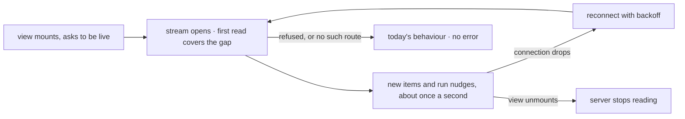

# FIX-1609 · Business rules

[Spec](SPEC.md) · [Decisions](DECISIONS.md) · **Rules** · [Plan](PLAN.md) · [Docs](DOCS.md) · [Evolution](EVOLUTION.md)

The cases, as rules. *Proved by* is the check the plan runs. "A live view" is a session view that
asked for `live: true`; "a run" is background work under that session.

## What a live view shows

| # | When | Then | Proved by |
|---|---|---|---|
| BR-1 | A request the view didn't send keeps an item in the session: a seat's line, a post from another tab | It shows in the view, whole, within about a second of being kept. No reload. After a reload it shows once, in the same place | Goal check (line, once) · V1 · V3 |
| BR-2 | The item is one a snapshot would hide: a transient, a trace, anything not meant for the client | Never sent. A live view and a reload show the same set | V2 |
| BR-3 | A request the view sent | Its items come on its own stream, as today. The live copy is dropped by item id. Each shows once | Goal check (once) · V3 |
| BR-4 | The same session is open live in two tabs, or by two people | Each shows every line, from either tab or any seat | V1 · V3 |
| BR-5 | Two requests keep items at about the same time | The view orders them as a reload would | V3 |
| BR-6 | An item changes after it was sent | Not resent. It shows at the view's next snapshot read: a reload, or the end of a request the view sent | V3 |

## Who is working

| # | When | Then | Proved by |
|---|---|---|---|
| BR-7 | A run under the session starts | Within about a second the view's run list shows it unfinished, and kitchen-sink shows `<seat> is working` | Goal check (working) · V1 · V4 |
| BR-8 | The run finishes, however it ends | "Working" goes within about a second. Any line it kept stays | Goal check · V4 |
| BR-9 | The run stops for an approval, or its worker dies | It reads as working until it finishes or is swept ([D3](DECISIONS.md#d3)) | V4 |
| BR-10 | Two seats work on one post | Two rows, each clearing on its own | V4 |
| BR-11 | A run has no recorded flow | Shown as background work, not a seat | V4 |

## The connection

| # | When | Then | Proved by |
|---|---|---|---|
| BR-12 | A view mounts while a line is being kept | Nothing is lost between the snapshot and the stream: the stream's first read covers the gap | V1 · V3 |
| BR-13 | The connection drops: the network, a serverless time limit, a restart | The client reconnects with backoff, re-reads, and the view shows only what it didn't hold. Nothing twice | V1 · V3 |
| BR-14 | The view unmounts or the page closes | The server's reads for it stop with the connection | V1 |
| BR-15 | The caller may not read the session, or it doesn't exist | Refused exactly as the snapshot refuses. Nothing streamed | V1 |
| BR-16 | The server has no session stream (an older version) | The view behaves as today, with no error shown, and doesn't retry in a loop | V3 |
| BR-17 | The seat's reply is written on a different server from the one holding the view | It arrives the same way: every server reads the shared store | V1, two engines on one store |
| BR-18 | A view without `live` | Opens no stream and makes no new reads | V3 · VG under `no-live` |

One loop per open view, and every way out of it is quiet. A refusal leaves the view as if it
never asked.

## What doesn't move

| # | When | Then | Proved by |
|---|---|---|---|
| BR-19 | A request is delivered into the session | It still doesn't become the session's latest request. A reload resumes as today | V1 · the existing resume tests |
| BR-20 | Kitchen-sink's channel or seat panel is open | Live, with no timer, poll or remount of its own | Goal check (no-poll) · V4 |
| BR-21 | The assistant chat in kitchen-sink | Unchanged: not live | V4 |

## Failure taxonomy

Nothing on the stream is fatal to the view. A failed read on the server ends the connection, and
the client reconnects with backoff. A refusal, a missing route or an unbuilt one leaves the view
as it would be without `live`. A failed re-read of the runs marks the list stale, as today, and
the rows stay on screen.

## Acceptance criteria this issue owns

[The goal](SPEC.md#the-goal-and-how-well-know-its-met), with today's `main` and `no-live` each seen
to fail. The kitchen-sink checks of FIX-1590, FIX-1594 and FIX-1602, and the talk-from-page e2e,
stay green (epic ER-18).
