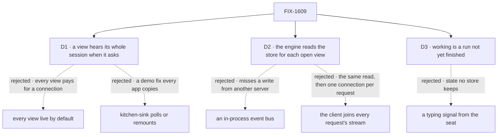

# FIX-1609 · Decisions

[Spec](SPEC.md) · **Decisions** · [Rules](BUSINESS-RULES.md) · [Plan](PLAN.md) · [Docs](DOCS.md) · [Evolution](EVOLUTION.md)

The epic put the fix in the framework, in its own words, with "working" read from the session's
unfinished runs ([epic D4](../../epics/FIX-1592/DECISIONS.md#d4)). These cards decide who gets it,
how the server finds what is new, and what "working" promises.

## The tree

Solid edges are what you're signing. Dashed edges lost, and the label says why.

## D1 · A view hears its whole session only when it asks: `useSession(id, { live: true })`. Without it, nothing new opens

| | |
|---|---|
| **Instead of** | Every session view live by default · or kitchen-sink polling or remounting the panel |
| **Because** | Most views show one person's conversation, which the request stream already covers. A live view holds a connection as long as the page is open: function time and reconnects on serverless, and one of the few connections a browser allows per host. Asking puts that cost where it's needed. A kitchen-sink poll teaches the wrong fix |
| **Locks in** | A public option, with a session stream in the client beneath it. An app showing a shared session that doesn't ask sees today's behaviour, not an error, and may not notice. Flipping the default later changes every app |

**What would change my mind:** most apps turn out to show sessions several writers share. Then
live should be the default, and a one-person view should opt out.

## D2 · The engine builds the stream from the store: about once a second per open view, it reads the session's requests and runs and sends what is new. No new store capability, nothing in-process

| | |
|---|---|
| **Instead of** | An in-process bus that request writers publish to · a push path in each store · the client joining every request's own stream |
| **Because** | The store is the one thing every server shares; the request stream already follows other servers through it, mostly by polling. An in-process bus misses a reply written by another instance, the serverless case. A session-wide push path is a new verb in every store adapter. Joining every request stream needs the same read, then a connection per request |
| **Locks in** | Each open live view costs two small store reads a second, whether or not anything happened. A line shows up to about a second after it is kept. A push path can replace the loop later without changing the route, the events or the hook |

**What would change my mind:** a deployment expecting hundreds of open live views on one database.
Then the push path comes first.

## D3 · "Working" is a run under the session that hasn't finished, named by the run's flow

| | |
|---|---|
| **Instead of** | A typing or heartbeat signal a seat sends while it thinks · counting requests in flight |
| **Because** | A session already lists its runs, each finished or not. A thinking seat has an unfinished run. A typing signal would be state no store keeps. The React guide says never to call an unfinished run "working": right for a list read once. In a live view the row clears when the work ends, so "working" reads as "hasn't answered yet" |
| **Locks in** | A run waiting on an approval, or whose worker died unswept, reads as working until it ends or is swept. The guide's rule gets a stated exception for live views |

**What would change my mind:** seats that routinely stop mid-answer for approval. Then "waiting"
needs its own label, read from the suspension the run already records.

## Decided, not asked

- **Finished items only, each sent once**, through the snapshot's filter. An item changed after
  sending shows at the next snapshot read.
- **No item cursor.** The client hands back the last server time it heard; the server re-reads
  generously from there, and the hook drops what it holds, by item id.
- **Runs arrive as a nudge**; the hook re-reads them through its existing guarded read.
- **A request the view sent still streams on its own connection**, and each item shows once.
- **A delivery still doesn't become the session's latest request**; `isStreaming` still means this
  view's own request.
- **Kitchen-sink's rail panel goes live**; its assistant chat doesn't.
- **Names come from the run's flow** until FIX-1611 names the roster.
- **The option is `live`**, though items carry a wire flag of that word. Apps never write the flag.
- **One PR.** The goal check needs every layer.

## Considered and dropped

| Alternative | Why not |
|---|---|
| Stamp a delivered request as the session's latest | The open view still hears nothing. Only a view mounted later sees it, by resuming the seat's request as its own |
| Build the per-user stream instead | A channel is a session; a user stream carries every session the user can see |
| A per-session sequence in the request event log | Needs a sequence shared across servers that no store has |
| Follow each request's event log on the server | Still needs the read that finds new requests, then a subscription per request |
| Re-read the whole snapshot on each change | Heavier than D2's read, paid again on every line |

## How it got here

- **Draft** — framed on epic D4 and its note preferring finished items and run summaries to every
  request's deltas. No POC: each premise was observed on `main` while diagnosing.

**Open: none.**
