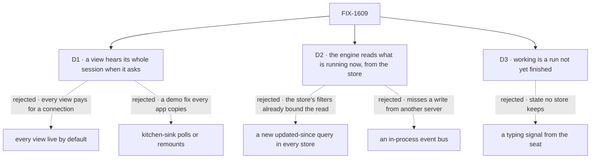

# FIX-1609 · Decisions

[Spec](SPEC.md) · **Decisions** · [Rules](BUSINESS-RULES.md) · [Plan](PLAN.md) · [Docs](DOCS.md) · [Evolution](EVOLUTION.md)

The epic put the fix in the framework, in its own words, with "working" read from the session's
unfinished runs ([epic D4](../../epics/FIX-1592/DECISIONS.md#d4)). These cards decide who gets it,
how the server finds what is new, and what "working" promises.

## The tree

Solid edges are what you're signing. Dashed edges lost, and the label says why.

## D1 · A view hears its whole session only when it asks: `useSession(id, { live: true })`. Without it, nothing new opens

| | |
|---|---|
| **Instead of** | Every session view live by default · or kitchen-sink polling or remounting the panel |
| **Because** | Most views show one person's conversation, which the request stream already covers. A live view holds a connection while the page is open: function time on serverless, and one of the few connections a browser allows per host. Asking puts that cost where it's needed. A kitchen-sink poll teaches the wrong fix |
| **Locks in** | A public option, with a session stream in the client beneath it. An app showing a shared session that doesn't ask sees today's behaviour, with no error, and may not notice. Flipping the default later changes every app |

**What would change my mind:** most apps turn out to show sessions several writers share. Then
live should be the default, and a one-person view should opt out.

## D2 · About once a second per open view, the engine reads what is running now in the session, with filters the store already has

| | |
|---|---|
| **Instead of** | A new "updated since" store query · re-reading the whole session each second · an in-process bus · the client joining every request's stream |
| **Because** | The store is what every server shares. It can't ask "updated since", but it can list a session's unfinished requests, and its requests newest-updated first until one predates the last read. A request's finishing write follows its items and moves its update time, so nothing is missed. Runs likewise: found once at open, then as they start. A bus misses another server's reply |
| **Locks in** | Each second costs what is running now, not the session's history. Opening a view reads every run once. A line shows up to a second after it is kept. A push path can later replace the loop without changing the route, events or hook |

**What would change my mind:** hundreds of live views on one database, or sessions with thousands
of runs. Then a push path first: on Postgres, the notices the request stream already hears could
wake the loop.

## D3 · "Working" is a run under the session that hasn't finished, named by the run's flow

| | |
|---|---|
| **Instead of** | A typing or heartbeat signal a seat sends while it thinks · counting requests in flight |
| **Because** | A session already lists its runs, each finished or not; a thinking seat has an unfinished one. A typing signal would be state no store keeps. The React guide says never to call an unfinished run "working": right for a list read once. In a live view the row clears when the work ends, so "working" reads as "hasn't answered yet" |
| **Locks in** | A run waiting on an approval, or whose worker died unswept, reads as working until it ends or is swept. The guide's rule gets a stated exception for live views |

**What would change my mind:** seats that routinely stop mid-answer for approval. Then "waiting"
needs its own label, read from the suspension the run already records.

## Decided, not asked

- **Finished items only**, through the snapshot's filter, each once per connection. An item
  changed after sending shows at the next snapshot read.
- **No item cursor.** The client hands back the last server time it heard; the server re-reads
  a few seconds before it, and the hook drops what it holds, keyed by request and item id.
- **A nudge names the unfinished runs**, and the hook keeps them past its page.
- **A live stream closes within 15 minutes** and reconnects, re-checking access.
- **A request the view sent still streams on its own connection**, and each item shows once.
- **A delivery still doesn't become the session's latest request**; `isStreaming` still means this
  view's own request.
- **Kitchen-sink's rail panel goes live**; its assistant chat doesn't.
- **Names come from the run's flow** until FIX-1611 names the roster.
- **The option is `live`**, though items carry a wire flag of that word. Apps never write the flag.
- **One PR.** The goal check needs every layer.

## Considered and dropped

| Alternative | Why not |
|---|---|
| Stamp a delivered request as the session's latest | The open view still hears nothing. Only a view mounted later sees it, by resuming the seat's request as its own |
| Build the per-user stream instead | A channel is a session; a user stream carries every session the user can see |
| A per-session sequence in the request event log | Needs a sequence shared across servers that no store has |
| Follow each request's event log on the server | Still needs the read that finds new requests, then a subscription per request |
| Re-read the whole snapshot on each change | Heavier than D2's read, paid again on every line |
| Wake the loop from Postgres's request notices | Not in v1; the first upgrade when D2's cost bites |

## How it got here

- **Draft** — framed on epic D4 and its note preferring finished items and run summaries to every
  request's deltas. No POC: each premise was observed on `main` while diagnosing.
- **Review round 1** — D2 names its reads: the store can't ask "updated since" (Codex, Cursor).
  Unfinished runs past the list's page stay working (Codex).

**Open: none.**
