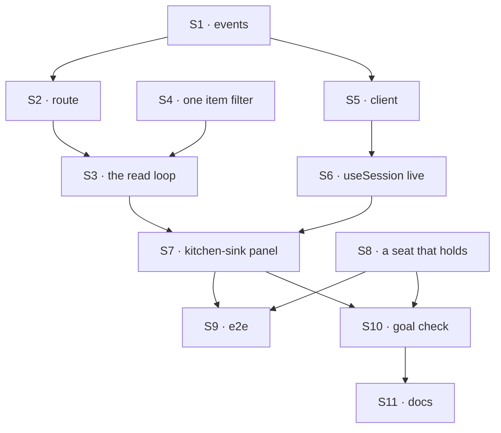

# FIX-1609 · Plan

[Spec](SPEC.md) · [Decisions](DECISIONS.md) · [Rules](BUSINESS-RULES.md) · **Plan** · [Docs](DOCS.md) · [Evolution](EVOLUTION.md)

For the implementing agent. IDs cite [BUSINESS-RULES.md](BUSINESS-RULES.md) (BR-n) and
[DECISIONS.md](DECISIONS.md) (D-n). `tdd`. One PR, from `main`, beside FIX-1610.

## Surfaces

| ID | Package · role | Change | Rules |
|---|---|---|---|
| S1 | `contracts` · stream event unions | A session union beside the request and user ones: a finished item with its request id; a runs-changed nudge naming the unfinished runs (id, flow, labels); a ping; each with the server's time | BR-1 BR-7 BR-13 BR-23 |
| S2 | `engine` · route table, parser, route-auth | `GET /sessions/:sessionId/stream`, in the snapshot's route-auth class | BR-15 |
| S3 | `engine` · a handler beside the request stream | The sketch's loop, per connection (D2): each finished item passing S4 sent once, keyed by request and item id; unfinished runs tracked, a nudge when they change; ping; stop on abort; close at 15 minutes. Snapshot's tenant and org filters; request stream's SSE framing | BR-1 BR-2 BR-4 BR-12 BR-14 BR-17 BR-19 BR-22 BR-23 BR-24 |
| S4 | `engine` · the snapshot's item filter | Lift it (canonical-log collapse, then client visibility) into one function the snapshot and S3 both call. Snapshot output unchanged | BR-2 |
| S5 | `client` · session stream client | Open with `since`, parse S1, reconnect with backoff carrying the last server time, stop quietly on 404, 501, 401 or 403. Documents that a reconnect can repeat an item. Exported | BR-13 BR-15 BR-16 BR-24 |
| S6 | `react` · `useSession` | `live?: boolean`. True: open S5 after the snapshot; merge items by request and item id in reload order; on a nudge, re-read the run page through the guarded read, keeping the nudged unfinished runs; close on unmount or session change. False: nothing. `isStreaming` and `autoResume` untouched | BR-1 BR-3 BR-5 BR-6 BR-13 BR-18 BR-22 BR-23 |
| S7 | kitchen-sink · the rail panel (`app/page.tsx`) | `live: true` on the picked session. A `<flow> is working` row per unfinished run (D3). `GOAL_CONTROL=no-live` drops `live` under `KITCHEN_SINK_TEST_MODE=1` | BR-7 to BR-11 BR-20 BR-21 |
| S8 | kitchen-sink · the one script file | A seat scenario holding its answer about three seconds before its text step | the goal |
| S9 | kitchen-sink · e2e | A no-reload case beside talk-from-page | BR-1 BR-7 |
| S10 | `goals/kitchen-sink-talk/shows-the-reply-without-a-reload/` | `goal.md`, fixtures, `run.mts`: legs working, line, once, no-poll; both controls | the goal |
| S11 | Docs, changesets | Per [DOCS.md](DOCS.md). `patch` for contracts, engine, client and react: all additive (AGENTS.md) | — |

Nothing removed; the per-user stream stays unbuilt. Nothing in `workforce` (epic ER-8).

## Sequence



## Checks

| ID | Runs after | Passes when |
|---|---|---|
| V1 | S3 | Real in-process engine, **on the memory, filesystem, SQLite and Postgres stores**: BR-1 within 2 s, from a request still running and from one that finished between reads; BR-4; BR-12; BR-14 no reads after abort; BR-15 refusals match the snapshot's; BR-17 **two engines on one store**; BR-19; BR-22; BR-23 with more runs than one page; BR-24; BR-7 a run starting and ending each nudges |
| V2 | S4 | For a session holding every item kind the fixtures know, streamed ids equal the snapshot's. Red first: S3 without S4 fails it |
| V3 | S6 | Hook tests on a fake stream: BR-3, BR-13 no duplicates; BR-5; BR-6; BR-22; BR-23 a nudged run the page lacks stays; BR-16 a 404, no error, no retry; BR-18 no stream, no extra reads |
| V4 | S7 | Panel tests: BR-7 to BR-11 from run rows; BR-20 no interval, poll or remount; BR-21 |
| V5 | S9 | Passes, and fails on today's `main` |
| VG | S10 | [The goal](SPEC.md#the-goal-and-how-well-know-its-met) PASSES after FAILING on today's `main` and under `GOAL_CONTROL=no-live`, each at **working** and **line** only. FIX-1590's and FIX-1594's kitchen-sink checks and talk-from-page stay green |

One check per decision: D1 is V3's BR-18 with VG's `no-live`; D2 is V1 across the four stores,
the two-engine case and BR-14; D3 is V4's BR-9. Second path (BP-035): BR-16 an older server,
BR-13 a drop, BR-15 a foreign session, BR-14 cancel, BR-24 a revoked caller.

## Pinned names

| Where | Name | Why pinned |
|---|---|---|
| `useSession` option | `live` | Public. D1 |
| Route | `GET /api/flows/sessions/:sessionId/stream` | Public, beside `/children` and `/state` |
| Goal path | `goals/kitchen-sink-talk/shows-the-reply-without-a-reload/` | The closure cites it |
| Control | `GOAL_CONTROL=no-live` | The check's control |
| Kitchen-sink text | `<seat> is working` | The check reads it; FIX-1611 may rename and re-point |

Everything else is yours, including the event types and the client export.

## Guardrails

| Rule | Because |
|---|---|
| No channel, seat, post or notify word below Workforce | Epic ER-8 |
| One item filter for snapshot and stream | A live line a reload hides can't be reproduced (BR-2) |
| Existing store verbs; each read covers what is running now, never the whole history | D2. Cost grows with activity, not age |
| The floor trails each read's start by a few seconds | Clock skew, write latency, rows moving while paging. A repeat costs one lookup |
| No `live`: no connection, no reads | D1, BR-18 |
| The loop is bounded and dies with its connection | BR-14. A leaked loop is a cost nobody sees |
| Leave the latest request and `isStreaming` alone | BR-19. Resume and the composer depend on them |
| Don't touch Workforce's channel flow, agent worker or post capability | FIX-1610 owns them, in parallel |
| No timer, poll or remount in kitchen-sink | The anti-game; the fix epic D4 rejected |
| Authorize through route-auth, as the snapshot | BP-031 |

## Docs

Reconcile [DOCS.md](DOCS.md) against what shipped after VG passes; publish it in the same PR.

## Sketch · pseudocode, illustrative, react to the shape

```
GET /sessions/:id/stream?since=<server time>              ← authorized like the snapshot
    sent = {} of (requestId, itemId) ; open = the session's unfinished runs, one pass at open
    floor = since less a margin, or the last minute when absent
    about once a second, for at most 15 minutes:             ← D2, BR-24
        start = now
        requests = the session's in-progress and suspended requests
                 + its requests newest-updated first, paged until one is older than floor
        for item in snapshotFilter(requests) where finished and (requestId, id) not in sent:
            send item(requestId, item, at: start) ; sent += (requestId, id)
        open += runs under the session newest-updated since floor   ← a run moves when it starts
        open -= runs in open whose latest request has finished
        if open changed: send runs-changed(open, at: start) else now and then: ping(at: start)
        floor = start less a margin
    close · the client reconnects with since = the last `at` it heard
```

**POC:** none built. Each premise was observed on `main` while diagnosing (2026-09-26); none is a
counted factual base.

## At implement time

- FIX-1610 changes the channel flow and agent worker. Re-run the kitchen-sink checks on your `main`.
- The script file is shared (epic ER-7) with FIX-1610's scripted evaluation. Add the hold beside
  it, not a second resolver.
- Check the indexes behind the reads on SQLite and Postgres. Settled in review: only the
  filesystem store moves a request's update time on an item write; the finishing write moves it
  everywhere.
- Check a seat's run records the seat's address as its flow.
- Open PR #2080 edits the same React docs and README; rebase if it lands first.
- Compare [Evolution](EVOLUTION.md)'s sources with `main`.

## Notes from review

- "consider documenting one invariant up front: e.g. session stream owns **foreign** finished items only, while the existing request client owns the in-flight send — still one dedupe set, but less ordering merge logic." — cursor ([thread](https://github.com/fixpoint-labs/flow-state-dev/pull/2313#discussion_r4116407503))
- "Diff cheap run rows for `runs-changed` nudges; let S6’s existing `refreshChildSessions` pay for full status on nudge only" — cursor ([thread](https://github.com/fixpoint-labs/flow-state-dev/pull/2313#discussion_r4116407514))
- "**no-poll** applies to kitchen-sink / caller-driven snapshot polling, not to the server’s internal store read behind `live` SSE" — cursor ([thread](https://github.com/fixpoint-labs/flow-state-dev/pull/2313#discussion_r4116407516))

These are inputs, not instructions. Adopt, adapt, or discard.

## Follow-ups

- Resend items changed after sending (BR-6).
- The DevTool's session view on this stream.
- A push path when D2's cost bites: on Postgres, wake the loop from the request notices the
  request stream already listens to.
