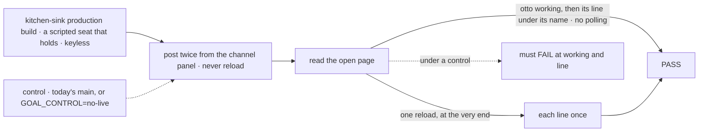
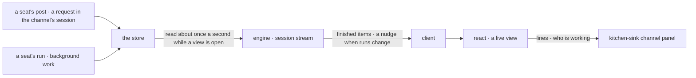

# FIX-1609 · A channel shows a seat's reply only after a reload, with no sign anyone is working

**Spec** · [Decisions](DECISIONS.md) · [Rules](BUSINESS-RULES.md) · [Plan](PLAN.md) · [Docs](DOCS.md) · [Evolution](EVOLUTION.md)

Feature · `contracts` + `engine` + `client` + `react` + kitchen-sink + `goals/` · large · 1 PR ·
epic [FIX-1592](https://linear.app/fixpoint-labs/issue/FIX-1592) · beside FIX-1610 · blocks
FIX-1611, FIX-1601

## Five people, before and after

| Someone who… | Today | After |
|---|---|---|
| **posts in a channel and waits** | Sees their own line, then nothing until they reload | Sees `support.otto is working` within about a second, then otto's line. No reload |
| **has the channel open in another tab** | Sees nothing new, not even their own post | Sees each line as the channel keeps it |
| **shows a channel, or any shared session, in an app** | Polls or remounts | Adds `live: true` to `useSession`: the view hears the whole session and its running work |
| **builds a one-person chat app** | Hears the requests it sends | The same. Nothing new opens unless the view asks |
| **grades the epic's leg a** | Grades checks that reload before they read | Grades a check that never reloads, red on today's `main` |

The cause is below the app: a view hears only requests it sent, and a seat's answer is another
request in the channel's session.

## The goal, and how we'll know it's met

**In an open channel view, with no reload, a person sees which seats are working on their post
and then each seat's reply as the channel keeps it, and any app showing a shared session gets the
same by asking for it.**

| Is it the right goal? | |
|---|---|
| **The real need** | Epic [ER-23](../../epics/FIX-1592/BUSINESS-RULES.md): *"an open channel view shows other requests' lines and who is working, with no reload"*, fixed in the framework by the owner's call ([epic D4](../../epics/FIX-1592/DECISIONS.md#d4)) |
| **Smaller, and rejected** | The reply without "working": silence while a seat thinks. Or a kitchen-sink poll: the demo fix D4 rejected |
| **Bigger, and not this issue's** | Word-by-word answers · one seat per post, an answer that always lands (FIX-1610) · roster names, re-pointed checks (FIX-1611) · the closure (FIX-1601) |
| **Not done if** | The check reloads first · the page polls or remounts · only one of "working" and the line shows · only kitchen-sink changed · no control failed |



The check reads the open page, never the wire, and reloads only at the end. Under either control
the page stays silent.

| How we verify | |
|---|---|
| **Goal check** | `goals/kitchen-sink-talk/shows-the-reply-without-a-reload/` · real browser · the implementer at completion (else `fsd-qa`) · verdict in the implementation PR |
| **Model** | n/a: the scripted model ([epic D3](../../epics/FIX-1592/DECISIONS.md#d3)), keyless. One seat holds its answer about three seconds, so "working" can be seen |
| **Signal** | Per post. **working**: `support.otto is working` before otto's line. **line**: within 15 s of Send, one line with the token under `support.otto`; "working" gone once the run ends. **once**: after the final reload, each line once. **no-poll**: at most two snapshot reads between Send and the line |
| **Input** | `support.desk`, two posts with fresh tokens, the second while otto works. Another channel or seat must pass too |
| **Anti-game** | No reload before the last leg. Nothing asserted on the wire, a hook's return, a package test or a CLI |
| **Control that must fail** | Today's `main`, and `GOAL_CONTROL=no-live` (the panel doesn't ask to be live). Both FAIL at **working** and **line** only, before the PASS counts |

## What changes


Same post. After, the view asks to be live and hears the whole session.

**What an app writes:**

```diff
  const channel = useSession(sessionId, {
    flowKind: "support.desk",
    items: true,
    autoResume: true,
+   live: true,   // hear requests this view didn't send, and runs still going
  });
+ const working = channel.childSessions.filter((run) => run.status === "active");
```

**By hand, against the server:**

```diff
+ GET /api/flows/sessions/<sessionId>/stream
+ // each finished item from any request in the session, once, and a nudge when its runs change
```

## How a seat's reply reaches the page



The engine reads the store for each open view and sends what is new. No writer knows anyone is
watching, so one server or several behave alike.

## What stays as it is

- A view that doesn't ask to be live opens and reads nothing new.
- A delivered request doesn't become the session's latest; a reload resumes as today.
- The per-user stream stays unbuilt.
- How a post wakes a seat and how its answer lands, which FIX-1610 changes.
- The reload checks, which FIX-1611 re-points.

## Sign off

**[The goal](#the-goal-and-how-well-know-its-met), at that size:** the line and "working", no
reload, in the framework. If wrong: leg a stays red, or every app that shows a channel writes its
own poll.

1. **[D1](DECISIONS.md#d1) · A view hears its whole session only when it asks, with `live: true`.**
   If wrong: shared views must know to ask. Flipping the default later changes every app.
2. **[D2](DECISIONS.md#d2) · The stream reads the store about once a second per open view, with
   no new store capability.** If wrong: many open views pay for reads that mostly find nothing.
3. **[D3](DECISIONS.md#d3) · "Working" is a run that hasn't finished.** If wrong: a run waiting on
   an approval, or one that died and hasn't been swept, reads as working.

**Open: none.** Number 1 is the one to weigh. Reasoning: [DECISIONS.md](DECISIONS.md). Cases:
[BUSINESS-RULES.md](BUSINESS-RULES.md).
