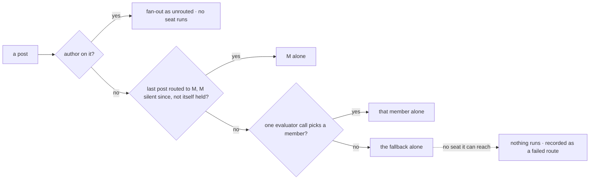

# FIX-1610 · Business rules

[Spec](SPEC.md) · [Decisions](DECISIONS.md) · **Rules** · [Plan](PLAN.md) · [Docs](DOCS.md) · [Evolution](EVOLUTION.md)

The cases, as rules. *Proved by* is the check the plan runs. "A person's post" is one with no
`author`; "routed" means the channel declares `routing:`.

## Who a post runs, in a routed channel

| # | When | Then | Proved by |
|---|---|---|---|
| BR-1 | A person's post arrives, and their last post was routed to M by the evaluator or the fallback, with no line from M since | M runs alone. No evaluator call. Recorded as held | Goal check · V2 |
| BR-2 | Any other person's post | One evaluator call over the recent lines and the post: one `choice` among the members with a seat that hears posts and the caller can reach (the wake's test), each described by its `WORKER.md` `description:`. Its pick runs alone, recorded as evaluated | Goal check · V2 · POC |
| BR-3 | The call fails, errors, or answers outside the options | The fallback member runs alone. Recorded as fallback, with the reason. The post itself never fails | Goal check · V2 |
| BR-4 | The last post was itself held, or its route isn't recorded yet (two posts close together) | No hold. BR-2 | V2 |
| BR-5 | A person follows up after M's answer | BR-2, with M's line among the recent lines | Goal check · POC L4 |
| BR-6 | The fallback can't run: the caller reaches none of its seats that hear posts, or it isn't among the open channel's members | Nothing runs; the route is recorded as failed, with the reason. Never a silent post with no specialist | V2 |
| BR-7 | Any routed post | No other member receives it, agent or not. At most one evaluator call | Goal check |
| BR-8 | A post carries an `author` (a seat wrote it) | No route, no call. It fans out as in an unrouted channel, where no seat runs (ER-3) | Goal check · V2 |
| BR-29 | Every route: held, evaluated, fallback or failed | A `channel-route` item on the channel's session, never a line. The shipped chat registry and kitchen-sink's copy name it `false` | V2 · V6 |

Three questions, in this order. The author check comes first so a seat's line never costs a call.

## What lands

| # | When | Then | Proved by |
|---|---|---|---|
| BR-9 | The routed member's turn ends with reply text, and the seat posted nothing for this post | The reply is posted into the channel as the seat, checked as a `post` is: `author` is its `seatId`. Exactly one line | Goal check · V3 |
| BR-10 | The turn calls the post tool for this channel, once or more | The first call is the line; later ones for that post post nothing and say the answer was handed over, and nothing lands after, unless the channel took the tool's answer and could not keep it, when the turn's reply is the line. The channel keeps one answer per post, keyed on the post's id, so a second delivery lands no second line, and a hand-off refused before or by the channel leaves the post to be answered | V3 |
| BR-11 | The turn ends with an empty reply | Nothing is posted. The run ends as a failed answer, recorded in the seat's conversation | V3 |
| BR-12 | The landed line reaches the fan-out | It carries an `author`, so BR-8: no seat runs, no route | Goal check |
| BR-13 | A routed post's heard turn | Says the reply is posted to the channel. An unrouted post's turn is byte for byte FIX-1590's | V3 |
| BR-14 | The same seat is woken in an unrouted channel, or talked to directly | Unchanged: it answers in a channel only by calling the tool | Goal check · V3 |

## What the routed specialist sees

| # | When | Then | Proved by |
|---|---|---|---|
| BR-24 | Any routed delivery: held, evaluated or fallback | The fan-out hands the member the last 20 lines before the post, the ones the route read. The turn gets them as context, whoever wrote them and whoever they went to | Goal check · V3 |
| BR-25 | That turn ends | The stored conversation keeps the heard turn and the answer, not the lines. The run's trace records them; no turn reads it | Goal check · V3 · POC |
| BR-26 | An unrouted post, direct talk, or the public `run` action | No lines. `run` takes none: only the fan-out sets them | V3 |
| BR-27 | Fewer than 20 lines before the post | The ones there are; none on a channel's first post | V3 |

## Declaring a routed channel

| # | When | Then | Proved by |
|---|---|---|---|
| BR-15 | `CHANNEL.md` declares `routing:` with `fallback: <member>`, on a kind built with a route | The channel is routed | V1 |
| BR-16 | The fallback isn't among `members:`, `fallback:` is missing, a subkey is unknown, or `routing:` isn't a mapping | Refused at bind, naming the channel and the key | V1 |
| BR-17 | `routing:` on a channel whose kind was built without a route | Refused at bind | V1 |
| BR-18 | No `routing:` line, on any kind | Unrouted: every agent member runs (ER-2) | Goal check · V1 |
| BR-19 | `routing:` added to, changed in or removed from the file of a channel already open | Takes effect at the next boot, the channel's session and lines kept: the line is read at every boot, as `boards:` is, never stored | V1 |
| BR-28 | The fallback is a member, but no seat the kind's route was built with hears posts for it | Refused at bind, naming the channel and the member | V1 |

## The model, and the scripts

| # | When | Then | Proved by |
|---|---|---|---|
| BR-20 | The app names the model to `routeByPurpose` as a string | It resolves through the app's resolver as an evaluation model | V2 |
| BR-21 | The model can't evaluate: a chat model named as a string through the gateway, or the cheap model through the adapter | Every call fails, so every post goes to the fallback, recorded. Never a crash | V2 · POC |
| BR-22 | A test resolver scripts evaluations | Keyed on the block name `channel-route`; the script may answer from the state it is handed | V4 |
| BR-23 | Kitchen-sink's one script file (ER-7) | `[route:<member>]` in a post picks that member; anything else fails the call. `[scenario:wake]` answers in text and never calls the post tool | V5 |

## Failure taxonomy

Nothing is fatal to a post. A failed call goes to the fallback; a fallback that can't run is a
failed route, and nothing runs. A failed answer is no line, recorded in the seat's run. A failed
delivery is recorded on the fan-out, as today. Every route is recorded, never as a line.

## Acceptance criteria this issue owns

[The goal](SPEC.md#the-goal-and-how-well-know-its-met), with each control seen to fail. Epic
ER-21 and ER-22 at package level; FIX-1601's leg b and smoke grade them in kitchen-sink after
FIX-1611. `a-fresh-host-wakes-its-member-agents` stays green (ER-2, ER-3).
