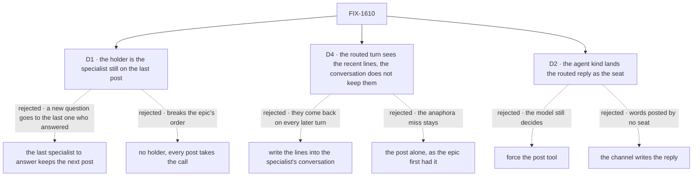

# FIX-1610 · Decisions

[Spec](SPEC.md) · **Decisions** · [Rules](BUSINESS-RULES.md) · [Plan](PLAN.md) · [Docs](DOCS.md) · [Evolution](EVOLUTION.md)

The epic decided the shape ([D5](../../epics/FIX-1592/DECISIONS.md#d5),
[D6](../../epics/FIX-1592/DECISIONS.md#d6)). These cards decide what holding the case means, what
the routed specialist sees, and where its answer lands. D3 is *decided, not asked*: three cards is
the ceiling.

## The tree

Solid edges are what you're signing. Dashed edges lost, and the label says why.

## D1 · The specialist holding the case is the one still on the person's last post, with no line from it since. Every other post takes the one evaluator call

| | |
|---|---|
| **Instead of** | (a) The last specialist to answer keeps the next post · (b) no holder: every post takes the call |
| **Because** | A rule over the lines can't tell a follow-up from a new question: (a) sends epic leg b's account question to `devices`. The evaluator, handed the lines, kept the POC's follow-up 6 in 6 and lost it 6 in 6 without them ([POC](poc/route-choice/README.md)). A rule can see a specialist still working, and routing past it starts a second one on the same person. (b) spends a call on a known answer |
| **Locks in** | A follow-up after an answer depends on the call; if it fails, the fallback takes it, so epic D5's *"a failed call never pulls a follow-up away"* holds only before the answer ([EVOLUTION](EVOLUTION.md)). A second question sent before the first answer goes to the same specialist. A hold is taken once, so a specialist whose answer failed can't keep the channel |

**What would change my mind:** FIX-1601's smoke misrouting an answered follow-up. Then the
question names the last specialist to answer as the default, still one call.

## D4 · A routed specialist's turn sees the channel's recent lines; its conversation doesn't keep them · the owner's call, relayed by the FSD Architect on 2026-09-27, confirmed here

| | |
|---|---|
| **Instead of** | (a) Writing the lines into the specialist's conversation with the post · (b) the post alone, epic D5's trade-off |
| **Because** | On the desk, "where can I buy it?" found no "it". The agent kind sends its model no earlier turn ([POC C1](poc/turn-context/README.md)), so the lines are the only place the referent is. A generator's context slot reaches the model on that turn and is never stored; lines written into the turn are stored and come back on every later turn (C2, red under its control). The fan-out already read the lines to route, so they ride the delivery: one channel log |
| **Locks in** | The specialist still wakes only on its routed posts, but its turn sees what was said to anyone in the last 20 lines, and nothing older. Epic D5's "hears only that post" is lifted for context only ([EVOLUTION](EVOLUTION.md)). Direct talk and unrouted channels are unchanged |

**What would change my mind:** the owner wanting a specialist to remember its case past the
window. That is the agent kind sending its own conversation, to every seat and in direct talk: its
own issue.

## D2 · For the routed member only, the agent kind posts the turn's reply into the channel as the seat, unless the turn already posted there. An empty reply lands nothing

| | |
|---|---|
| **Instead of** | Forcing the post tool on the turn · the channel's route step posting the reply · landing for every woken member |
| **Because** | Epic D6 fixes the outcome; this places it. The agent kind runs the turn and holds the seat's id, and posting into the channel as the seat, checked as a `post` is, keeps the member check, the author rule and the line (ER-3, ER-4). A forced tool call still leaves the words to the model. A channel-side post is a line no seat sent. Landing for every member is five answers. The fan-out marks the delivery, never the post (BP-031) |
| **Locks in** | A routed agent can't stay quiet: an empty reply is a failed answer in its run, never a stock line. A kind of your own gets the mark and decides. Landing needs dispatch in process, like the tool (FIX-1594 D3) |

## Decided, not asked

- **D3 · `routing:` with one subkey, `fallback:`; the app passes
  `routeByPurpose(seats, { model })` as the route.** A bare `fallback:` would read as the
  notify's. The model needs a key and must evaluate (POC), which a file can't check. Only
  `routeByPurpose` makes a route, so the order, the one-call cap and the record hold. One model
  per channel kind. A fallback without a hired seat that hears posts, an unknown subkey, or
  `routing:` on a kind without a route refuses at bind. The line is read from the file at every
  boot, as `boards:` is, and never stored, so it reaches an open channel.
- **One line per routed post:** the seat's first post for it, by the tool or the landing. The
  channel keeps it, one answer per post, so a hand-off the channel never took leaves nothing to
  undo.
- **The window is the last 20 lines**, one constant for the route and the turn.
- **A seat's post takes no route**; it fans out as unrouted, where no seat runs (ER-3).
- **The options are the members with a seat that hears posts and the caller can reach**,
  described by `WORKER.md` `description:` verbatim. Only the pick receives the post.
- **Only the call's own failure, or a pick outside the options, goes to the fallback.** Nothing
  else is caught there.
- **No confidence threshold**: the evaluation model was 0.94–0.96 sure of the wrong member under
  the POC's control.

## Considered and dropped

| Alternative | Why not |
|---|---|
| `cascadingRouter` | One level is enough; it propagates a failed call, where ER-21 wants the fallback |
| `intentRouter`, `intentClassifier` | They pick through a generator (epic D5) |
| Routing inside notify | One call per member |
| The specialist reading the channel at turn time | A read across sessions the seat has no path for |
| A placeholder line while the specialist works | A line no seat wrote; FIX-1609 shows "working" |

## Settled

- **One `evaluator` choice picks the right specialist from the lines and the post**:
  **CONFIRMED**, 30 of 30 on two real models; without the lines the follow-up misrouted 6 of 6
  ([poc/route-choice](poc/route-choice/README.md), [evidence](poc/route-choice/evidence.txt)).
- **A chat model named as a string, or the cheap model, can't evaluate**: **CONFIRMED**.
  Kitchen-sink needs its own route model ([PLAN](PLAN.md#coordination)).
- **A generator's context slot reaches the model on its own turn only and is never stored, even
  when the generator reads its history**: **CONFIRMED**, keyless. The agent kind sends no earlier
  turn ([poc/turn-context](poc/turn-context/README.md), [evidence](poc/turn-context/evidence.txt)).

## How it got here

- **Draft**: POC first. The holder became the in-flight case only.
- **Review round 1**: D4, the owner's call, after a second POC; D3 to *decided, not asked*. Five
  correctness folds: a fallback that can run, one line per routed post, routing read at every
  boot, the route record kept out of threads, a patch changeset.
- **Implementation review**: the one line per routed post moved from a claim in the seat's session,
  given back when a hand-off failed, to the channel, which refuses a second answer in the same
  write that takes the line into its ledger. A route's commit point is the ledger write: a cancel
  after it still wakes the member. The turn's reply goes to the channel even after the tool's
  answer, since a hand-off the channel took is not a line it kept; it lands only when the tool's
  did not.

**Open: none.**
