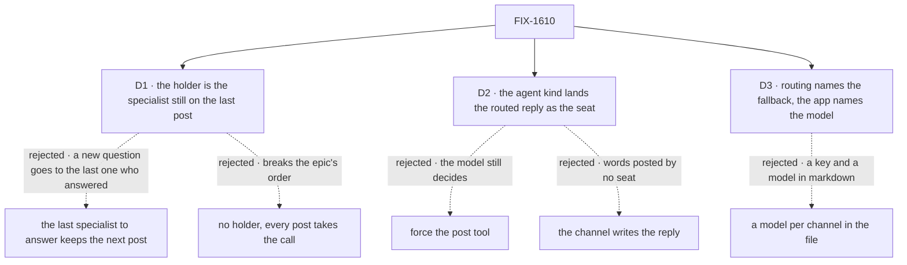

# FIX-1610 · Decisions

[Spec](SPEC.md) · **Decisions** · [Rules](BUSINESS-RULES.md) · [Plan](PLAN.md) · [Docs](DOCS.md) · [Evolution](EVOLUTION.md)

The epic decided the shape ([D5](../../epics/FIX-1592/DECISIONS.md#d5),
[D6](../../epics/FIX-1592/DECISIONS.md#d6)). These cards decide what "holding the case" means,
where the landing lives, and what an app writes.

## The tree

Solid edges are what you're signing. Dashed edges lost, and the label says why.

## D1 · The specialist holding the case is the one still on the person's last post: routed there by the evaluator or the fallback, with no line from it since. Every other post takes the one evaluator call

| | |
|---|---|
| **Instead of** | (a) The last specialist to answer keeps the next post · (b) no holder: every post takes the call |
| **Because** | A rule over the lines can't tell a follow-up from a new question. (a) sends epic leg b's account question to `devices`. The evaluator, handed the lines, kept the POC's follow-up 6 in 6 on two models, and lost it 6 in 6 without them ([POC](poc/route-choice/README.md)). What a rule can see is a specialist still working; routing past it starts a second specialist on the same person. (b) breaks the epic's order and spends a call on a known answer |
| **Locks in** | A follow-up after an answer depends on the call; if it fails, the fallback takes it. Epic D5's *"a failed call never pulls a follow-up away"* holds only before the answer ([EVOLUTION](EVOLUTION.md)). A second question sent before the first is answered goes to the same specialist, whatever its topic. A hold is taken once, so a specialist whose answer failed can't keep the channel. Each pick is recorded on the channel's session for the next route to read |

**What would change my mind:** FIX-1601's smoke misrouting an answered follow-up. Then the
question names the last specialist to answer as the default, still one call.

## D2 · For the routed member only, the agent kind posts the turn's reply into the channel as the seat, unless the turn already posted there. An empty reply lands nothing

| | |
|---|---|
| **Instead of** | Forcing the post tool on the turn · the channel's route step posting the reply · landing for every woken member |
| **Because** | Epic D6 fixes the outcome; this places it. The agent kind runs the turn and holds the seat's id. Posting through the channel's own `post` as the seat is the tool's path, so the member check, the author rule and the line are unchanged (ER-3, ER-4). A forced tool call still leaves the words to the model, and some models ignore it. A channel-side post is a line no seat sent. Landing for every member is five answers. The fan-out marks the delivery routed, never the post (BP-031) |
| **Locks in** | A routed agent can't stay quiet: an empty reply is a failed answer in its run, never a stock line. A routed turn says the reply goes to the channel. A kind of your own gets the mark and decides. Landing needs dispatch in process, like the tool (FIX-1594 D3) |

## D3 · A channel opts in with `routing:` and one subkey, `fallback:`. The app hands the channel kind the route, built by `routeByPurpose(seats, { model })`

| | |
|---|---|
| **Instead of** | A bare `fallback:` key · a model named in `CHANNEL.md` · `route` as an open block slot, like `notify` |
| **Because** | The epic: a `CHANNEL.md` line opts in, and the one fact it must state is who takes what fits no one. A bare `fallback:` reads as the notify's. The model needs a key and must be one that can evaluate (POC), which a file can't check. Only `routeByPurpose` makes a route, because the order, the one-call cap and the record are the promise; an open slot lets a generator in under that name |
| **Locks in** | A sixth declarable key; a fallback that isn't a member, an unknown subkey, or `routing:` on a kind without a route refuses at bind. `routeByPurpose` and the name `channel-route` (the evaluator block, the record) go public. One model per channel kind |

## Decided, not asked

- **A seat's post takes no route and no call**; it fans out as unrouted, where no seat runs (ER-3).
- **The options are the members whose hired seat hears posts**, described by their `WORKER.md`
  `description:` verbatim.
- **Only the routed member receives the post.** A non-agent member gets nothing in a routed
  channel.
- **A pick outside the options is a failed call.**
- **No confidence threshold.** Under the POC's control the evaluation model was 0.94–0.96 sure of
  the wrong member; chat models report none (FIX-1558).
- **A specialist hears only its routed posts** (epic D5's trade-off).

## Considered and dropped

| Alternative | Why not |
|---|---|
| `cascadingRouter` | One level is enough; it propagates a failed call, where ER-21 wants the fallback |
| `intentRouter`, `intentClassifier` | They pick through a generator (epic D5) |
| Routing inside notify | One call per member |
| A placeholder line while the specialist works | A line no seat wrote; FIX-1609 shows "working" |

## Settled

- **One `evaluator` choice over four described members picks the right specialist from the
  recent lines and the post**: **CONFIRMED**, 30 of 30 on two real models across five intents.
  Without the lines the follow-up went to `accounts` 6 of 6.
  ([poc/route-choice](poc/route-choice/README.md), [evidence](poc/route-choice/evidence.txt))
- **A chat model named as a string can't evaluate through the gateway, and the cheap model
  refuses the adapter**: **CONFIRMED**. Kitchen-sink needs a route model of its own
  ([PLAN](PLAN.md#coordination)).

## How it got here

- **Draft**: POC first. It confirmed one call and showed the lines carry a follow-up, so the
  holder became the in-flight case only.

**Open: none.**
