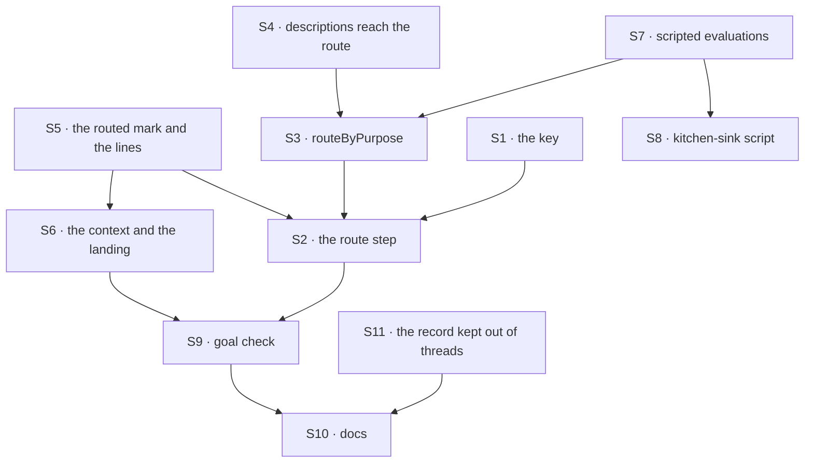

# FIX-1610 · Plan

[Spec](SPEC.md) · [Decisions](DECISIONS.md) · [Rules](BUSINESS-RULES.md) · **Plan** · [Docs](DOCS.md) · [Evolution](EVOLUTION.md)

For the implementing agent. IDs cite [BUSINESS-RULES.md](BUSINESS-RULES.md) (BR-n) and
[DECISIONS.md](DECISIONS.md) (D-n). `tdd`. One PR, from `main` once this spec merges.

## Surfaces

| ID | Package · role | Change | Rules |
|---|---|---|---|
| S1 | `workforce` · channel binder | `routing:`, the sixth declarable key, one subkey `fallback:`, checked at bind against the route's seats. Built onto the kind from the roster at every boot, by channel id, as `boards:` is; never written to the channel's session (D3) | BR-15 to BR-19, BR-28 |
| S2 | `workforce` · channel flow | `defineChannelFlow({ route })`. Before `forEach`, a person's post to a routed channel fans out to the route's one member, or to no one on a failed route, marked routed and carrying the lines the route read. Anything else as today | BR-1 to BR-8, BR-24 |
| S3 | `workforce` · a module beside the wake | `routeByPurpose(seats, { model })`: one function for the holder, the `channel-route` evaluation, the fallback and the `channel-route` record (D1). Options by the test `wakeMemberSeats` applies, shared, not copied | BR-1 to BR-7, BR-20, BR-21, BR-29 |
| S4 | `workforce` · hire | Each seat's `WORKER.md` `description:` readable by S3, on every mint path, without a new settings key | BR-2 |
| S5 | `workforce` · notify input and the wake | Optional `routed` and `recent` on `channelNotifyInputSchema`, set only by S2, passed through by `wakeMemberSeats` | BR-8, BR-24, BR-26 |
| S6 | `workforce` · agent kind and the post tool | On a routed delivery: the heard turn says the reply goes to the channel; the answer's `context` slot renders `recent` (D4); after the turn, land the reply as the seat unless it already posted for this post; the tool posts once per routed post; both send it to the channel's internal `answer`, which keeps one answer per post, keyed on its id in the channel's session; an empty reply fails the run (D2) | BR-9 to BR-14, BR-24 to BR-27 |
| S7 | `testing` | `createMockModelResolver` gains `evaluators`, keyed by block name, behind `resolveEvaluationModel`. `mockEvaluationModel` can answer from the state it is handed | BR-22 |
| S8 | kitchen-sink · `lib/e2e-mock-script.ts`, `test/mock-flowstate.ts`, `test/e2e-mock-script.test.ts` | The scripted route evaluation in the one script file, wired into the one resolver under `channel-route`; unit cases for it and for `[scenario:wake]` never calling the tool | BR-23 |
| S9 | `goals/workforce-channels/a-routed-post-gets-one-answer/` | The goal check: fixture tree, a host importing only `@flow-state-dev/*`, `run.mts`, four controls, a live leg behind `GOAL_LIVE=1` | the goal |
| S10 | Docs and changesets | Per [DOCS.md](DOCS.md). `workforce` and `testing` patch | — |
| S11 | `ui` · chat registry, and kitchen-sink's copy | `"channel-route": false` in `chatAssistantRenderers`, both files, which the drift test holds identical; a case in `substrate-components-never-raw.test.ts` | BR-29 |

Nothing in `core`, `engine`, `client` or `react`.

## Sequence



## Checks

| ID | Runs after | Passes when |
|---|---|---|
| V1 | S1 | Binder tests: BR-15 to BR-19, BR-28, each refusal naming the channel and the key or member. BR-19 over one store across two boots |
| V2 | S3 | A real in-process host with a scripted evaluation: BR-1 to BR-8, BR-20, BR-21, BR-29, evaluation calls counted per post. BR-4 with two posts sent together; BR-6 with the fallback's seat pinned to another organization; an error outside the evaluation is not a fallback |
| V3 | S6 | Agent-kind tests, four scripted answers: text, one tool post, two, empty. BR-9 to BR-14, BR-24 to BR-27: the lines in the system message, not the stored conversation. The unrouted heard turn byte for byte |
| V4 | S7 | A string model resolves to the scripted evaluation by block name; an answer computed from state |
| V5 | S8 | The script's unit cases. Kitchen-sink's `channel-wake` and `channel-reply` tests unchanged and green |
| V6 | S11 | `substrate-components-never-raw` names `channel-route` as `false`; the drift test green |
| VG | S9 | [The goal](SPEC.md#the-goal-and-how-well-know-its-met): `run.mts` PASSES after FAILING under `GOAL_CONTROL=no-route`, `no-landing`, `no-transcript` and `no-context` (the host's notify drops `recent`), each on its leg. The live leg once, with a key: the POC's five posts and "where can I buy it?". `a-fresh-host-wakes-its-member-agents` still PASSES |

D1 is V2 with VG's `no-transcript`; D4 is V3 with `no-context`; D2 is V3 with `no-landing`; D3 is
V1 with V4. Second path (BP-035): BR-19, BR-4, BR-6, BR-21 and BR-27.

## Pinned names

| Where | Name | Why pinned |
|---|---|---|
| `CHANNEL.md` key | `routing:`, subkey `fallback:` | Authors write it |
| Export and option | `routeByPurpose`, `defineChannelFlow({ route })` | Every routed host types them |
| Evaluator block name | `channel-route` | Test resolvers script it by this name |
| Record component | `channel-route` | Clients and registries tell it from a line by this name |
| Notify input fields | `routed`, `recent` | App kinds that hear posts read them |
| Goal path | `goals/workforce-channels/a-routed-post-gets-one-answer/` | FIX-1601 and this spec cite it |

Everything else is yours to name.

## Guardrails

| Rule | Because |
|---|---|
| One evaluator call per person's post, before `forEach`, never in notify | Epic D5 |
| The holder reads only the channel's lines and route records. No model call, no run status | D1. Run status is FIX-1609's |
| `routed` and `recent` come from the fan-out, never the post or the caller; the public `run` action takes no lines | BP-031 · BR-26 |
| The lines reach the turn only through the answer's `context` slot | D4. The heard turn stays FIX-1590's (BR-13) |
| No new key on a seat's settings | A hand-written kind schema refuses at boot on a new key ([FIX-1589 D3](../FIX-1589/DECISIONS.md#d3)) |
| Compose core's `evaluator` and `generator` as they are | Layer rule. A needed core change stops the work and is raised |
| The scripted evaluation lives in the one script file and the one resolver | ER-7 |
| No kitchen-sink roster, channel, desk or README change | FIX-1611's |
| No default model in the package | The app names it (D3) |

## Sketch · pseudocode, illustrative, react to the shape

```
fan-out(post):
    routing = the kind's routing for this channel                  ← from the file, at boot (S1)
    if post.author or no routing:  members = state.members          ← as today
    else:
        r = route(post)                                             ← writes the channel-route record
        members = r.member ? [r.member] : []                        ← a failed route runs no one
    forEach member: notify(post, member, routed, recent = r.lines)

route(post):                                                  ← routeByPurpose(seats, { model })
    lines = the 20 lines before post
    last = person's post before this one, with its record
    if last.by in {evaluated, fallback} and no line from last.member since:  → last.member, held
    options = { seatId: description } for members whose seat hears posts and caller can reach
    result = evaluate "channel-route" { lines, post } choice(options)    ← its own failure is a value
    if result ok and result.answer in options:  → answer, evaluated
    reason = result failed ? its error : "outside the options"
    if fallback in options:  → fallback, fallback, reason
    → none, failed, reason                                                ← BR-6

agent onChannelPost(input):                                   ← D2, D4
    reply = the turn, context = input.recent                 ← not the heard turn, not stored
    if input.routed and the seat has no line for input.postId:
        reply empty → fail the run · else post(input.channelId, reply) as seatId, note input.postId
post tool, routed turn: the first call for input.postId posts and notes it · later calls post nothing
```

**POC:** [`poc/route-choice/`](poc/route-choice/README.md),
[`poc/turn-context/`](poc/turn-context/README.md). No counted factual base needs a checker.

## Coordination

- **FIX-1611** needs a kitchen-sink route model that can evaluate: its dev runs force the cheap
  model, which refuses the adapter (POC). Its e2e marks posts `[route:<member>]`, and a "where
  can I buy it?" scenario reads `recent`. FIX-1601's leg b posts each question after the previous
  answer shows, or BR-1 holds it.
- **FIX-1609:** the route runs in the fan-out's request, 0.3 to 2 s, before the specialist's run
  exists. Its record is a `channel-route` item, never a line.

## At implement time

- Re-read the channel flow, the wake, the agent kind, `hire.ts` and the chat registry on `main`,
  and compare [Evolution](EVOLUTION.md)'s claims with the code. Re-run `poc/turn-context`.

## Follow-ups

- A seat remembering its own conversation: the agent kind sends its model no earlier turn, in a
  channel or direct talk ([POC C1](poc/turn-context/README.md)).
- A model per channel; `route` as an open slot.
- Landing behind a queue-backed dispatcher (FIX-1594 D3).

## Notes from review

Recorded verbatim for the implementer; none changes the approach.

- **Cursor, on Surfaces (S4, S5):** "Ten named surfaces are accurate but heavy for a single PR. S4
  and S5 are really “wire descriptions into S3” and “mark deliveries from S2” — consider grouping
  them under S3/S6 in this table (same V1–V5/VG gates) so implementers do not treat them as
  separate milestones. I would not drop the behaviors or tests."
- **Cursor, on the sketch's `route`:** "When you implement, keep holder + evaluator + fallback +
  record write in one resolution function (`routeByPurpose` or a single internal helper). S2’s
  fan-out should only branch on its result. That avoids duplicating BR-1/BR-4 logic across the
  channel flow and the route module — the main place this spec could accidentally become messier
  than the design."
- **Cursor, on the rules' flowchart:** "`routing.fallback` (route target when the evaluator fails)
  vs `wakeMemberSeats({ fallback })` (non-hearing member delivery) are different fallbacks. One
  sentence in workforce channel docs may help; not a spec blocker."
- **Cursor, on `poc/route-choice/run.mts`:** "long header largely duplicates `README.md`. Trimming
  to “see README” reduces drift; no impact on the settled POC results."
