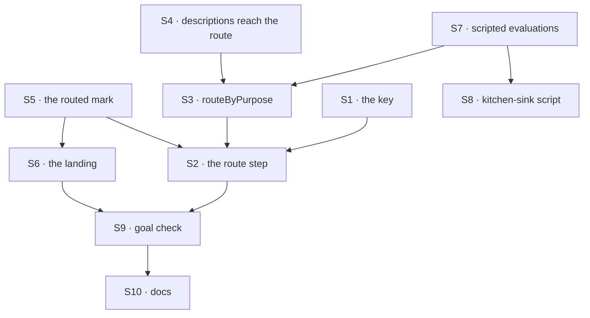

# FIX-1610 · Plan

[Spec](SPEC.md) · [Decisions](DECISIONS.md) · [Rules](BUSINESS-RULES.md) · **Plan** · [Docs](DOCS.md) · [Evolution](EVOLUTION.md)

For the implementing agent. IDs cite [BUSINESS-RULES.md](BUSINESS-RULES.md) (BR-n) and
[DECISIONS.md](DECISIONS.md) (D-n). `tdd`. One PR, from `main` once this spec merges.

## Surfaces

| ID | Package · role | Change | Rules |
|---|---|---|---|
| S1 | `workforce` · channel binder and channel state | `routing:` becomes the sixth declarable key, one subkey `fallback:`, checked at bind. The channel's state carries it, nullable, default null (D3) | BR-15 to BR-19 |
| S2 | `workforce` · channel flow | `defineChannelFlow({ route })`. In the fan-out, before `forEach`: a person's post to a routed channel goes through the route and fans out to one member, marked routed; anything else fans out as today. The route writes its record, component `channel-route` | BR-1 to BR-8 |
| S3 | `workforce` · a module beside the wake | `routeByPurpose(seats, { model })`: the holder from the channel's lines and route records; else the `channel-route` evaluator, one `choice`; else the fallback (D1). Options are the seats that hear posts, by the test `wakeMemberSeats` already applies, shared rather than copied | BR-1 to BR-7, BR-20, BR-21 |
| S4 | `workforce` · hire | Each seat's `WORKER.md` `description:` becomes readable by S3, on every mint path, without a new settings key | BR-2 |
| S5 | `workforce` · notify input and the wake | An optional `routed` flag on `channelNotifyInputSchema`, set only by S2, passed through by `wakeMemberSeats`. Absent means unrouted | BR-6, BR-8 |
| S6 | `workforce` · agent kind | For a routed delivery: the heard turn says the reply goes to the channel; after the turn, land the reply through the channel's `post` as the seat, unless the turn posted there; an empty reply ends the run as a failed answer (D2) | BR-9 to BR-14 |
| S7 | `testing` | `createMockModelResolver` gains `evaluators`, keyed by block name, behind `resolveEvaluationModel`. `mockEvaluationModel` can answer from the state it is handed | BR-22 |
| S8 | kitchen-sink · `lib/e2e-mock-script.ts`, `test/mock-flowstate.ts`, `test/e2e-mock-script.test.ts` | The scripted route evaluation in the one script file, wired into the one resolver under `channel-route`; unit cases for it and for `[scenario:wake]` never calling the tool. No roster, channel or UI change | BR-23 |
| S9 | `goals/workforce-channels/a-routed-post-gets-one-answer/` | The goal check: fixture tree, a host importing only `@flow-state-dev/*`, `run.mts`, the three controls, and a live leg behind `GOAL_LIVE=1` | the goal |
| S10 | Docs and changesets | Per [DOCS.md](DOCS.md). `workforce` minor, `testing` patch | — |

Nothing in `core`, `engine`, `client` or `react`.

## Sequence



## Checks

| ID | Runs after | Passes when |
|---|---|---|
| V1 | S1 | Binder tests: BR-15 to BR-19, each refusal naming channel and key |
| V2 | S3 | On a real in-process host with a scripted evaluation, not a mocked route: BR-1 to BR-8, BR-20, BR-21. Evaluation calls counted per post. BR-4 with two posts sent together. BR-21 with a scripted evaluation that always fails |
| V3 | S6 | Agent-kind tests with three scripted answers: text only, a tool post, empty. BR-9 to BR-14. The unrouted heard turn compared byte for byte |
| V4 | S7 | A string model resolves to the scripted evaluation by block name; an answer computed from state |
| V5 | S8 | The script's unit cases. Kitchen-sink's `channel-wake` and `channel-reply` tests unchanged and green |
| VG | S9 | [The goal](SPEC.md#the-goal-and-how-well-know-its-met): `run.mts` PASSES after the same run FAILED under `GOAL_CONTROL=no-route`, `no-landing` and `no-transcript`, each on its leg. The live leg once, with a key: five posts, one line each, by the expected specialist. `a-fresh-host-wakes-its-member-agents` still PASSES |

D1 is V2 with VG's `no-transcript`; D2 is V3 with `no-landing`; D3 is V1 with V4. Second path
(BP-035): BR-19, BR-4 and BR-21.

## Pinned names

| Where | Name | Why pinned |
|---|---|---|
| `CHANNEL.md` key | `routing:`, subkey `fallback:` | Authors write it |
| Export and option | `routeByPurpose`, `defineChannelFlow({ route })` | Every routed host types them |
| Evaluator block name | `channel-route` | Test resolvers script it by this name |
| Record component | `channel-route` | A client reading the session tells it from a line by this name |
| Notify input field | `routed` | App kinds that hear posts read it |
| Goal path | `goals/workforce-channels/a-routed-post-gets-one-answer/` | FIX-1601 and this spec cite it |

Everything else is yours to name.

## Guardrails

| Rule | Because |
|---|---|
| One evaluator call per person's post, before `forEach`, never in notify | Epic D5 |
| The holder reads only the channel's lines and route records. No model call, no run status | D1. Run status is FIX-1609's |
| `routed` comes from the fan-out, never the post | BP-031 |
| No new key on a seat's settings | A hand-written kind schema refuses at boot on a new key ([FIX-1589 D3](../FIX-1589/DECISIONS.md#d3)) |
| Compose core's `evaluator` as it is | Layer rule. A needed core change stops the work and is raised |
| The scripted evaluation lives in the one script file and the one resolver | ER-7 |
| No kitchen-sink roster, channel, UI or README change | FIX-1611's |
| No default model in the package | The app names it (D3) |

## Sketch · pseudocode, illustrative, react to the shape

```
fan-out(post):
    if post.author or no state.routing:  members = state.members            ← as today
    else:                                members = [route(post)], routed      ← D5
    forEach member: notify(post, member, routed)

route(post):                                                  ← routeByPurpose(seats, { model })
    last = person's post before this one, with its record
    if last.by in {evaluated, fallback} and no line from last.member since:  → last.member, held
    options = { seatId: description } for members whose seat hears posts
    try answer = evaluator "channel-route" { recent lines, post } choice(options)
    if answer in options: → answer, evaluated
    → state.routing.fallback, fallback, reason

agent onChannelPost(input):                                   ← D2
    reply = the turn
    if input.routed and turn did not post to input.channelId:
        reply empty → fail the run · else post(input.channelId, reply) as seatId
```

**POC:** [`poc/route-choice/`](poc/route-choice/README.md). No counted factual base needs a
checker.

## Coordination

- **FIX-1611** needs a kitchen-sink route model that can evaluate: its dev runs force the cheap
  model, which refuses the adapter (POC). Its e2e marks posts `[route:<member>]`. FIX-1601's
  leg b posts each question after the previous answer shows, or BR-1 holds it.
- **FIX-1609:** the route runs in the fan-out's request, 0.3 to 2 s, before the specialist's run
  exists. Its record is a `channel-route` item, never a line.

## At implement time

- Re-read the channel flow, the wake, the agent kind and `hire.ts` on `main`: FIX-1609 may have
  touched the channel flow. Compare [Evolution](EVOLUTION.md)'s claims with the code.

## Follow-ups

- Handing a specialist the lines other specialists heard (epic D5).
- A model per channel; `route` as an open slot.
- Landing behind a queue-backed dispatcher (FIX-1594 D3).

## Notes from review

None yet.
