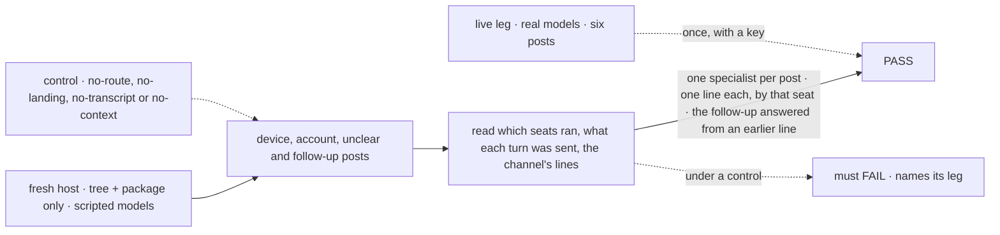
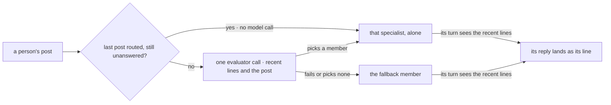

# FIX-1610 · Routed channel: each post reaches one specialist by purpose, whose answer always lands in the channel

**Spec** · [Decisions](DECISIONS.md) · [Rules](BUSINESS-RULES.md) · [Plan](PLAN.md) · [Docs](DOCS.md) · [Evolution](EVOLUTION.md)

Feature · `workforce` + `testing` + kitchen-sink's script file + `goals/` · medium · 1 PR · epic
[FIX-1592](https://linear.app/fixpoint-labs/issue/FIX-1592) · beside FIX-1609 · blocks FIX-1611
and FIX-1601

## Four people, before and after

| Someone who… | Today | After |
|---|---|---|
| **asks the support channel a question** | Every agent member runs. An answer shows only if a model calls the post tool: 4 times in 6 on one real model, 0 in 2 on another ([epic D6](../../epics/FIX-1592/DECISIONS.md#d6)) | One specialist runs, picked by purpose. Its answer lands in the channel, every time |
| **follows up on that answer** | Every member hears it again, and no turn sees the lines before it: "where can I buy it?" finds no "it" | It reaches the specialist the recent lines point to, and its turn sees them |
| **declares a channel** | Five keys. Nothing routes | A sixth, `routing:`, naming who takes what fits no one |
| **builds the host** | Writes a router, or lives with every agent answering | Passes `routeByPurpose(seats, { model })`. Writes no router |

## The goal, and how we'll know it's met

**A person's post to a channel that declares `routing:` runs exactly one specialist, the one its
purpose and the recent lines point to. That specialist answers with the recent lines in view, and
its answer lands in the channel as its own line every time, whatever the model does with its
tools. A channel without the line behaves as today.**

| Is it the right goal? | |
|---|---|
| **The real need** | The owner's failures on the desk: every agent answering, answers that never showed ([epic D5](../../epics/FIX-1592/DECISIONS.md#d5), [D6](../../epics/FIX-1592/DECISIONS.md#d6)), and "where can I buy it?" finding no "it" ([D4](DECISIONS.md#d4)) |
| **Smaller, and rejected** | "Land every woken member's answer": five answers to one question. "Route, but leave the answer to the tool": a routed question still goes unanswered |
| **Bigger, and not this issue's** | The kitchen-sink desk (FIX-1611) · the live view (FIX-1609) · a seat remembering its own conversation, direct talk included · verified authors (FIX-1493) |
| **Not done if** | The host writes a router · a line lands only because the script called the tool · one post runs two specialists or lands two lines · a follow-up passes with the lines hidden from the route or the turn · the lines land in the stored conversation · a control never failed |



Each control removes one half of the promise and must fail that half.

| How we verify | |
|---|---|
| **Goal check** | `goals/workforce-channels/a-routed-post-gets-one-answer/`, in-process, verdict in the implementation PR. FIX-1601's leg b and smoke grade it again in kitchen-sink after FIX-1611 |
| **Model** | Scripted and keyless for every gated leg ([epic D3](../../epics/FIX-1592/DECISIONS.md#d3)); the answer script never calls the post tool. One live leg with a key, outside CI |
| **Signal** | Device, account and unclear posts each run the expected member alone, and each gets one line by that seat. A follow-up after an answer reaches the specialist only when the evaluation saw its line; one sent before the answer, with no evaluation. "Where can I buy it?" is answered from a line the specialist wasn't sent, and its stored conversation keeps only its routed posts and answers. A failed evaluation runs the fallback. An unrouted channel wakes every agent |
| **Input** | A tree: four agent specialists, one routed channel, one unrouted channel |
| **Anti-game** | Not the route record alone, a dispatch handle or a unit test |
| **Control that must fail** | `GOAL_CONTROL=no-route` strips the routing line: the one-specialist leg fails. `no-landing` hires a kind without the landing: the lands leg fails. `no-transcript` hides the recent lines from the evaluation: the follow-up leg fails. `no-context` strips them from the routed delivery: the context leg fails. Today's `main` fails leg 0 |

## What changes


Before, four seats run and the channel gets whatever the models chose to post. After, one seat
runs with the recent lines in view, and the channel always gets its line.

```diff
  # teams/support/channels/help/CHANNEL.md
  members: [support.devices, support.accounts, support.fsd, support.general]
+ routing:
+   fallback: support.general
```

```diff
  defineChannelFlow({
    notify: wakeMemberSeats(seats),
+   route: routeByPurpose(seats, { model }),   // an evaluation model, named once
  });
```

## How a post finds its specialist



The options are the members, described by their `WORKER.md` `description:`. The
[POC](poc/route-choice/README.md) picked right 30 in 30 on two real models; a
[second](poc/turn-context/README.md) shows the lines reach the turn and are never stored.

## What stays as it is

- A channel without `routing:` wakes every agent member (epic ER-2). A seat's post wakes nobody
  (ER-3).
- The answer is the seat's own generator turn, in its conversation for the channel, which keeps
  only its routed posts and its answers.
- Direct talk, `run`, and unrouted channels send no lines.
- The post tool and its gate (FIX-1594).
- Nothing in core, engine, client or react. FIX-1609 owns the stream and "working".

## Sign off

**[The goal](#the-goal-and-how-well-know-its-met), at that size.** If wrong: the desk FIX-1611
builds either wakes everyone or answers only when the model feels like it.

1. **[D1](DECISIONS.md#d1) · "Holding the case" means still on the person's last post: routed
   there, not yet answered. After an answer, the next post takes the one evaluator call.** If
   wrong: a follow-up after an answer depends on that call. If it fails, the follow-up goes to the
   fallback, not back to its specialist.
2. **[D4](DECISIONS.md#d4) · A routed specialist's turn sees the channel's last 20 lines as
   context; its stored conversation keeps only its routed posts and its answers.** The owner's
   call, relayed by the FSD Architect: confirm it here. If wrong: a specialist can't see anything
   said before the window, its own earlier answers included.
3. **[D2](DECISIONS.md#d2) · For the routed member only, the agent kind posts its reply into the
   channel as the seat, unless its turn already did.** If wrong: a routed agent can't stay quiet,
   and an empty reply shows nothing.

**Open: none.** Number 1 is the one to weigh: it narrows the epic's "a failed call never pulls a
follow-up away" ([EVOLUTION](EVOLUTION.md)). D4 lifts the epic's "hears only that post" for
context only. [D3](DECISIONS.md#d3), the key and the model in code, is decided, not asked.
Reasoning: [DECISIONS.md](DECISIONS.md). Cases: [BUSINESS-RULES.md](BUSINESS-RULES.md).
