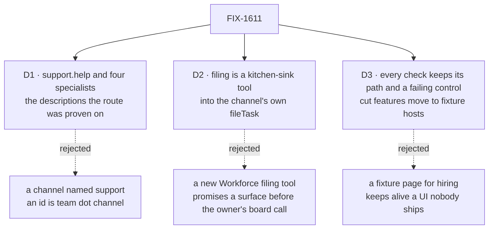

# FIX-1611 · Decisions

[Spec](SPEC.md) · **Decisions** · [Rules](BUSINESS-RULES.md) · [Plan](PLAN.md) · [Docs](DOCS.md) · [Evolution](EVOLUTION.md)

What was chosen, what lost, and what each choice locks in. The epic already decided the shape
([D7](../../epics/FIX-1592/DECISIONS.md#d7), [D8](../../epics/FIX-1592/DECISIONS.md#d8)); these
three are what it left to this issue.

## The tree

Solid edges are what you're signing. Dashed edges lost, and the label says why.

## D1 · The team is `support.help` and four specialists, described as the route was proven on; each can post and escalate

| | |
|---|---|
| **Instead of** | A channel called plain `support`, or descriptions rewritten for the page |
| **Because** | A channel's id is `<team>.<channel>`, so `support` can't exist; `support.help` is the id the epic's docs draft and FIX-1610's examples use. The four descriptions picked the right specialist 30 times in 30 on two real models ([FIX-1610 POC](../FIX-1610/poc/route-choice/README.md)); new wording re-opens that proof. FIX-1601's leg b answers through the post tool, and ER-25 needs filing, so every specialist names both tools |
| **Locks in** | These ids are what FIX-1601 and every re-pointed check read, and what the README teaches. FIX-1601's `support` is shorthand for `support.help` |

**The route model** is the gateway's evaluation model, named once in `lib/models.ts`. On the POC
it answered in about 0.3 s against 1.7 s for the chat model wrapped in the evaluation adapter,
both right 15 in 15. The cheap model and a chat model named as a plain string are refused. Being
an evaluation model, it is also untouched by the dev override that forces every generator onto
the cheap model. Test mode scripts `channel-route`, as FIX-1610 BR-23 has it.

## D2 · Filing is one kitchen-sink tool into the channel's own `fileTask`, not a new Workforce tool

| | |
|---|---|
| **Instead of** | A Workforce "file onto a board" tool mirroring `post-to-channel`, offered to every app |
| **Because** | The epic scopes filing to the app ("the app composes … escalations"). Who works `escalations` is the owner's held call (FIX-1591), and a public tool would promise a filing surface before it. The desk clerk filed this way, reviewed (FIX-1589); this moves that tool onto the built-in kind. It stays a bare tool, not a capability: it does one thing, and it is a like-for-like port of that reviewed shape. Moving it into Workforce later is additive |
| **Locks in** | Kitchen-sink holds one `dispatcher`, in `escalate`. This PR amends FIX-1601's sweep row to match: no dispatcher for routing or notify (ER-18), `escalate` and the test-mode controls allowed ([FIX-1601 PLAN](../FIX-1601/PLAN.md#part-4--gap-sweep)) |

**What would change my mind:** FIX-1591 deciding that seats filing onto boards is a framework
promise. Then the tool moves into Workforce, and this file shrinks to a `uses:` line.

## D3 · Every check keeps its path and a control that fails; the page-hire check's hire half leaves with the button

| | |
|---|---|
| **Instead of** | Deleting checks whose subject left, or building a fixture page to keep the hire check |
| **Because** | ER-27. Retained specs cite these paths, so they stay. A check whose feature D8 cut moves those legs to a fixture host, reusing one that already proves the shape. The page-hire half reads a hired seat back in the rail; after D8 nothing hired while the app runs shows there, so its only fixture would be a copy of the cut page |
| **Locks in** | Hiring from a browser is unchecked until FIX-1415 restores both, as D8 already leaves it undemoed. Each verdict log gains a "re-pointed" row, and each re-pointed control is seen to fail again |

The [inventory](PLAN.md#inventory) is derived from the tree, not listed from memory: a checker
([`poc/inventory/`](poc/inventory/README.md)) fails if any check that reads the old roster has no
row.

## Decided, not asked

- **Specialist instructions:** answer in a sentence or two; say plainly when unsure; when a case
  needs a person, file it with `escalate` and say so.
- **`escalate` names `support.help` and `escalations` in code.** The model writes only the case;
  the author is the seat's own id, so no model files as another seat (FIX-1589).
- **The notify drops its name-only fallback:** every member is an agent. The stand-in moves into
  the `name-only-notify` control.
- **`echo` retires with the clerk's `answer`.** It reverted a behaviour the agent kind never
  had; `no-landing` is the answer leg's control now.
- **`cli-principal` stays on the real app**, running `support.general`: its subject is the app's
  own resolver. The epic's EVOLUTION note had it moving.
- **FIX-1590's check follows the routed member**; the every-member rule stays proven by FIX-1602's
  fixture host.
- **Stored rows naming a cut kind are skipped by name at boot** (FIX-1475's degrade), not
  migrated.
- **This issue's goal check is FIX-1589's, re-pointed**: its legs already are answer and file.
- **Mechanics are the plan's:** what leaves with each seat (S1 to S3), the panel as FIX-1609
  merges it (S6), where `no-history` acts (S8), the queue-host rescue (BR-11).

## Considered and dropped

| Alternative | Why not |
|---|---|
| A Workforce filing tool | D2 |
| A fifth `care` specialist | Epic D7: upset is a tone, not a topic |
| A history-window option on the agent kind, for the no-history control | A public option only a control would use |
| One custom kind kept for `code-comes-from-files-alone` | D8 cuts it; `escalate` carries the Next-built leg through the same generated module |
| A new goal folder for this issue | Repeats FIX-1589's legs under a second path |
| The chat model in the evaluation adapter | Five times slower, same picks |

## Settled

- **The inventory is total** — **CONFIRMED**: 14 goal folders and 10 e2e tests name a cut piece
  or read the roster's source; every one has a row. Dropping a row or planting a hit fails the
  checker ([evidence](poc/inventory/evidence.txt)).

## How it got here

- **Draft** — ids, route model, the tool's home and every re-point, on FIX-1601's amended plan
  and FIX-1612 merged.
- **Review round 1** (#2318) — the build starts after FIX-1610 and merges after both; FIX-1601's
  sweep row is amended for `escalate`; V5 gates the inventory; FIX-1476's cut legs reuse
  channel-boards' fixture.

**Open: none.**
