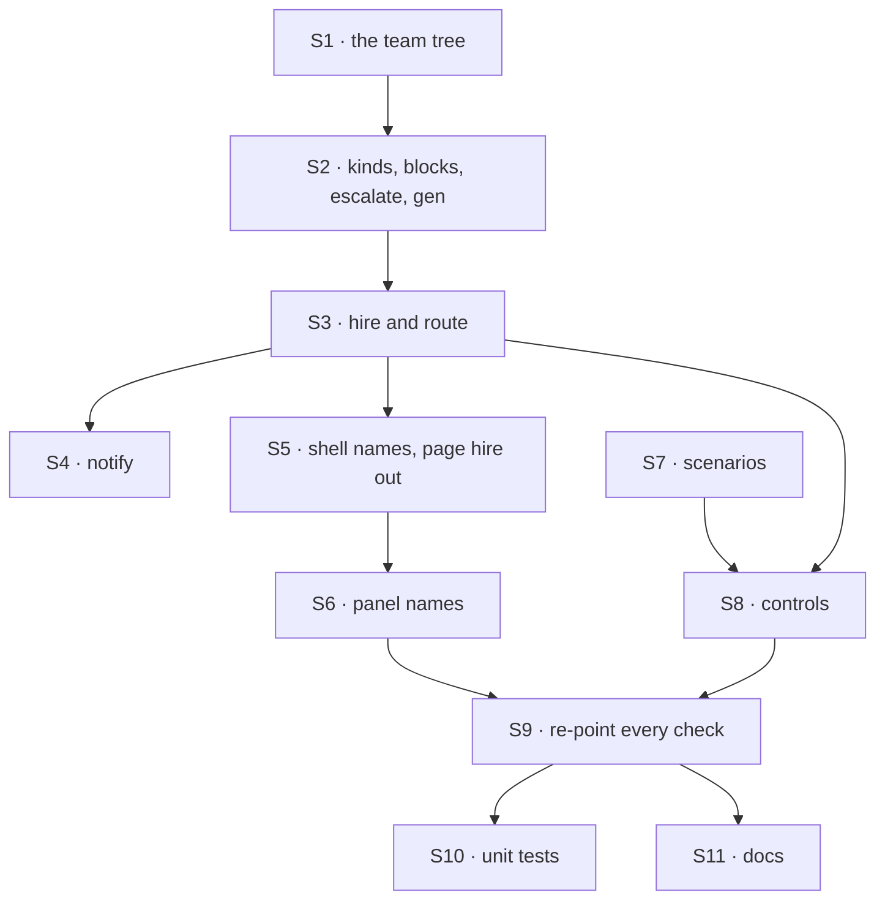

# FIX-1611 · Plan

[Spec](SPEC.md) · [Decisions](DECISIONS.md) · [Rules](BUSINESS-RULES.md) · **Plan** · [Docs](DOCS.md) · [Evolution](EVOLUTION.md)

For the implementing agent. IDs cite [BUSINESS-RULES.md](BUSINESS-RULES.md) (BR-n) and
[DECISIONS.md](DECISIONS.md) (D-n). `tdd`. One PR, from `main` after FIX-1609 and FIX-1610 have
merged (ER-14); FIX-1612 already has. All paths under `apps/kitchen-sink/` unless rooted.

## Surfaces

| ID | Where | Change | Rules |
|---|---|---|---|
| S1 | `workforce/teams/support/` | **Remove** workers `ada`, `grace`, `iris` (with `blocks/desk-summary.ts`), `mara`, `otto`, `wren`; channels `desk`, `ada-wren`, `noticeboard`; `resources/research.ts`. **Add** workers `devices`, `accounts`, `fsd`, `general` and channel `help` (D1) | BR-1 |
| S2 | `workforce/flows/`, `workforce/blocks/` | **Remove** `desk-clerk.ts`, `followup-runner.ts`, `channels/digest.ts`, `desk-note.ts`. **Add** `blocks/escalate.ts`: a sequencer around a core `dispatcher` into `support.help`'s `fileTask` on `escalations`, author the seat's `seatId`, the external-dispatcher refusal rescued as "unavailable" (D2). Regenerate `workforce.gen.ts` | BR-8, BR-10, BR-11 |
| S3 | `workforce/hire.ts`, `lib/models.ts` | The agent kind `uses` only `channelPost` (and the catalog). **Remove** `seatHire`, `discover`, `kitchenSinkSeatHireOptions`. The channel kind gains `route: routeByPurpose(seats, { model: ROUTE_MODEL })`, `ROUTE_MODEL` the gateway's evaluation model | BR-4, BR-5 |
| S4 | `workforce/channel-notify.ts`, `lib/channel-wake-control.ts` | `wakeMemberSeats(seats)` with no name-only fallback; that stand-in moves into the `name-only-notify` control | BR-4 |
| S5 | `lib/workforce-shell.ts`, `app/page.tsx`, `components/`, `flows/chat-agent/` | `SEAT_KINDS` `["agent"]`, `CHANNEL_KINDS` `["channel"]`, `SEAT_ASKS` one row (ER-6), `SHELL_BOARDS` `support.help`'s `escalations`. **Remove** page hiring: `HireForm`, the `hireSeat` action, `SEAT_HIRES_TAG` | BR-1 to BR-3, BR-15 |
| S6 | The panel | FIX-1609's live view and working row as merged; only names change | BR-4 |
| S7 | `lib/e2e-mock-script.ts`, `test/mock-flowstate.ts` | `[scenario:recall]`, `[scenario:needs-a-person]`; scenario steps receive the whole message list. `[route:<member>]` is FIX-1610's; add it only if absent | BR-19 to BR-21 |
| S8 | Controls, all via `goalControl()` | `no-route` strips `routing` from the manifests before bind. `no-landing` mirrors FIX-1610's. `no-history` strips everything between the system message and the latest user turn at the scripted model. `no-filing` swaps `escalate` for a stand-in that says it filed. **Remove** `echo` and `lib/desk-clerk-echo-control.ts` | BR-22, BR-23 |
| S9 | `goals/`, `e2e/` | Every [inventory](#inventory) row | BR-24 to BR-27 |
| S10 | `test/` | Unit tests of cut code leave with it; the rest name the new roster | — |
| S11 | Docs | [DOCS.md](DOCS.md) | ER-19 |

## Sequence



## Checks

| ID | After | Passes when |
|---|---|---|
| V1 | S3 | The boot hires four seats and opens one channel; one unattended warning, naming `escalations`; the generated map holds `escalate` and no custom kind |
| V2 | S4 | `goals/workforce-channels/a-fresh-host-wakes-its-member-agents/` passes: the notify builds no router or dispatcher (ER-18) |
| V3 | S7 | Script and tool units: BR-10, BR-11, BR-14, BR-19 to BR-21. Recall names no token from the latest turn; under `no-history` it names none from earlier turns |
| V4 | S8 | BR-22 by source scan and by running each control without test mode |
| V5 | S9 | Every inventory row: its control FAILS its own leg, then it PASSES on this roster; a "re-pointed" row in its verdict log |
| V6 | S9 | `node specs/issues/FIX-1611/poc/inventory/check.mjs` passes on the final tree |
| VG | S9 | [The goal](SPEC.md#the-goal-and-how-well-know-its-met): FAILS under `no-landing` (answer) and `no-filing` (file, at the row), and on today's `main` (roster); then PASSES. `GOAL_LIVE=1` once, with a key |
| V7 | S11 | `pnpm --filter @flow-state-dev/kitchen-sink test:e2e --workers=1` and `fsdev gen --check` pass |

One check per decision: D1 is VG's roster leg; D2 is VG's file leg with `no-filing`; D3 is V5 and V6.

## Inventory

Every goal check and e2e test that reads the old roster, derived by [`poc/inventory/`](poc/inventory/README.md). Paths kept; retained specs untouched.

| Check | Reads today | Re-pointed at | Control that must fail |
|---|---|---|---|
| `goals/kitchen-sink-talk/answers-a-clerk-note-or-files-it/` | FIX-1589: `support.ada` answers or files | **real app** · this issue's goal | `no-landing` · `no-filing`; `echo` retires |
| `goals/kitchen-sink-talk/a-post-runs-each-member-agent-once/` | FIX-1590: every agent in `support.desk` | **real app** · the routed specialist once, nobody else | `name-only-notify` · `no-author-filter` |
| `goals/kitchen-sink-talk/agent-replies-in-the-channel/` | FIX-1594: `support.otto` posts | **real app** · a routed specialist posts through the tool, once | `post-without-author` · `no-author-filter` |
| `goals/kitchen-sink-talk/keeps-both-sides-across-a-reload/` | FIX-1585: desk, otto, wren | **real app** · `support.help`, `support.devices`; wren's leg on an unmapped-kind seat injected at the network | `no-post-item` · `drop-user-message` |
| `goals/kitchen-sink-talk/shows-the-reply-without-a-reload/` | FIX-1609: `support.desk`, `support.otto` | **on arrival** · `support.help`, a routed specialist | `no-live` · today's `main` |
| `goals/workforce-channels/a-fresh-host-wakes-its-member-agents/` | FIX-1602: `channel-notify.ts`, `SEAT_ASKS` | **unchanged** · both stay | its own |
| `goals/workforce-conventions/a-channel-holds-the-work-a-seat-drains/` | FIX-1476: three channels, a custom kind, a drain | **real app + fixture host** · app: V2, V5, V6, V9's warning, V10 to V13, V14's writer half. Fixture tree in the folder: V1, V3, V4, V7, V8, V9's attended half, V14's non-hearing half | each leg's recorded red state |
| `goals/workforce-conventions/code-comes-from-files-alone/` | FIX-1357: `desk-clerk`, `desk-note` | **real app + fixture host** · app, Next-built: `escalate` and the source scan. Fixture: two seats on one custom kind, differing by a setting | the planted registration |
| `goals/workforce-conventions/durable-hire-survives-redeploy/` | FIX-1475: a `desk-clerk` hire, token in `desk` | **real app** · kind `agent`, token in `instructions`, read back by `[scenario:recall]`; control seat `support.general` | its recorded mutations |
| `goals/cli-principal/runs-in-the-apps-organization/` | FIX-1551: `support.mara` hires | **real app** · `support.general` runs; its conversation is stored under `kitchen-sink` | the placeholder ask |
| `goals/hire-plane/discover-survives-an-unaddressable-row/` | Fixture data only | **unchanged** · own host | its own |
| `goals/hire-plane/reload-survives-an-unaddressable-row/` | Fixture data only | **unchanged** · own host | its own |
| `goals/workforce-conventions/capabilities-come-from-files-alone/` | Its own tree | **unchanged** · own fixture | its own |
| `goals/workforce-packages/a-held-package-reaches-one-worker/` | Its own tree | **unchanged** · own fixture | its own |
| `goals/workforce-seats/a-non-agent-seat-receives-its-skills/` | Its own tree | **unchanged** · own fixture | its own |
| `e2e/talk-from-page.spec.ts` › "a line posted to support.desk" | The desk line | **real app** · `support.help` | red on unfixed code |
| `e2e/talk-from-page.spec.ts` › "a new support.otto conversation" | otto; wren takes none | **real app** · `support.devices`; an injected unmapped-kind seat | red on unfixed code |
| `e2e/talk-from-page.spec.ts` › "a failed New conversation" | grace | **real app** · a specialist | red on unfixed code |
| `e2e/talk-from-page.spec.ts` › "a note to support.ada" | The clerk's answer | **real app** · a routed post's answer lands under its specialist | red on unfixed code |
| `e2e/talk-from-page.spec.ts` › "a note the clerk files" | The clerk files | **real app** · a needs-a-person post is one `escalations` row | red on unfixed code |
| `e2e/talk-from-page.spec.ts` › "a post to support.desk runs each agent" | Every agent once | **real app** · the routed specialist once | red on unfixed code |
| `e2e/talk-from-page.spec.ts` › "a woken support.otto answers" | otto's line | **real app** · a specialist's tool line wakes nobody | red on unfixed code |
| `e2e/workforce-shell.spec.ts` › "the rail opens a channel kind" | `support.desk`, `desk-clerk` | **real app** · `support.help`, `agent` | red on unfixed code |
| `e2e/workforce-shell.spec.ts` › "the rail, fully expanded" | ada, grace, `desk-clerk`; an injected clerk | **real app** · specialists; an injected `agent` seat | red on unfixed code |
| `e2e/workforce-shell.spec.ts` › "VG · open a declared seat" | FIX-1500: `support.iris`, then a page hire | **retires** its hire half (D3); the declared half on `support.devices` | red on unfixed code |
| `e2e/workforce-shell.spec.ts` › "at ${width}px" | Layout only | **unchanged** | its own |

Beside them, a new e2e case: a post routed to `support.accounts` with `[scenario:recall]` names
a token from `support.devices`' earlier line (BR-7). FIX-1609's no-reload case is renamed on
arrival.

## Pinned names

| Where | Name | Why pinned |
|---|---|---|
| Roster | `support.help`, `support.devices`, `support.accounts`, `support.fsd`, `support.general`, `escalations` | FIX-1601 and every re-pointed check read them |
| Tool | `escalate` | A `WORKER.md` names it |
| Scenarios | `[scenario:recall]` → `[reply:recall]`; `[scenario:needs-a-person]` → `[reply:escalated]` or `[reply:unfiled]` | FIX-1601's legs c2 and part 2 |
| A token | `/[a-z]+-token-[a-z0-9]+/` | What recall names; the checks mint these |
| Controls | `no-route`, `no-landing`, `no-history`, `no-filing` | FIX-1601's Controls table |
| Goal path | `goals/kitchen-sink-talk/answers-a-clerk-note-or-files-it/` | Kept (D3) |

## Guardrails

| Rule | Because |
|---|---|
| No router, evaluator, seat loop, poll or messaging API in kitchen-sink; the one `dispatcher` is `escalate`'s | ER-9, ER-18, D2 |
| Every scenario and scripted evaluation in the one script file; every control behind `goalControl()` | ER-7, BR-22 |
| A check moves or narrows; it is never deleted, and its control is seen to fail on this roster | ER-27: a green `main` that stopped checking |
| No Workforce concept, and no change, under `packages/` | ER-8; FIX-1610 owns the route |
| Assert on the page as drawn, after a reload, by this run's token | The anti-game of every browser check here |

## Docs

Publish [DOCS.md](DOCS.md) after VG passes, in the same PR. No changeset: kitchen-sink is private.

## Sketch · illustrative

```
escalate(case):
    dispatch fileTask to session "support.help": { board: "escalations", goal: case, author: my seatId }
    on external-dispatcher refusal → { filed: false, reason }
    else → { filed: true }
no-history, at the scripted model: messages ← [system…, latest user turn]
```

**POC:** [`poc/inventory/`](poc/inventory/README.md): 14 goal folders and 11 e2e tests name the
old roster (nine folders read it as their subject, five only as their own fixture data); each
has a row, and dropping or planting one fails. The premise held.

## At implement time

- Read FIX-1609's and FIX-1610's merged code: the panel, `no-landing`'s seam, and whether
  `[route:<member>]` shipped. Re-derive which legs each FIX-1594 control reddens under landing.
- Re-run the inventory checker before re-pointing; a check added since is a row to add.
- Compare [Evolution](EVOLUTION.md) with the current goal files.

## Follow-ups

- FIX-1415: restore the page-hire browser check's hire half with page hiring.
- A Workforce filing tool, if FIX-1591 makes filing a framework promise (D2).
