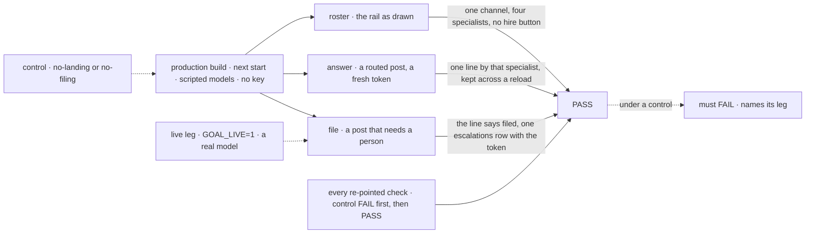

# FIX-1611 · Kitchen-sink's support desk: one routed channel, four specialists by purpose, escalations filed, every check re-pointed

**Spec** · [Decisions](DECISIONS.md) · [Rules](BUSINESS-RULES.md) · [Plan](PLAN.md) · [Docs](DOCS.md) · [Evolution](EVOLUTION.md)

Feature · `apps/kitchen-sink` + `goals/` · large · 1 PR · epic
[FIX-1592](https://linear.app/fixpoint-labs/issue/FIX-1592) · merges after FIX-1609 and FIX-1610;
the build starts once FIX-1610 merges · blocks FIX-1601

## Six people, before and after

| Someone who… | Today | After |
|---|---|---|
| **opens kitchen-sink** | Three channels, six named seats on three kinds, and a "Hire another" button. The owner: *"whats the point"* ([epic D8](../../epics/FIX-1592/DECISIONS.md#d8)) | One channel, `support.help`, and four specialists named for what they handle |
| **asks the channel a question** | Every agent runs; an answer shows only if a model posts it | One specialist answers, in the channel (FIX-1610's route, composed here) |
| **has a case that needs a person** | Asks the clerk `support.ada` directly | The specialist files it onto `escalations` and says so in the channel. Nobody drains it yet |
| **talks to a specialist directly** | "New conversation" on `support.otto` | The same, on any specialist. That conversation remembers only its own turns |
| **copies kitchen-sink into their app** | Custom kinds, a clerk and a hiring seat to untangle first | Four `WORKER.md` files, one `CHANNEL.md`, one small tool and a route in one line |
| **relies on the checks** | Nine goal checks and ten e2e tests read the old roster | Each re-pointed at this roster or a fixture host, keeping its anti-game and a control that fails |

## The goal, and how we'll know it's met

**A person who opens kitchen-sink finds one support channel and four specialists named for what
they handle. A question gets one specialist's answer in the channel; a case that needs a person
is filed onto `escalations` and the specialist says so. Every check that read the old roster
still runs, against this one or a fixture host.**

| Is it the right goal? | |
|---|---|
| **The real need** | The owner could not tell what the old roster was for ([epic D7](../../epics/FIX-1592/DECISIONS.md#d7), [D8](../../epics/FIX-1592/DECISIONS.md#d8)); ER-25 to ER-27 |
| **Smaller, and rejected** | "Swap the files and delete what breaks." Deleting a check makes `main` green by checking less, which is what this epic is fixing ([ER-27](../../epics/FIX-1592/BUSINESS-RULES.md)) |
| **Bigger, and not this issue's** | The route and the landing (FIX-1610) · the live view (FIX-1609) · someone working `escalations` (FIX-1591) · page hiring back (FIX-1415) · the closure run (FIX-1601) |
| **Not done if** | The page is right but a re-pointed check never ran · a control never failed · the line says "filed" and no row exists · kitchen-sink writes its own router · a check was deleted instead of moved |



The browser check reads the page as drawn, after a reload. The inventory half runs every
re-pointed check and sees each control fail before its pass counts.

| How we verify | |
|---|---|
| **Goal check** | `goals/kitchen-sink-talk/answers-a-clerk-note-or-files-it/`, re-pointed (path kept, [D3](DECISIONS.md#d3)). Real browser, production build; the implementer runs it at completion, verdict in the PR |
| **Model** | Scripted and keyless for roster, answer and file. `GOAL_LIVE=1`: a real model files each of three posts that plainly need a person and none of two that don't |
| **Signal** | Roster: `support.help` and the four specialists with their descriptions; no other channel or seat, no "Hire another". Answer: one line by the routed specialist, no echo of the token. File: that line says filed, `escalations` shows exactly one row carrying the token, and the boot still warns it is unattended |
| **Input** | Fresh tokens per run. `GOAL_SEAT` aims both legs at another specialist; a correct build passes |
| **Anti-game** | Not the generated map, the ledger or the request log: the rail, the channel and the board column as drawn. A "filed" line alone never passes the file leg |
| **Control that must fail** | `GOAL_CONTROL=no-landing` fails answer. `no-filing` fails file at the row only. Today's `main` fails roster. Each re-pointed check's control fails its own leg ([Plan → Inventory](PLAN.md#inventory)) |

## What changes


Left is everything D7 and D8 remove. Right is all that replaces it: one channel, four
specialists, one board.

```diff
+ # workforce/teams/support/channels/help/CHANNEL.md
+ description: Ask the support team anything.
+ members: [support.devices, support.accounts, support.fsd, support.general]
+ boards: [escalations]
+ routing:
+   fallback: support.general
```

```diff
+ # workforce/teams/support/workers/devices/WORKER.md
+ description: Printers, laptops, phones, wifi and anything else with a power button.
+ tools: [post-to-channel, escalate]
```

```diff
  channel: defineChannelFlow({
    notify: notifyFor(seats),
+   route: routeByPurpose(seats, { model: ROUTE_MODEL }),   // the gateway's evaluation model
  }),
```

## What stays as it is

- The route, the landing and the recent lines are FIX-1610's; the live view and the working row
  are FIX-1609's. This issue names and composes them.
- The operator's HTTP hire, so `durable-hire-survives-redeploy` stays on the real app (D8).
- `escalations` stays unattended, boot warning included (FIX-1476 D3, FIX-1591 held).
- The chat-agent flow and every other subsystem the app hosts.
- Nothing under `packages/`.

## Sign off

**[The goal](#the-goal-and-how-well-know-its-met), at that size:** the page and every check.
If wrong: a demo that reads well while `main` checks less than it did.

1. **[D1](DECISIONS.md#d1) · The team is `support.help` and four specialists whose
   descriptions are the ones the route was proven on; each can post and escalate.** If wrong: a
   customer's question lands with the wrong specialist, and we tune descriptions after the demo
   ships.
2. **[D2](DECISIONS.md#d2) · Filing is one small kitchen-sink tool into the channel's own
   `fileTask`, not a new Workforce tool.** If wrong: an app wanting filing copies about forty
   lines until Workforce offers one.
3. **[D3](DECISIONS.md#d3) · Every check keeps its path and a control that fails; a cut
   feature's legs move to a fixture host. The page-hire browser check keeps its declared-seat
   half; its hire half leaves with the button, for FIX-1415 to restore.**
   If wrong: hiring from a browser goes unchecked until FIX-1415, as D8 already has it undemoed.

**Open: none.** Number 3 is the one to weigh. It narrows the epic's ER-27 ("re-pointed, never
deleted") for the hire half of one e2e test, and merging this PR accepts that. D2 brings a
one-row amendment to FIX-1601's gap sweep, in this PR, so the closure run doesn't flag
`escalate`. Reasoning: [DECISIONS.md](DECISIONS.md). Cases: [BUSINESS-RULES.md](BUSINESS-RULES.md).
