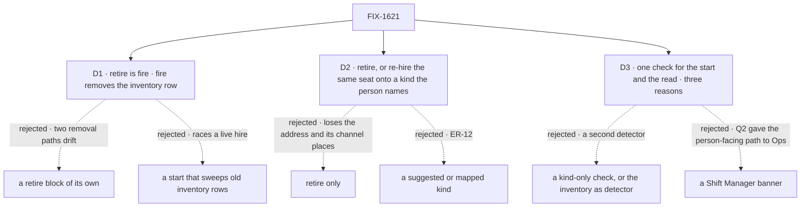

# FIX-1621 · Decisions

[Spec](SPEC.md) · **Decisions** · [Rules](BUSINESS-RULES.md) · [Plan](PLAN.md) · [Docs](DOCS.md) · [Evolution](EVOLUTION.md)

Three decisions are the sign-off surface. They answer the issue's three open walls where the
epic's Q2 doesn't reach ([FIX-1650 → Decided in review](../../epics/FIX-1650/DECISIONS.md#decided-in-review-recorded-so-no-child-reopens-them)),
inside the epic's rules: [ER-5](../../epics/FIX-1650/BUSINESS-RULES.md#what-a-team-gets-and-what-it-doesnt)
and [ER-19](../../epics/FIX-1650/BUSINESS-RULES.md#what-a-team-gets-and-what-it-doesnt) are this
issue's to decide, [ER-7](../../epics/FIX-1650/BUSINESS-RULES.md#what-a-team-gets-and-what-it-doesnt)
its to build, and [ER-20](../../epics/FIX-1650/BUSINESS-RULES.md#what-a-team-gets-and-what-it-doesnt)'s
gate is FIX-1719's.

## The tree

Solid edges are what you're signing. Dashed edges lost, and the label says why.

## D1 · Retire is fire, and fire removes the seat's inventory row; a row an older fire left behind is hidden by the reader, never swept

| | |
|---|---|
| **Instead of** | A retire block of its own beside fire · a start that deletes inventory rows with no roster row |
| **Because** | Retiring an orphan and firing a seat are the same fact: this organization no longer employs it. Fire already deletes an orphan's roster row (nothing holds its address, so nothing is released). What neither does is the inventory row, and TEAMS reads the inventory. One path means the second-path checklist is walked once ([ER-19](../../epics/FIX-1650/BUSINESS-RULES.md#what-a-team-gets-and-what-it-doesnt)). A sweep at start would delete in a race with a hire in another process; hiding a row the roster no longer backs is the dual read BP-030 asks for, and it covers a crash between the two deletes too (tenet 5: one rule, every writer) |
| **Locks in** | "The inventory row stays after a fire" stops being true, for hired seats, in docs people have read. An app that counted fired seats from the inventory loses that count. The team list now needs the roster beside the inventory to read |

It comes down to whether TEAMS can disagree with the roster: two paths and a sweep let it.

**What would change my mind:** an app that relies on the inventory as a history of every seat ever
hired. Then fire keeps the row and gains a `firedAt` mark the reader filters on, which costs a
schema change instead of a delete.

## D2 · Repair is retire, or re-hire of the same seat onto a kind the person names; the framework suggests no kind and maps none

| | |
|---|---|
| **Instead of** | Retire only, with a fresh hire as the way back · a suggested target kind, or one mapped from the cut one |
| **Because** | A seat's id is its address, its place in channels' member lists and the owner of its sessions. Retire-then-hire under the same id works today and costs two approvals and a window where the seat is gone. Re-hire keeps all of it in one write. Suggesting a kind is the auto-map the Architect's fence and [ER-12](../../epics/FIX-1650/BUSINESS-RULES.md#what-no-child-may-do) kill: the kind is always the person's word |
| **Locks in** | A second mutation on the hire plane that replaces a stored row, so concurrent repairs of one seat need a refusal, not a lock. Re-hire is only for a seat that won't start: changing a working seat's kind stays fire then hire, so there is one way to do each thing |

It comes down to the seat's address: retire-only throws it away with the kind.

**What would change my mind:** Ops (FIX-1719) never needing re-hire because every cut kind's seats
are simply let go. Then re-hire is dropped before it ships and retire stands alone.

## D3 · The read runs the start's own check and names every stored seat that won't come back, with one of three reasons; no banner and no new tool here

| | |
|---|---|
| **Instead of** | A check for a missing kind only · the inventory or Discover as the detector · a Shift Manager banner as the affordance |
| **Because** | A seat can fail to start for three reasons the start already tells apart: its kind is gone, the kind now refuses its settings, or the row can't be read. A kind-only read would leave the other two listed by the start and absent from the read, and Ops would grow a second detector ([ER-5](../../epics/FIX-1650/BUSINESS-RULES.md#what-a-team-gets-and-what-it-doesnt)). The inventory says *was registered*, not *won't start*, and the Architect fenced it off as the detector. Q2 made Ops the person's way in, so a banner would be a second one |
| **Locks in** | Three reason names Ops and the closure read, so renaming one later is a breaking change for them. Until FIX-1719 ships, a person has no screen for this: only an app's own action reaches it |

It comes down to agreement with the start: a kind-only read misses two of its three refusals.

**What would change my mind:** FIX-1719 slipping past the release that needs repair. Then a
minimal operator action ships here, not a banner.

## Decided, not asked

- **ER-5's orphan is the `kind-gone` reason; the read also names the other two**, so Ops has one
  list. A widening reported to the epic coordinator, not a conflict.
- **No gate in the blocks.** Model-free, like `hire` and `fire`. ER-20 places the ask; these run on
  Approve and are safe to run again after a crash.
- **Re-hire carries the instructions, not the settings**, which belong to the old kind's schema.
- **Retiring an unreadable row deletes it by its storage key.**
- **The org is the principal's, never the body's** (ER-7, BP-031).
- **Kitchen-sink's admin fire goes through the same removal**: no second writer.
- **A seat the registry refuses at start** (an address already held) is a collision, not a broken
  row; the start's own report names it.

## Considered and dropped

| Alternative | Why not |
|---|---|
| Retire every orphan automatically at start | Deletes evidence without a person; contradicts the locked boot default |
| Mark fired inventory rows `firedAt` instead of deleting | A history nobody reads, and every reader must filter. The simpler delete won |
| An Ops template in this issue | Q2 made the org seats FIX-1719's; this would be a second Ops |

## How it got here

- **Draft** — framed as the way out of degrade-by-name: one shared check behind the start and a
  read with three reasons; retire folded into fire, which now removes the inventory row, with
  the reader hiding older rows; re-hire keeps the seat. One PR, gate left to FIX-1719.

**Open: none.**
