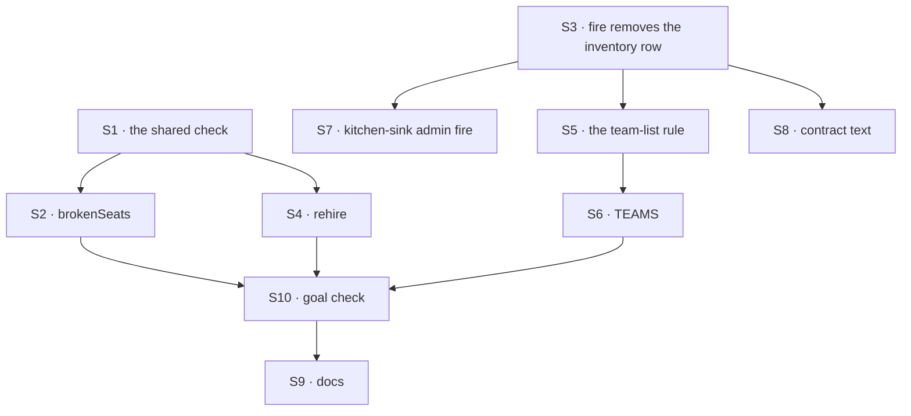

# FIX-1621 · Plan

[Spec](SPEC.md) · [Decisions](DECISIONS.md) · [Rules](BUSINESS-RULES.md) · **Plan** · [Docs](DOCS.md) · [Evolution](EVOLUTION.md)

Written for the implementing agent. IDs cross-reference [BUSINESS-RULES.md](BUSINESS-RULES.md)
(BR-n), [DECISIONS.md](DECISIONS.md) (D-n) and the epic's rules (ER-n). `tdd`. One PR. Build only
when Jake schedules it ([ER-17](../../epics/FIX-1650/BUSINESS-RULES.md#how-the-set-is-run)).

## Surfaces

| ID | Package · role | Change | Rules |
|---|---|---|---|
| S1 | `workforce` · the per-row check inside `reloadHiredSeats` | Extract "does this row become a seat, and if not, which reason and what detail" into one function. `kind-gone` is decided before any mint, so a cut kind is never minted. The reload calls it per row; its output and wording are unchanged | BR-1 to BR-5 |
| S2 | `workforce` · `brokenSeats`, a block on `createSeatHireBlocks` | Lists the org's roster rows through S1 with the kinds the blocks close over. Read-only. Org from the principal | BR-1 to BR-7 |
| S3 | `workforce` · the removal, behind `fire` | After the roster delete and release, delete the seat's inventory row (keyed by its address). With no roster row and a leftover inventory row, remove it and answer "already gone". Fire's description and the file header change with it (D1) | BR-8 to BR-12 |
| S4 | `workforce` · `rehire`, a block on `createSeatHireBlocks` | Refuse unless S1 says `kind-gone` or `refused`. Mint on the named kind first; replace the row in one version-checked write; register; on failure write the old row back; upsert the inventory row with the new kind (D2) | BR-14 to BR-19 |
| S5 | `workforce/browser` · the team-list rule, a leaf | Given an org's inventory rows and roster rows: a hired seat's row is listed only when the roster backs it; a declared seat's row as today. S3 is authoritative for new fires; S5 is only the BP-030 hide for rows already on disk (and BR-10's crash residue). S6 applies it; no third filter | BR-22 to BR-24 |
| S6 | `shift-manager` lab · the TEAMS read | Read the roster beside the inventory and apply S5 | BR-22 to BR-24 |
| S7 | kitchen-sink · `workforce-admin` fire | Route through S3's removal, private rows included. Its hire writes no inventory row today; sharing the path keeps one writer | BR-13 |
| S8 | `workforce` · contract text | S3's change, stated in the roster, inventory and `openInventory` headers | D1 |
| S9 | Docs | Publish [DOCS.md](DOCS.md) | — |
| S10 | `goals/hire-plane/repairs-a-seat-whose-kind-was-cut/` | The goal check, with its control | The goal |

Nothing is removed. The seat-hire capability's tool list is unchanged (D3).

## Sequence



## Checks

| ID | Runs after | Passes when |
|---|---|---|
| V1 | S1 | The reload's existing suite is green with no expectation changed; each reason maps from its refusal; a `kind-gone` row is classified without a mint, so BR-5's set equality compares outcomes, not mint calls |
| V2 | S2 | BR-1 to BR-4, BR-6, BR-7. BR-5 as set equality: the read and the reload over the same rows name the same rows with the same detail |
| V3 | S3 | BR-8, BR-9, BR-11, BR-12. BR-10 with a store that throws between the two deletes, then a second call |
| V4 | S4 | BR-14 to BR-16, BR-18. BR-17 with a register that kills the run after the write, then a reload. BR-19 with two calls racing (D2) |
| V5 | S5, S6 | BR-22 seeded as today's fire leaves it; BR-23; BR-24 with the roster read failing |
| V6 | S7 | Kitchen-sink's admin suite green, user-owned fire included, with the removal reached through S3 |
| VG | S10 | [The goal](SPEC.md#the-goal-and-how-well-know-its-met) PASSES after the same run FAILED under `GOAL_CONTROL=fire-keeps-inventory` (D1), and fails on today's `main` |
| V7 | all | BR-20: no new kind map, mapping or registration path (grep plus review); the start's refusal unchanged |

The second path (BP-035): the crash and concurrency rows (BR-10, BR-17, BR-19), the legacy row
(BR-22), two orgs (BR-6), and user-owned rows through kitchen-sink (BR-13).

## Pinned names

| Where | Name | Why pinned |
|---|---|---|
| Reason | `kind-gone` · `refused` · `unreadable` | FIX-1719 and the closure read them (D3) |
| Blocks | `brokenSeats`, `rehire` on `createSeatHireBlocks` | FIX-1719 mounts them; its spec names them |

Everything else is yours to name.

## Guardrails

| Rule | Because |
|---|---|
| Every removal of a hired seat passes through S3: `fire`, retire, kitchen-sink's admin fire (tenet 5) | ER-19 enumerated at one entry point is the review we most often pay for twice |
| The read and the reload call S1; neither re-derives a reason | Two detectors drift, and the epic's leg c compares them (ER-5) |
| Delete the roster row before the inventory row | The roster is the fact; a leftover inventory row is hidden by S5, a leftover roster row would be a seat that still starts |
| Never delete or rewrite a row at start | The boot default is the Architect's lock; evidence stays until a person decides |
| Never pick, suggest or register a kind (ER-12) | The kind is the person's word; seats never install kinds |
| Org from the principal in every block (ER-7, BP-031) | A body naming another org must change nothing |

## Docs

Reconcile [DOCS.md](DOCS.md) against shipped behaviour after VG passes, then publish. The epic's
[ownership row](../../epics/FIX-1650/DOCS.md#ownership) gives this issue `durable-hire.md`.

## Sketch · pseudocode, illustrative, react to the shape

```
the shared check (row, kinds):
    parse the row        → unreadable, if it fails
    kind not carried     → kind-gone
    mint it on its kind  → refused, with the kind's message, if it throws
    otherwise            → a seat
brokenSeats:  every roster row in the principal's org through the check, keep the non-seats
fire:         roster row gone → release if held → inventory row gone
              (no roster row but an inventory row: remove it, say "already gone")
rehire:       check says kind-gone or refused → mint on the named kind → replace the row
              → register (failed: write the old row back) → inventory row on the new kind
TEAMS:        a hired seat's inventory row shows only if the roster has its row
```

**POC: none.** The premises are read off `main`: `fire` already deletes an orphan's roster row
and releases nothing when no kind holds the address; the reload already returns a reason per
skipped row. No counted factual base, so no checker.

## At implement time

- Re-read FIX-1719's spec if it has merged: if it moved the gate into the hire blocks
  ([ER-20](../../epics/FIX-1650/BUSINESS-RULES.md#what-a-team-gets-and-what-it-doesnt)), S2 and S4
  gain it there, and BR-21 moves with it.
- S5 has to tell a hired seat's inventory row from a declared one. A hired row's id is
  `<org>.<seatId>`, so it splits with `splitSeatAddress` in the session's org; check the case
  where a team shares the org's name.
- Check whether the DevTeam profile declares the roster on a listed flow yet. If not, S6's
  BR-24 path is what Shift Manager shows until FIX-1719 adds it.
- Compare [Evolution](EVOLUTION.md)'s predecessor claims with current code and docs.

## Follow-ups

- A seat the registry refuses at start is named only by the app's own boot report. Out of scope
  (D3, decided not asked).
- Membership index rows naming a fired seat are left as the channel wrote them; channel admin is
  parked ([D3 of the epic](../../epics/FIX-1650/DECISIONS.md#d3)).
