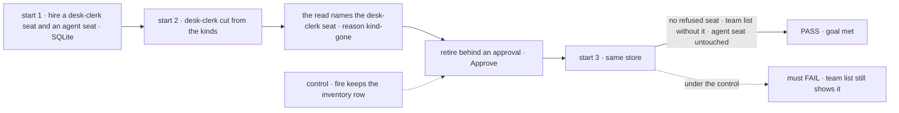
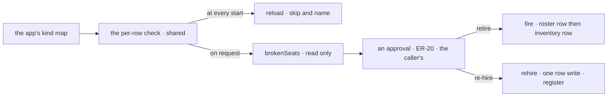

# FIX-1621 · Workforce Ops template: detect broken hire rows and repair

**Spec** · [Decisions](DECISIONS.md) · [Rules](BUSINESS-RULES.md) · [Plan](PLAN.md) · [Docs](DOCS.md) · [Evolution](EVOLUTION.md)

## Four people, before and after

| Someone who… | Today | After |
|---|---|---|
| **shipped a release that cut a kind** (kitchen-sink's `desk-clerk`) | Every start names `support.joe` as a stored seat it could not bring back, and nothing clears it short of reaching the database | Asks which stored seats don't come back and gets each one with its reason. Retires it, or re-hires it onto a kind the app still carries, and the next start names nothing |
| **fires a seat it hired** | The seat stops answering, but its row stays in the inventory, so Shift Manager's TEAMS keeps listing it | The seat leaves TEAMS when it is fired. A seat fired before this change leaves too |
| **runs the chief of staff** (FIX-1719, next in the epic) | Would have to write its own detector and its own delete | Calls this issue's read, and retires through the same path it fires through |
| **changes a seat's kind on purpose** | Fires it and hires it again under the same id, losing nothing but a step | The same. Re-hire is for a seat that no longer starts, not a second way to edit a working one |

The refusal at start is right and stays the default. What's missing is the way out.

## The goal, and how we'll know it's met

**After an app cuts a kind, a person can see each stored seat that no longer comes back and why,
and clear it on their approval, by retiring it or re-hiring it onto a kind the app still carries;
the next start names no refused seat, and the team list shows only seats that are hired.**

| Is it the right goal? | |
|---|---|
| **The real need** | "Detect hire rows whose kind is missing, inspect why they failed, and repair: retire, or explicitly re-hire onto a registered kind" ([FIX-1621](https://linear.app/fixpoint-labs/issue/FIX-1621)); the epic's leg c: named, retired on approval, and the next boot names no refused seat ([FIX-1650](../../epics/FIX-1650/SPEC.md#the-goal-and-how-well-know-its-met)) |
| **Smaller, and rejected** | "Retire deletes the orphan's roster row." The next start goes quiet, and TEAMS still lists the seat, because fire never touched the inventory. That is half the epic's leg b failing on the same path |
| **Bigger, and not this issue's** | The chief of staff asking in Inbox, and where that approval sits (FIX-1719, [ER-20](../../epics/FIX-1650/BUSINESS-RULES.md#what-a-team-gets-and-what-it-doesnt)). The browser run over Shift Manager (the closure, FIX-1720) |
| **Not done if** | The read and the boot disagree about which seats are broken · a seat fired before this change is still in TEAMS · a crash between the two deletes leaves a seat listed · a Deny changes a row · any kind is mapped onto another without a person naming it |



The check reads what the third start and the team list say, never what retire returned. Under
the control, today's fire, it must fail on the team list.

| How we verify | |
|---|---|
| **Goal check** | `goals/hire-plane/repairs-a-seat-whose-kind-was-cut/` · model n/a (the blocks are model-free; the model-driven ask is FIX-1719's) · three starts as separate processes over one SQLite file · run by the implementer at completion · verdict in the implementation PR |
| **Signal** | Start 2: the read lists exactly the cut seat, `kind-gone`; a Deny leaves it listed and its row unchanged. After Approve, start 3 reports **zero** problems, the team-list rule lists no cut seat, and the agent seat answers. A second orphan re-hired onto `agent` answers at its old address. An inventory row seeded as today's fire leaves one is not listed |
| **Input** | Kitchen-sink's case: `support.joe` on `desk-clerk`. Another cut kind, or a row whose settings the kind now refuses (`refused`), must pass too |
| **Anti-game** | No asserting on a block's return value or a mocked store; every claim is read back from a fresh process |
| **Control that must fail** | `GOAL_CONTROL=fire-keeps-inventory` (retire as today's fire) must FAIL on *the team list lists no cut seat*. Today's `main` fails at the read, which doesn't exist. The PR shows both before the PASS |

## What changes


Same store, before and after. The left is every start today; the right is the two ways out and
the team list that agrees with the roster.

**What the chief of staff (FIX-1719) or an app's own action writes:**

```diff
- const { hire, fire } = createSeatHireBlocks({ kinds, register, unregister, kindAt });
+ const { hire, fire, brokenSeats, rehire } = createSeatHireBlocks({ kinds, register, unregister, kindAt });
+ // brokenSeats → [{ seatId: "support.joe", kind: "desk-clerk", reason: "kind-gone", detail }]
+ // on Approve, one of:
+ //   fire   { seatId: "support.joe" }                       → roster row and inventory row gone
+ //   rehire { seatId: "support.joe", flow: "agent", instructions } → same address, new kind
```

## How a repair reaches the store



One check decides what is broken, so the read and the start can't disagree. Neither mutation
carries a gate of its own; where the ask sits is FIX-1719's first question.

## What stays as it is

- **The boot default.** A seat whose kind is gone is still refused, named and left alone at start
  ([FIX-1475 D2](../FIX-1475/DECISIONS.md#d2)). Nothing repairs at boot.
- **Kinds enter only through the boot map.** Nothing maps, registers or hot-loads a kind
  ([ER-12](../../epics/FIX-1650/BUSINESS-RULES.md#what-no-child-may-do)).
- **The seat-hire capability's tools** stay `hire` and `fire`. Mounting the read and re-hire as
  tools behind an ask is FIX-1719's.
- **The inventory binder** still never deletes; only fire does, for a hired seat's own row.
- **A seat's history.** Retire, like fire, keeps its sessions, state and resources.

## Sign off

**[The goal](#the-goal-and-how-well-know-its-met), at that size:** found, cleared on approval,
gone from the next start and from the team list. If wrong: the chief of staff gets a delete that leaves the seat
on screen, and leg b of the epic fails on the same path.

1. **[D1](DECISIONS.md#d1) · Retire is fire, and fire removes the seat's inventory row; an older
   row is hidden by the reader, never swept.** If wrong: two paths drift, or a start deletes a
   live seat's row in a race.
2. **[D2](DECISIONS.md#d2) · Repair is retire or re-hire of the same seat onto a kind the person
   names; nothing is suggested or mapped.** If wrong: a person has to retire and hire again, and
   loses the seat's address and channel places.
3. **[D3](DECISIONS.md#d3) · The read reuses the start's own check and names every stored seat
   that won't come back, with one of three reasons; no banner, no new tool here.** If wrong: the chief of staff
   reports a different list from the one the start refuses.

**Open: none.** D1 is the one to weigh: it changes a shipped promise ("the inventory row stays").
Reasoning: [DECISIONS.md](DECISIONS.md). Cases: [BUSINESS-RULES.md](BUSINESS-RULES.md).

Feature · `workforce`, `shift-manager` lab, kitchen-sink · medium · 1 PR · epic
[FIX-1650](../../epics/FIX-1650/SPEC.md) · Linear [FIX-1621](https://linear.app/fixpoint-labs/issue/FIX-1621)
