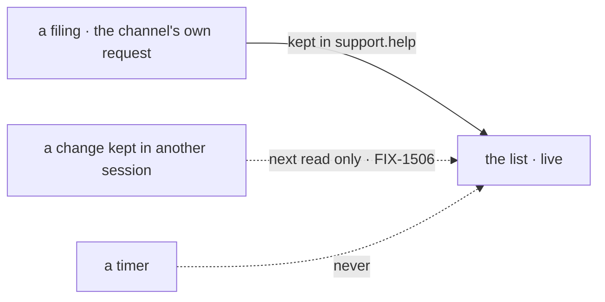

# FIX-1622 · Business rules

[Spec](SPEC.md) · [Decisions](DECISIONS.md) · **Rules** · [Plan](PLAN.md) · [Docs](DOCS.md) · [Evolution](EVOLUTION.md)

The cases, as rules. *Proved by* names the check [PLAN.md](PLAN.md#checks) runs. Filing itself
is FIX-1611's (its BR-8 to BR-12); this page covers seeing what was filed.

## Seeing a filed case

| # | When | Then | Proved by |
|---|---|---|---|
| BR-1 | A specialist files a case | The escalations list gains its row within a few seconds, with no reload, on every open page showing the list, whichever conversation that page has open | Goal · row, other-tab |
| BR-2 | A row is drawn | It shows the case (title, else goal, else id) and its status word. The list draws no status columns | Goal · status · V1 |
| BR-3 | The board holds several rows | Newest first. None is hidden, whatever its status | V1 |
| BR-4 | A row carries a status this version doesn't know, or the old `awaiting_review` | The first shows its own word; the second shows `parked`. No row is dropped | V1 |
| BR-5 | A case is filed once | One row, before and after a reload | Goal · once |
| BR-6 | The board holds nothing | The list says so, which is a different render from still loading | V1 |
| BR-7 | A read fails | The list says what failed and offers a retry, as the columns do | V1 |

## Staying current

| # | When | Then | Proved by |
|---|---|---|---|
| BR-8 | `live` is on and the session the list reads through keeps a change to its board | The list reads the board again and draws what that read returns | V2 · Goal · row |
| BR-9 | The change item carries fields the board does not publish | None of them is drawn. What shows is only ever the read's result | V2 |
| BR-10 | A change names a different board, or the item is not a board change | No read | V2 · Goal · no-poll |
| BR-11 | Changes arrive in a burst | At most one read in flight and one queued | V2 |
| BR-12 | Nothing changes | No read at all. Nothing re-reads on a timer | V2 · Goal · no-poll |
| BR-13 | A change is kept in a **different** session: a seat working the board from its own conversation, or later a person's pickup | It shows on the list's next read: a mount, a reload, or the next change the followed session keeps. Not live until FIX-1506. The docs say so | POC F6 · [Docs](DOCS.md) |
| BR-14 | The stream drops and comes back | A change kept meanwhile is read on its return (FIX-1609's resume) | V2 |
| BR-15 | The server has no stream, or refuses it (credential, unknown session, not attributable) | The list stays read-once, as without `live`. No error shown | V2 |
| BR-16 | The host reads the board with its own credential | The stream carries the same credential | V3 |
| BR-17 | `live` is off, the default | No stream opens. The list reads on mount, as the columns do | V2 |
| BR-18 | The list unmounts, or its session or board changes | Its stream closes; a read for the old board is discarded | V2 |

## In kitchen-sink

| # | When | Then | Proved by |
|---|---|---|---|
| BR-19 | Someone opens kitchen-sink | The escalations panel is a live `BoardList` read through `support.help`, drawn before any assistant conversation exists | V5 · Goal |
| BR-20 | The page is opened with `?goalControl=no-live` in a test-mode build | The list is not live, nor is the open conversation. Any other build ignores the parameter | Goal · control |
| BR-21 | A check reads the board as drawn | Each row is still an `li[data-task-id]` inside `board-support.help.escalations`; FIX-1611's goal and e2e case pass unchanged | V6 · V7 |
| BR-22 | The roster, or `BoardColumns` anywhere, is drawn | As today: read on mount, no stream | V4 · V7 |

The solid path is live; the dashed ones are the two things the list never does: pretend another
session's change is live, or re-read on a clock.

## Failure taxonomy

Nothing here is fatal. A stream that is missing, refused or dropped for good degrades to
read-once, silently, as FIX-1609's view does. A failed read is shown with a retry. Nothing
retries on a timer. A control that fails at setup, or reddens a leg it doesn't name, is a
failure of this issue.

## Acceptance criteria this issue owns

[The goal](SPEC.md#the-goal-and-how-well-know-its-met), with all three controls seen to fail on
their named legs before it passes. Epic ER-8 (no Workforce word below Workforce: the list says
*board* and *task*, as the columns do) and ER-27 (no check deleted).
