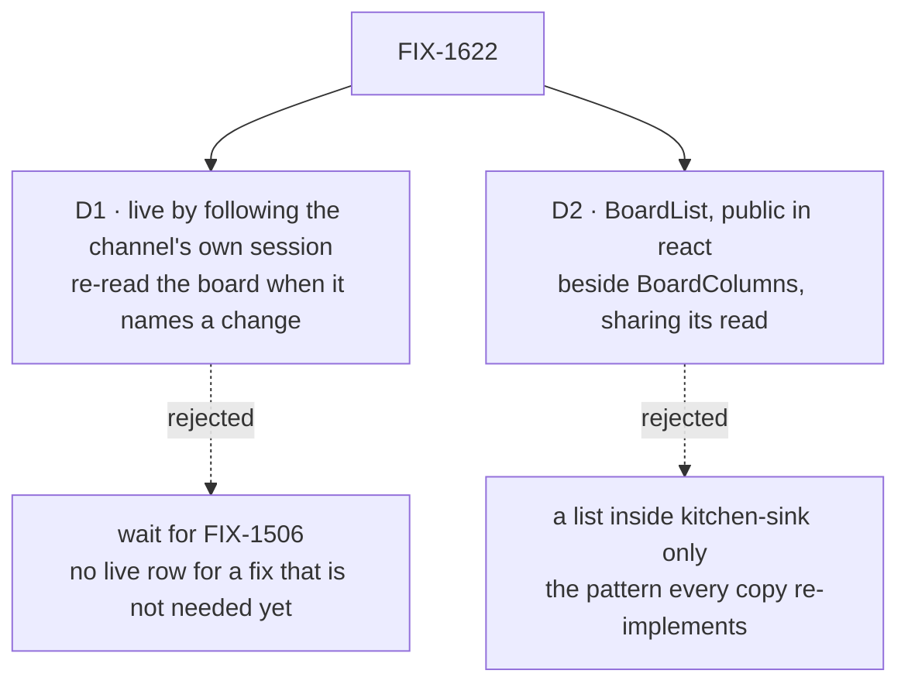

# FIX-1622 · Decisions

[Spec](SPEC.md) · **Decisions** · [Rules](BUSINESS-RULES.md) · [Plan](PLAN.md) · [Docs](DOCS.md) · [Evolution](EVOLUTION.md)

What was chosen, what lost, and what each choice locks in. The issue's own fences decided a lot
already: no poll, no remount as the fix, no second live bus, no new task status, FIX-1591 stays
parked. These two are what they left open.

## The tree

Solid edges are what you're signing. Dashed edges lost, and the label says why.

## D1 · The list goes live by following the channel's own session, and re-reads the board when that session keeps a change to it

| | |
|---|---|
| **Instead of** | Waiting for FIX-1506, the fan-out that would carry an organization's resource changes to every session |
| **Because** | Everything written to `escalations` today is written by one action, the channel's own `fileTask`, in `support.help`: no hired seat declares the board (the boot warns so), and a client may only read it. Each filing keeps a `task-change` item there, and FIX-1609's stream delivers it to any open page within about half a second. Shown on the real app, where nothing reached the assistant's stream and no `resource_change` reached any ([POC](poc/filed-row-on-the-channel-stream/README.md)). FIX-1506 is still `Todo`; a board with one writer doesn't need it |
| **Locks in** | Live for filings, not for work done elsewhere. A change a seat or a person keeps in their own conversation shows on the list's next read: a mount, a reload, or the next filing. When FIX-1591 lets a person work a case, their change isn't live until FIX-1506, and that issue owns the gap. `live` then widens with no prop change |

It comes down to a filing today: waiting for FIX-1506 leaves every filing invisible until a reload.

**The panel reads through the channel, not the assistant**: one session for the read and the
stream, and the one that owns the board.

**What would change my mind:** a second writer of `escalations` landing before FIX-1506: a seat
that drains it, or FIX-1591 unparked. Then the other half of the gap is on the path, and FIX-1506
comes first.

## D2 · The list is `BoardList`, a public component in `@flow-state-dev/react` beside `BoardColumns`, sharing its read; `live` is on the list only

| | |
|---|---|
| **Instead of** | A list drawn inside kitchen-sink over the same read |
| **Because** | kitchen-sink is the app people copy, so a list there is one every support desk re-implements: paging, the read fence, the host's credential, the legacy status, loading apart from empty, and the live re-read. `BoardColumns` already holds all but the last, where the fences point ("shipped board presentation contracts Labs can reuse"), and FIX-1477's BR-13 already holds the shell's panel to package components. A list beside the columns adds only the drawing |
| **Locks in** | A public component, its prop list asserted like the columns', and a changeset. `live` is public, its limit in the docs. `BoardColumns` gains nothing: its boards are the ones seats drain, where `live` would see only filings until FIX-1506 |

It comes down to the app that copies the demo: a kitchen-sink list is one it rewrites, live re-read included.

**What would change my mind:** FIX-1385's board chrome deciding one board component with a
layout switch. Then `BoardList` folds into it; the read it shares means nothing is lost.

## Decided, not asked

- **The status word is the task status as written**, the words the columns head with. No new
  status (the fences).
- **Each row stays an `li[data-task-id]` in `board-support.help.escalations`**, so FIX-1611's
  goal and e2e case pass unchanged (ER-27).
- **The stream asks for components only**; the list acts on a `task-change` naming its board and
  never draws its payload (POC F5).
- **A refused or missing stream is silent**, as `useSession`'s `live` is (FIX-1609).
- **How the host hands the stream its credential is the implementer's**; that it does is a rule
  (BR-16).
- **`?goalControl=no-live` also turns off the list's `live`**, test-mode builds only. FIX-1609's
  check under it keeps failing at exactly its two legs.
- **The assistant flow stops declaring the board**; nothing reads it there any more.
- **One stream per live list.** A page with the channel open follows it twice; sharing is a
  follow-up.

## Considered and dropped

| Alternative | Why not |
|---|---|
| Re-read on a timer, or remount after Send | The fences, and FIX-1477: a timer hides a broken deployment behind fresh-looking rows |
| Listen for `resource_change` | It reaches only the writer's session, and never a store-read stream (POC F3) |
| Read through the assistant's session, stream the channel's | Two session props for one panel, and the assistant session is not the board's owner |
| Draw the row from the `task-change` payload | Shows fields the board withholds (POC F5), and differs from a reload |
| A `layout` prop on `BoardColumns` | A list under a columns name, with slots that mean nothing in one of its modes |
| The registry's `TaskPlan` | Scoped to one request's plan, drawn from items; a standing board is neither |
| A `board-list` in the `ui` registry | Copied source can't share the columns' read, which `react` keeps internal on purpose; it would carry paging, fencing and the live re-read itself |
| `live` on `BoardColumns` too | Its boards are drained from other sessions, so it would promise what only FIX-1506 delivers |

## Settled

- **A filing reaches an open page through what already ships** — **CONFIRMED**: on the real
  app, the channel's stream carried the `task-change` 0.5 s after the post; the assistant's
  carried nothing; a row written from another session stayed off the channel's stream; under
  `no-filing` the two filing checks went red and nothing else did
  ([evidence](poc/filed-row-on-the-channel-stream/evidence.txt)).

## How it got here

- **Draft** — the crux settled by a POC on `main` at 9a55b79e4 before drafting; FIX-1506 named
  as the boundary, off the critical path.

**Open: none.**
