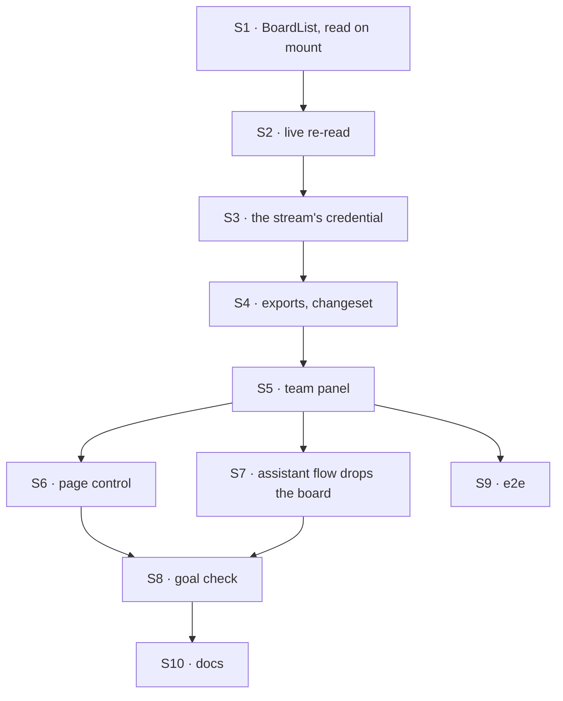

# FIX-1622 · Plan

[Spec](SPEC.md) · [Decisions](DECISIONS.md) · [Rules](BUSINESS-RULES.md) · **Plan** · [Docs](DOCS.md) · [Evolution](EVOLUTION.md)

For the implementing agent; BR-n and D-n cite [Rules](BUSINESS-RULES.md) and
[Decisions](DECISIONS.md). `tdd`, one PR. FIX-1609 and FIX-1611 are merged; start from `main`.

## Surfaces

| ID | Where | Change | Rules |
|---|---|---|---|
| S1 | `react` · `components/panels/`, new `BoardList` | One `li[data-task-id]` per row in a `data-panel="board"` container: the columns' label, the status word, the assignee when present. Newest first by `createdAt`; undated rows after, in read order. Reuses the columns' migration, card guard and chrome; loading, empty and error apart. Props: `sessionId`, `boardRef`, `resourceClient`, `limit`, `slots` (`row`, `empty`), `live`, and S3's transport. A prop allow-list and type test | BR-2 to BR-7, D2 |
| S2 | `react` · the shared read (`reads.ts`) | With `live`, after the first read, open `createSessionSSEClient` on `sessionId` with `itemTypes: ["component"]` and no `since` (its first read reaches back a minute, covering a change between the read and the open). A `task-change` whose data names `boardRef` schedules a re-read: one in flight, one queued. Nothing from the item is drawn. Close on unmount or a new identity; stay quiet on `onStop` | BR-8 to BR-15, BR-17, BR-18, D1 |
| S3 | `react` · the stream's transport | The stream carries the read's credential: a host with its own resource client can hand the stream the same `fetch`; one passing neither uses the provider's `baseUrl` for both. The prop's shape is yours | BR-16 |
| S4 | `react` · `index.ts`, `panels/index.ts`, README, changeset | Export `BoardList`, its props, slots and prop names. `minor` changeset for `@flow-state-dev/react` | — |
| S5 | kitchen-sink · `components/team-panel.tsx`, `test/shell-imports.test.ts` | `BoardColumns` becomes `BoardList`, `sessionId={board.channelId}`, `live` from a new prop; no wait on the assistant session. An `empty` slot in the app's words. The shell-imports test's panel case names `BoardList` | BR-19, BR-21 |
| S6 | kitchen-sink · `app/page.tsx` | Pass `live={pageGoalControl(searchParams) !== "no-live"}` to `TeamPanel`, the same value `pickedLive` reads | BR-20 |
| S7 | kitchen-sink · `flows/chat-agent/shared/workforce-panels.ts`, `test/workforce-shell.test.ts` | **Remove** the board ledgers from the assistant flow's panel resources. The shell test asserts the channel flow declares each `SHELL_BOARDS` ref instead, and still fails when a board is dropped | BR-19 |
| S8 | `goals/kitchen-sink-talk/lists-a-filed-case-without-a-reload/` | New. Browser mechanics from `shows-the-reply-without-a-reload/` (production build, two pages, request counting, `?goalControl=`); scenario and token from `answers-a-clerk-note-or-files-it/` | Goal |
| S9 | kitchen-sink · `e2e/talk-from-page.spec.ts` | Keep "a post that needs a person … after a reload" as it is. **Add** one case: the row appears in the list with no reload, and no `[data-column]` is drawn | BR-1, BR-2, BR-21 |
| S10 | Docs | [DOCS.md](DOCS.md) | — |

## Sequence



## Checks

| ID | After | Passes when |
|---|---|---|
| V1 | S1 | `BoardList` units: BR-2 to BR-7. One `li[data-task-id]` per row, no `[data-column]`; newest first; an unknown status shown; `awaiting_review` shown as `parked`; loading, empty and error are three renders |
| V2 | S2 | Against a fake stream: this board's `task-change` reads once; another board's, a `channel-post`, a non-component item read nothing; five in a burst read at most twice; `live` off opens nothing; a stop (401, 404, 501) keeps the rows, no error; unmount closes; a read for a board left behind is discarded; a change kept during a drop is read on reconnect. **BR-9:** an item saying `completed` while the read says `pending` shows `pending` |
| V3 | S3 | The stream request carries a host transport's header. Red state first: the provider's plain `fetch` sends none |
| V4 | S4 | `BoardList`'s prop type test; `BoardColumns`' and `Roster`'s unchanged. `pnpm --filter @flow-state-dev/react test` and `typecheck` |
| V5 | S5, S7 | Kitchen-sink units: the shell test green, and red when a board leaves `SHELL_BOARDS` or the channel's declaration; the shell-imports test green, and red with `BoardColumns` put back |
| V6 | S9 | `pnpm --filter @flow-state-dev/kitchen-sink test:e2e --workers=1`; the new case red on `main` first |
| VG | S8 | [The goal](SPEC.md#the-goal-and-how-well-know-its-met): FAILS under `no-live` (row, other-tab), on `main` with the folder copied in (row, other-tab, status), and under `no-filing` (row, other-tab, status, once), each naming only its legs; then PASSES. Verdict log rows for each |
| V7 | S8 | Neighbours, re-run: `answers-a-clerk-note-or-files-it` passes (its board leg reads `li[data-task-id]`); `shows-the-reply-without-a-reload` passes, and under `no-live` still fails at exactly working and line |

One check per decision: D1 is VG's row and other-tab legs with `no-live`; D2 is V1, V4 and VG's
status leg against `main`.

## Pinned names

| Where | Name | Why pinned |
|---|---|---|
| Component | `BoardList` | Public; the docs and kitchen-sink import it |
| Prop | `live` | The same word `useSession` uses for the same promise |
| Goal path | `goals/kitchen-sink-talk/lists-a-filed-case-without-a-reload/` | FIX-1601's P2e re-runs it |
| Legs | row, other-tab, status, once, no-poll | The controls' expectations name them |
| Page control | `no-live` | Reused from FIX-1609; its check depends on its scope staying the page's panels |

Everything else is yours to name.

## Guardrails

| Rule | Because |
|---|---|
| Draw only what the read returns; the item says *when*, never *what* | The item carries fields the board withholds (POC F5) |
| No timer, no remount, no `key` change, no `resource_change` listener | The fences, FIX-1477's taxonomy, and POC F3: `resource_change` never reaches a store-read stream |
| No engine, client, orchestration or workforce change | The stream and the item both ship. A change there means the premise broke: stop and surface it |
| The stream carries the read's credential, and a unit proves it | A refused stream degrades silently (BR-15), so a missing credential would pass everything else here |
| No Workforce word in `react` | Epic ER-8. *Board*, *task* and *session* are the substrate's words |
| No check deleted; the new e2e case is seen red before green | Epic ER-27, BP-003 |

## Docs

Publish [DOCS.md](DOCS.md) after VG passes, in the same PR, through `docs-writer` then
`docs-editor` against what shipped. The kitchen-sink README is private; `react` gets the changeset.

## Sketch · illustrative

```
BoardList(sessionId, boardRef, live):
    rows ← shared paged read (sessionId, boardRef)
    if live, once the first read has landed:
        follow sessionId's stream, components only
        on item: if it is a task-change naming boardRef → schedule a re-read (coalesced)
        on stop: keep the rows, say nothing
    draw rows newest first: label · status word
```

**POC:** [`poc/filed-row-on-the-channel-stream/`](poc/filed-row-on-the-channel-stream/README.md).
On the real app, a filing's `task-change` reached the channel's stream in 0.5 s and no other; a
write from another session stayed on its own stream. The premise held; nothing changed.

## At implement time

- Re-read `useSession`'s live effect and `createSessionSSEClient`'s callbacks: S2 follows the same
  stop and reconnect semantics, and a helper shared with it is fine if it stays internal.
- Grep `goals/` and `e2e/` for a board read through a chat-agent session before S7.
- `test/roster-boot-report.test.tsx` renders `TeamPanel` against a fake client; keep it green
  when the board reads through `support.help` (`live` optional, off by default).
- Re-run the POC on the starting tree. If F1 fails, stop: the premise moved.
- Compare [Evolution](EVOLUTION.md) with current code and docs.

## Follow-ups

- **For the coordinator:** FIX-1601's P2e reads *"the `escalations` column"*. Re-point it to the
  list, with no reload, and re-run this goal there.
- The channel's item log publishes task rows wider than the board's read (POC F5): `metadata`,
  `incarnationId`, `revision`. Pre-existing; its own issue.
- One stream per live list; a shared subscription when a page holds several.
- FIX-1506: when it lands, `live` also carries other sessions' changes, with no prop change.
