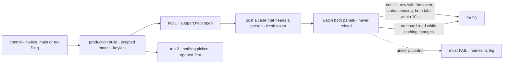

# FIX-1622 · Escalations panel: live without a reload, a list of tasks with their status

**Spec** · [Decisions](DECISIONS.md) · [Rules](BUSINESS-RULES.md) · [Plan](PLAN.md) · [Docs](DOCS.md) · [Evolution](EVOLUTION.md)

Feature · `react` + kitchen-sink + `goals/` · medium · 1 PR · epic
[FIX-1592](https://linear.app/fixpoint-labs/issue/FIX-1592) · after FIX-1609 and FIX-1611 (both
merged) · blocks FIX-1601

## Five people, before and after

| Someone who… | Today | After |
|---|---|---|
| **asks `support.help` for a real person** | Is told it's filed; the escalations panel changes only on a reload | The case appears in the panel within about two seconds |
| **has the demo open in a second tab** | Sees the case only after reloading that tab | Sees it too, with no reload |
| **reads the escalations panel** | Seven narrow status columns, mostly empty: *"unreadable"* (Jake's hand test, 2026-09-28) | One list, newest first, each case with its status word |
| **builds a support desk on FSD** | Writes their own list and its refresh | Imports `BoardList` with `live` |
| **later works a case from their own view** (FIX-1591, parked) | n/a | Their change shows on the next read until FIX-1506, as the docs say |

**The crux: how does the panel go live, honestly?** A filing is written by the channel's own
request in `support.help`, which keeps a change item there. FIX-1609's session stream already
delivers it to any open page about half a second later
([POC](poc/filed-row-on-the-channel-stream/README.md)). The panel misses it because it reads
through the assistant's conversation, a different session, and watches nothing. So the list
follows the channel's session and re-reads the board when a change arrives. No poll, no remount,
no second stream, and no FIX-1506: only the channel writes `escalations` today.

## The goal, and how we'll know it's met

**A person who asks `support.help` for a real person sees the case appear in the escalations
panel as a row with its status, in a list, with no reload, in that tab and in any other tab open
on the demo.**

| Is it the right goal? | |
|---|---|
| **The real need** | The issue's two outcomes: the row *"without a page reload"*, at FIX-1609's honesty bar, and *"a list of tasks with status"*. FIX-1601's closure shows it ([P2e](../FIX-1601/PLAN.md)) |
| **Smaller, and rejected** | A list that re-reads when *this* page sends. It passes a one-tab hand test and fails the second tab, the gap FIX-1609 closed for lines |
| **Bigger, and not this issue's** | Changes from any session, live (FIX-1506) · a person working a case (FIX-1591) · board chrome (FIX-1385) |
| **Not done if** | The row shows because the page re-read on Send · it passes only with the channel picked · a timer re-reads · the list draws the change item, not the board's read · no control failed |



The check reads both panels as drawn, by this run's token, and reloads only at the very end.

| How we verify | |
|---|---|
| **Goal check** | `goals/kitchen-sink-talk/lists-a-filed-case-without-a-reload/`, new. Real browser, production build, FIX-1611's scripted needs-a-person scenario, no key. The implementer runs it; verdict in the PR. FIX-1601's P2e re-runs it |
| **Signal** | **row**: within 10 s of Send, tab 1's panel holds one row with the token. **other-tab**: tab 2 too. **status**: it reads `pending`; no status column is drawn. **once**: one row after a final reload. **no-poll**: at most two board reads per tab from Send to row; none in a 10 s idle window |
| **Input** | A fresh token per run. `GOAL_SEAT` routes to another specialist; a second filing must appear above the first. Every row here is `pending`, since nothing works the board; the plan's units prove the other words |
| **Anti-game** | The panel as drawn, never the ledger, the "filed" line or a response. A reload or navigation before the last leg voids it. Tab 2 never picks the channel |
| **Control that must fail** | `no-live` (the page opened with `?goalControl=no-live`): row and other-tab. Today's `main`: row, other-tab and status. `no-filing`: every leg but no-poll, so the "filed" line alone never passes |

## What changes


The filing is untouched. What changes is which session the panel follows, and what it draws. The
stream only says *something changed*; what the list shows comes from its own read.

```diff
  // apps/kitchen-sink/components/team-panel.tsx
- <BoardColumns sessionId={sessionId} boardRef={board.ref} resourceClient={resourceClient} />
+ <BoardList sessionId={board.channelId} boardRef={board.ref} resourceClient={resourceClient} live={live} />
```

```diff
  // any app, the same board
+ import { BoardList } from "@flow-state-dev/react";
+ <BoardList sessionId="support.help" boardRef="support.help.escalations" live />
```

## What stays as it is

- Filing, what the board publishes, the unattended warning. FIX-1591 stays parked.
- `BoardColumns` and the roster, read on mount.
- FIX-1609's stream and `useSession`: no engine or client change, no new route.
- The seven task statuses. The list adds none.

## Sign off

**[The goal](#the-goal-and-how-well-know-its-met), at that size:** live in any open tab, and a
list. If wrong: a demo that looks live to the person who filed and stale to everyone else.

1. **[D1](DECISIONS.md#d1) · The list goes live by following the channel's own session; a
   change kept in another session shows on the next read until FIX-1506.** If wrong: a person
   working a case (FIX-1591) isn't live, and FIX-1506 lands on that issue's path.
2. **[D2](DECISIONS.md#d2) · The list is `BoardList`, public in `@flow-state-dev/react` beside
   `BoardColumns`, sharing its read; `live` is on the list only.** If wrong: one more public
   component to keep in step.

**Open: none.** Number 1 is the one to weigh. It lifts the epic's *"no board UI"* for this panel
([ER-13](../../epics/FIX-1592/BUSINESS-RULES.md#what-no-child-may-do)), and makes one panel live
where FIX-1477 left panels read on mount ([Evolution](EVOLUTION.md)). FIX-1601's P2e still says
*"the `escalations` column"*; the coordinator re-points it. Reasoning:
[DECISIONS.md](DECISIONS.md). Cases: [BUSINESS-RULES.md](BUSINESS-RULES.md).
