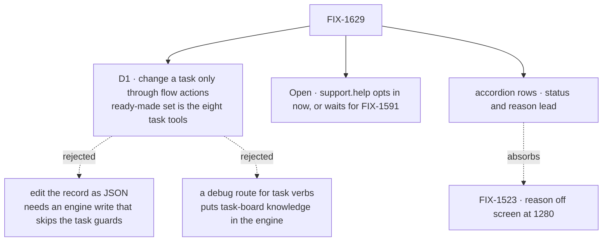

# FIX-1629 · Decisions

[Spec](SPEC.md) · **Decisions** · [Rules](BUSINESS-RULES.md) · [Plan](PLAN.md) · [Docs](DOCS.md) · [Evolution](EVOLUTION.md)

One decision to sign, one fork to call. The rest was decided and is listed so nobody re-derives it.

## The tree

Solid edges are what you're signing. Dashed edges lost or were absorbed.

## D1 · A task changes only through the flow's own actions. The ready-made set is the eight task tools. No record editor, no DevTool-only route

| | |
|---|---|
| **Instead of** | An editable JSON view of the task record in the Tasks tab or the Resources panel, or a debug-gated engine route that runs task verbs for the DevTool |
| **Because** | Every way a task moves already exists as a guarded verb (terminal rows refuse, a lost claim refuses, `parked → pending` is fenced). The eight task tools (`addTask`, `assignTask`, `completeTask`, `failTask`, `blockTask`, `cancelTask`, `updateTask`, `listTasks`) are the framework's own surface over those verbs, already given to models. Exposing them as flow actions reuses the action path the DevTool already calls. A record editor needs a state-write route that no client has today and would bypass every guard. A debug verb route puts task-board knowledge in the engine (L1) and is a DevTool-only mutation path. Tenets 2 and 5: refine what exists, one convergence point for writes |
| **Locks in** | What you can do to a task from the DevTool is exactly what the flow exposes. A flow that exposes nothing shows nothing to press, with a line saying how to expose the set. Fields no verb writes (the goal, attempts, revision) can't be changed from the DevTool. Adding an editor later means a new write route and a decision about which guards it skips |

![D1. How does the DevTool change a task? Chosen: the flow's own actions, with the eight task tools as the ready-made set. Instead of: edit the record as JSON. It comes down to the task guards: actions go through the verbs that refuse illegal moves, an editor writes past them. The price: only what a verb allows, and a flow must expose actions. Layer fit: actions need no engine change; the editor needs a new write route. Locks in: the DevTool can do what the flow exposes and nothing else. Flips if: you need to change fields no verb writes, such as the goal](figures/d1-actions-not-edits.svg)

It comes down to the task guards: an editor writes a row the verbs would have refused.

## Open · Should the reference app's `support.help` channel turn its escalation actions on now?

**Plain terms.** Workforce channels gain an opt-in that exposes their boards' eight task
tools as actions, off by default. Turning it on for `support.help` makes the screen you sent
manageable. It also means anyone who can reach that channel can cancel, complete or reassign an
escalation, including one a seat is working on right now; that seat's own result is then refused
and dropped. FIX-1591 ("who attends escalations") is parked waiting on you.

**Trade-off.** On now: your screenshot works end to end, and the demo shows the feature on its
headline board. Off until FIX-1591: nothing pre-empts that hold, but the reference app's only
board stays read-only in the tab; the feature is proved only on the lab hire.

**Recommendation: on now.** It is a developer's tool on a demo board with no production users,
and the change is one line to reverse. It does not decide FIX-1591's question: nothing drains
`escalations` and no person-side screen is built.

**What would change my mind:** if you mean `support.help` to demo "nobody works this board" as
the point of the unattended-board warning, off is right.

**If wrong:** on, and you wanted the hold: revert one line, nothing else moves. Off, and you
wanted it: the tab stays read-only on the board you use most until a follow-up.

![Open fork. Should support.help expose its escalation actions now? Recommended: on now. Instead of: off until FIX-1591 decides. It comes down to your screenshot: on, the escalations rows are manageable from the tab; off, they stay read-only. The price of on: any caller who can reach the channel can change an escalation, even one a seat is working on, on a demo with no production users. FIX-1591 hold: on does not decide it, nothing drains the board. Locks in: a one-line setting in the reference app. Flips if: the demo is meant to show an unattended board](figures/open-support-help-actions.svg)

It comes down to your screenshot: off, the board you asked about stays read-only.

## Decided, not asked

- **FIX-1523 is absorbed and closes when this ships.** The collapsed row leads with status, then
  the goal and the reason sharing the remaining width; nothing scrolls sideways at 1280.
- **Which actions a row offers:** every public action on the viewed flow whose input has a
  required string `taskId`. One whose name ends with the suffix of any board the tab lists
  (`_support_help_escalations`) shows only on that board's rows; the rest show on every board.
  Generic, so an app's own `answer` action shows too. Of the eight task tools, `addTask` and
  `listTasks` take no `taskId`, so a row offers six.
- **`taskId` is filled in and locked;** other fields use the action bar's existing form.
- **The row reads the result from the request's root trace.** The dispatch returns only a
  request id and a refusal writes nothing, so the tool's `{ ok, error }` lives only in the root
  `block_trace` of the request the row sent. With traces off, the row says the outcome isn't
  visible. A refusal never shows as success.
- **An action's settlement overrides a worker's claim.** An action has no claim ticket, so it
  settles as a coordinator does today: legal transitions only, no ownership check. The holding
  seat's later result is refused (`lost-claim`). Clearing a stuck row is the debugging job, and
  refusing would need a new substrate guard. It is why channel exposure stays opt-in.
- **Durable boards only.** A request- or sequencer-backed ledger is gone before the row's action
  runs, so `taskToolActions` refuses those backings by name, as `unparkAndDrain` does.
- **A channel's actions work only in its own session.** Channels share one flow, so each action
  runs the session check `fileTask` and `readBoard` already make.
- **One PR, not two.** You asked for both halves together; Cursor's review agreed.
- **The row reads the item stream, as today.** It updates from the change item the action's
  own request emits. Changes made by another session stay FIX-1506's.
- **One orchestration export, `taskToolActions`,** so a non-Workforce board gets the set without
  reaching for an internal resolver. The suffix rule moves from Workforce into orchestration so
  names have one home.
- **Several rows can be open at once;** a live update never collapses an open row.
- **The Resources panel is untouched.** It stays the ledger view.

## Considered and dropped

| Option | Why it lost |
|---|---|
| Accordion only, actions later | Half of what was asked |
| Match actions by a fixed name list | Misses an app's own `answer`; `taskId` in the input is the honest signal |
| Always expose channel board actions | Opens every production channel's rows to any caller |
| Offer `unpark` as a ninth tool | Not in the eight; answering a parked row stays the app's action (FIX-1457 ER-1) |
| A POC of the row | The UI is an extension of an existing table and form; the goal check renders it on a live hire |

## How it got here

- **Draft** — Framed as read-in-place plus change-through-actions; chose the eight task tools as
  flow actions over a record editor, a Workforce opt-in with one open fork on `support.help`,
  one PR.
- **Review, round 2** — The refusal path moved to the request's root trace, because the dispatch
  response and the change items carry no refused result. Added the claim-override, durable-board
  and channel-session rules the second look and Codex found missing. D1 and the fork stand.
