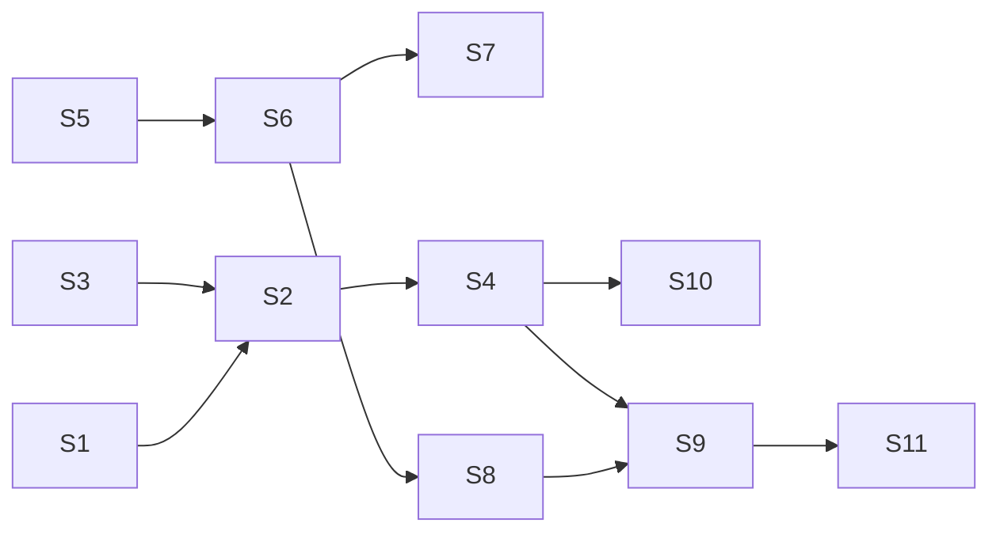

# FIX-1629 · Plan

[Spec](SPEC.md) · [Decisions](DECISIONS.md) · [Rules](BUSINESS-RULES.md) · **Plan** · [Docs](DOCS.md) · [Evolution](EVOLUTION.md)

Discipline: `tdd`. One PR. Directional: shape and order are fixed, local design is yours.

## Surfaces

| ID | Package · file or role | Change | Rules |
|---|---|---|---|
| S1 | `devtool` · `components/workspace/task-collections-view.tsx` | Table → list of disclosure rows (button, `aria-expanded`, `aria-controls`). Collapsed: status · goal · reason · assignee · run · kind, as a grid whose flexible cells have `minmax(0, 1fr)`. **Remove** the `
` Details column and its fixed `w-[28rem]` block | BR-1–BR-8 |
| S2 | `devtool` · new row-body component beside S1 | Field list (BR-4), folded `JsonViewer`, Actions section. Open state keyed by board + task id, held above the row so item updates don't reset it | BR-4–BR-7, BR-9–BR-15 |
| S3 | `devtool` · a pure `lib/` helper | `taskActionsFor(actions, schemas, collectionId)`: qualifying actions per BR-9 / BR-10. Mirrors the suffix rule (S5) locally, as the panel mirrors wire shapes | BR-9–BR-11 |
| S4 | `devtool` · `DevToolPanel.tsx` + `action-bar`'s form | Pass the flow's action names, schemas and the existing `handleSendAction` into S1. Reuse `SchemaForm`; add a way to fix one field's value. Capture the dispatch result (response or thrown error) for the row | BR-12–BR-15 |
| S5 | `orchestration` · `skills/task-tools-capability.ts` + `task-board` | Export `taskToolActions(board)` → `Record<string, ActionConfig>` over `buildTaskToolsList(resolver, undefined, suffix)`. Accepts a `TaskBoardHandle` (uses its own resolver) or a `(collectionId, resolver)` pair. **Move** `boardToolSuffix` here as `taskToolSuffix` | BR-17, BR-18 |
| S6 | `workforce` · `channel/channel-board.ts`, `channel-flow.ts`, `channel-binder.ts` | Import `taskToolSuffix` (remove the local copy). `defineChannelFlow` takes a per-channel `boardActions`; when true, spread each board's `taskToolActions` into public `actions` **and** `internal.actions`. Binder: seventh key in the closed list, boolean only | BR-19, BR-20 |
| S7 | kitchen-sink · `support/channels/help/CHANNEL.md` | `boardActions: true` **if** the open fork lands on "on now"; otherwise untouched | BR-21 |
| S8 | `goals/multi-seat-collab/lab` | The lab's channel declares `boardActions`, unless `GOAL_CONTROL=channel-actions-off` | VG tool |
| S9 | `goals/devtool-workforce-visibility/works-a-task-from-its-row/` | New goal check (SPEC → How we verify) | VG |
| S10 | `goals/devtool-workforce-visibility/the-checklist-rows/run.mts`, `goals/multi-seat-collab/it-hands-a-row-between-two-seats-in-view/run.mts` | Re-point the reason read from "cell under the Reason heading" to the collapsed row's reason slot, by task id. Same legs, same controls | BR-8 |
| S11 | docs | Per [DOCS.md](DOCS.md) | — |

## Sequence

S5/S6 and S1–S4 are independent; land orchestration first so the DevTool tests can use real action names.

## Checks

| ID | After | Passes when |
|---|---|---|
| C0 | S5 | **Premise first:** a task-tool handler (it declares `parentStateSchema`) runs as a flow-action root in a `fsdev run`/engine test and writes the ledger. If it doesn't, wrap each in a one-step sequencer inside S5 — no engine change |
| C1 | S5 | Each of the eight actions runs its verb; a settled-row `cancelTask_x` returns `declined`/`ok:false` (BR-17, BR-18) |
| C2 | S6 | Channel with `boardActions: true` lists 8 × boards more public actions; without it the public map equals today's snapshot; a bad value is refused at bind by name (BR-19, BR-20) |
| C3 | S3 | Qualification: required `taskId` string in, optional `taskId` out, suffix scoping, unsuffixed on every board (BR-9, BR-10) |
| C4 | S1/S2 | jsdom: collapsed order, expand by click and keyboard, every BR-4 field present when set and absent when not, JSON folded and equal to the task, open row survives an update, long unbroken token contained (BR-1, BR-3–BR-7) |
| C5 | S4 | Submit calls the existing dispatch with `taskId` fixed; `ok:false` and a thrown error render as failures; the no-actions line appears (BR-11–BR-15) |
| C6 | S1 | FIX-1481's Reason tests pass, re-pointed at the new slot (BR-8) |
| C7 | S10 | Both existing goal checks PASS on the new row; their named controls still FAIL where they did |
| VG | S9 | The goal check PASSes; `main` fails read/answer/tool; `channel-actions-off` fails tool/refuse only |
| C8 | all | `pnpm typecheck`, `pnpm test`; engine route-table test unchanged (BR-22) |

Second paths (BP-035): off state of `boardActions` (C2); a flow with no qualifying action (C5);
legacy `awaiting_review` rows still render as `parked` (existing fold, keep its test).

## Pinned names

| Name | Why |
|---|---|
| `taskToolActions` | The one public hook; docs and the diff use it |
| `taskToolSuffix` and the `<tool>_<suffix>` action names | Same names models already see for channel boards; the DevTool scopes by it |
| `boardActions` (CHANNEL.md key) | A declared key users type |
| `taskId` as the qualifying input field | It is what the eight tools and the lab's `answer` already take |

## Guardrails

| Rule | Because |
|---|---|
| No engine/core change | L1 stays generic; the action path already exists (constraint, BR-22) |
| The DevTool never writes except through `handleSendAction` | One mutation path; anything else is the DevTool-only route D1 rejected |
| Render refusals as refusals | The verbs return `declined` as a value; a green toast on a refusal lies |
| Keep the FIX-1481 presence predicate and verbatim reason | Its BR-4/BR-8 are load-bearing; see Evolution |
| Workforce off by default | A public action set on every channel is a production exposure nobody asked for |

## Docs

[DOCS.md](DOCS.md) holds the drafts. Reconcile against shipped behaviour, run `docs-writer` then
`docs-editor`, and publish in this PR.

## Sketch

None; the shape extends an existing table and form. No POC: the goal check renders it on a live hire.

## At implement time

- PR #2344 (FIX-1622) touches kitchen-sink's escalations wiring; rebase over it if merged.
- Confirm the lab's `answer` action input requires `taskId` (BR-9 depends on it).
- Confirm the change item from an action's request reaches the viewed session's items (FIX-1622's POC shows this for `fileTask` on the channel).

## Follow-ups

- Close FIX-1523 on merge.
- If D1 flips later (editing fields no verb writes), that is its own issue with its own route.
