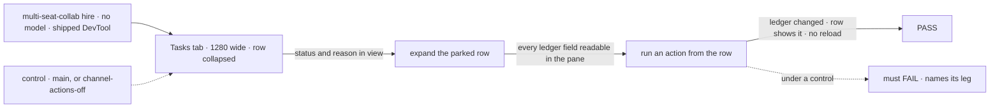
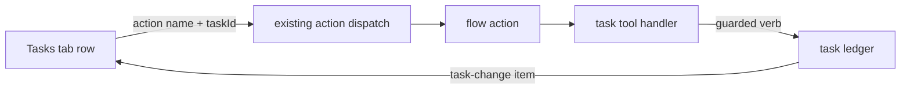

# FIX-1629 · DevTool Tasks tab: inspect a task in an accordion row, and manage its state with the framework's standard tools

**Spec** · [Decisions](DECISIONS.md) · [Rules](BUSINESS-RULES.md) · [Plan](PLAN.md) · [Docs](DOCS.md) · [Evolution](EVOLUTION.md)

Feature · `devtool` + `orchestration` + `workforce` + kitchen-sink + `goals/` · medium · 1 PR ·
no epic · absorbs [FIX-1523](https://linear.app/fixpoint-labs/issue/FIX-1523)

## Five people, before and after

| Someone who… | Today | After |
|---|---|---|
| **opens a task in the Tasks tab** | A raw JSON block floats over the table, clipped at the pane edge. The whole record is readable only in the Resources panel | The row opens in place: every field readable, raw JSON folded underneath |
| **reads why a row is parked, on a laptop** (FIX-1523) | Reason off screen below ~1500px; Status too at 1280 | Status and reason lead the row, in view at 1280 |
| **wants to cancel, re-prioritize, fail or answer a task while debugging** | Can't from the tab. Writes a curl or a throwaway action | Picks an action on the row, task id filled in, result shown on the row |
| **builds a flow with a board** | Nothing in the DevTool changes task state | Any action on the flow that takes a `taskId` shows on the row. The ready-made set is the framework's eight task tools, as actions |
| **runs a Workforce channel in production** | Callers can `fileTask` and `readBoard` | Unchanged unless the channel opts in to its board's task actions ([open fork](#sign-off)) |

## The goal, and how we'll know it's met

**A developer can open any task in the Tasks tab, read its whole record in place, change its
state from the same row through the flow's own actions, and see the result on the row without a
reload.**

| Is it the right goal? | |
|---|---|
| **The real need** | Jake, 2026-09-28: *"way better to inspect the task by having its contents drop down like an accordion. I should also be able to manage state using standard tools available from the framework."* |
| **Smaller, and rejected** | The accordion alone. Fixes the read, leaves "manage state" for later, and Jake asked for both |
| **Bigger, and not this issue's** | A free-form record editor ([D1](DECISIONS.md#d1)) · rows changed by other sessions going live (FIX-1506) · a person-side pickup screen for escalations (FIX-1591) |
| **Not done if** | The row actions exist but only a hand-wired lab flow has any · the result shows only after a reload · the expanded row still overflows the pane at 1280 · a refusal (`declined`, illegal transition) reads as success |



The check reads the screen against the ledger, never the ledger alone.

| How we verify | |
|---|---|
| **Goal check** | `goals/devtool-workforce-visibility/works-a-task-from-its-row/`, new. Chromium, shipped DevTool bundle, the `multi-seat-collab` hire, no model. The implementer runs it; verdict in the PR |
| **Signal** | **read**: collapsed, the parked row's status and ≥40px of its reason in view at 1280×800; expanded, every field the ledger holds is in the row and nothing overflows the pane. **answer**: the seat's own `answer` action is offered on the parked row with its id filled; after submit the ledger row has left `parked` and the row's status matches, no reload. **tool**: on the channel's session, a board task-tool action run from a row changes the ledger and the row. **refuse**: the same tool on a settled row shows the refusal on the row; the ledger is unchanged |
| **Input** | The lab's held-out fixture question. A different question, or a different settled row, must pass too |
| **Anti-game** | No reading the store for what the screen should show, no URL typed by hand, no reload before the last leg, no row found by text alone (read by task id) |
| **Control that must fail** | Today's `main`: read, answer and tool. `GOAL_CONTROL=channel-actions-off` (the lab's channel does not opt in): tool and refuse only |

## What changes


The row opens in place; the actions strip is the only way to change the task, and each button is
an ordinary flow action.

**What a flow author writes to get the ready-made set** (illustrative):

```diff
 defineFlow({
   kind: "ops",
   resources: { [todos.id]: todos },
   actions: {
     drain: { block: board.drain },
+    ...taskToolActions(board), // addTask_todos, cancelTask_todos, updateTask_todos, …
   },
 });
```

**And on a Workforce channel**, off by default:

```diff
 # workforce/teams/support/channels/help/CHANNEL.md
 members: [support.devices, support.accounts, support.fsd, support.general]
 boards: [escalations]
+boardActions: true
```

## How a row action reaches the ledger



No new route, no new verb. The tab calls actions the way the action bar already does; the tools
call the same guarded verbs a worker's model calls.

## What stays as it is

- Engine and core: no route, no type. The Resources panel stays read-only.
- The task verbs and their guards. A refusal is the verb's own.
- Who may reach an action: the flow's public `actions` map, as today.
- The Reason rule from FIX-1481: shown whenever `feedback` is present, verbatim ([Evolution](EVOLUTION.md)).

## Sign off

**[The goal](#the-goal-and-how-well-know-its-met), at that size:** read and change a task from
its row, proved on a live hire. If wrong: we ship an accordion and call the "manage" half done.

1. **[D1](DECISIONS.md#d1) · A task changes only through the flow's actions; the ready-made
   ones are the eight task tools. No record editor, no DevTool-only route.** If wrong: you
   wanted to hand-edit fields; that needs an engine write that skips the task guards.

**Open: one** — [should the reference app's `support.help` turn its escalation actions on now?](DECISIONS.md#open)
It is the one to weigh.
