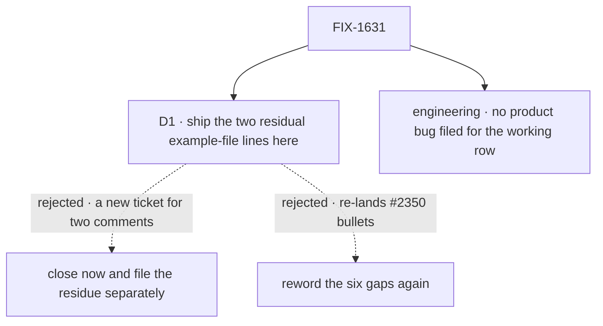

# FIX-1631 · Decisions

[Spec](SPEC.md) · **Decisions** · [Rules](BUSINESS-RULES.md) · [Plan](PLAN.md) · [Docs](DOCS.md)

The FSD Architect's fence on the issue fixes the scope class: docs and copy only, land only the
"still open after #2350" set, never re-land a #2350 bullet, never change `escalate` or close
FIX-1591. One call is left: what this issue does now that #2350 closed that set.

## The tree

Solid edges are what was chosen. Dashed edges lost, and the label says why.

## D1 · Ship only the two residual `.env.local.example` corrections under this issue; record the six gaps as closed by #2350

| | |
|---|---|
| **Instead of** | (a) Closing FIX-1631 as done by #2350 and filing the two residual lines as a new issue. (b) Re-auditing and rewording the six gaps in a second pass |
| **Because** | Checked on `main` (`7a23a753`): the README now answers the direct-`escalate`, rail-group, working-row and which-model questions; the channels guide describes the fallback once; the example file has the right precedence. All six landed in #2350's commit `425cc4c1`. The two lines Jake found while fixing sit in the same example file, under the same bullet's intent: the file should agree with the code. (a) spends a ticket, a triage and a second spec-or-brief on two comments. (b) is what the fence forbids |
| **Locks in** | One docs PR touching `apps/kitchen-sink/.env.local.example` only. FIX-1631's description is reframed to say the six gaps closed on #2350 and the residue closes here |

**What would change my mind:** the Architect reading the fence as the literal list, so anything
not on it, however small, needs its own ticket. Then (a).

**What being wrong costs:** two comment lines land under a label that didn't name them. Nothing
a reader of the app sees changes either way.

It comes down to ceremony: a separate issue costs a triage and a review for two comment lines.

## Engineering calls

- **E1 · No product bug is filed for the lingering working row.** The README now says working
  can outlast the answer while the specialist finishes its run, which is what happens. The issue
  says a product fix is separate if someone judges it one; nobody has, and this spec doesn't.

## Open

None.

## How it got here

- **Draft** — framed against `main` after #2350 merged: the six listed gaps are closed there, so
  the issue shrinks to the two stale statements Jake's comment found in `.env.local.example`.
