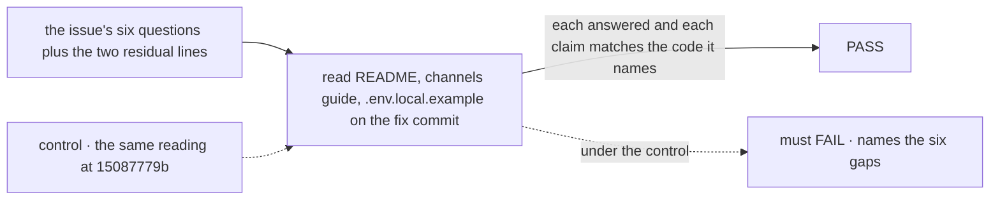

# FIX-1631 · Kitchen-sink docs gaps found by the closure's blind walk-through

**Spec** · [Decisions](DECISIONS.md) · [Rules](BUSINESS-RULES.md) · [Plan](PLAN.md) · [Docs](DOCS.md)

Improvement · docs · `apps/kitchen-sink` only · tiny · 1 PR · epic
[FIX-1592](https://linear.app/fixpoint-labs/issue/FIX-1592), soft polish, not a closure
blocker · sibling of FIX-1607 · builds on
[#2350](https://github.com/fixpoint-labs/flow-state-dev/pull/2350) (merged)

## Six people, before and after

| Someone who… | At `15087779b` (the walk-through) | On `main` today, after #2350 | After this issue |
|---|---|---|---|
| **talks to a specialist directly and it files a case** | Told the conversation is "separate from the channel", then finds the case on the channel's board | README says a case filed there lands on `support.help`'s `escalations` board | Unchanged |
| **looks for `support.help` or a specialist in the rail** | Finds neither until they guess which collapsed group to open | README names the group to expand for each | Unchanged |
| **watches a specialist answer** | Promised "working, then its answer"; sees working outlast the answer | README says working can stay a few seconds after the answer | Unchanged |
| **asks which model the specialists use** | Nothing says | README: the `chat` intent in `fsdev.config.ts`, since no `WORKER.md` names one | Unchanged |
| **reads the channels guide on the fallback member** | Two passages disagree | One description: the fallback takes a post the route can't place | Unchanged |
| **copies `.env.local.example` to set up a database** | Told `DATABASE_URL` wins; the code reads `FSD_DB_URL` first | Order fixed. Still told about pooling in a `lib/server.ts` that no longer exists, and that `STORE_TYPE` is ignored only under `DATABASE_URL` | The file describes what the app does: pool tuning lives in the Vercel store adapter, and any database URL makes `STORE_TYPE` moot |

All six "still open after #2350" gaps the issue lists were closed by #2350's last commit
(`425cc4c1`), which merged. Jake's comment on the issue names what that fix left behind: two
stale statements in the same example file. That residue is the whole of what this issue has
left to ship.

## The goal, and how we'll know it's met

**A reader following the kitchen-sink README, the channels guide and `.env.local.example` can
answer each of the issue's six questions without reading code, and no statement in those three
files contradicts what the app does on the commit the fix lands on.**

| Is it the right goal? | |
|---|---|
| **The real need** | The issue's own desired outcome, with `.env.local.example` named because it is the one file of the three still wrong |
| **Smaller, and rejected** | "Close it, #2350 did the work." Leaves two statements in a setup file that send a reader to a file that doesn't exist |
| **Bigger, and not this issue's** | The lingering working row as a product timing bug · roster empty-state copy · anything that changes `escalate` or FIX-1591's call |
| **Not done if** | Any of the six answers needs the code · the example file names a file or precedence the code doesn't have |



The check reads the three files a first-time reader reads, and each claim against the line of
code it describes. At the walk-through commit it must fail on all six gaps, or it reads
something else.

| How we verify | |
|---|---|
| **Goal check** | No automated goal check applies: this is prose. The proof is [PLAN.md → Checks](PLAN.md#checks), a table of question → the doc line that answers it → the code line that makes it true, filled on the fix commit |
| **Control that must fail** | The same table at `15087779b`: all six rows fail (verified for the README rows while drafting) |

## What changes


Every gap the issue lists is already closed on `main`. What's left is two comment blocks in one
file.

```diff
 # apps/kitchen-sink/.env.local.example  (shape only; exact text in DOCS.md)
-# … pooling and Neon behaviour in lib/server.ts …
+# Pool tuning and the Neon driver swap live in vercelPostgresStores()
+# (@flow-state-dev/vercel), which the prod profile uses.
-# STORE_TYPE is ignored when DATABASE_URL is set.
+# STORE_TYPE is ignored when FSD_DB_URL or DATABASE_URL is set.
```

## What stays as it is

The README, the channels guide, the app's behaviour, the by-design `escalate` filing, the
lingering working row, and every bullet #2350 already landed.

## Sign off

**The goal, at that size.** If wrong: we hold a docs ticket open over two comments, or close it
with a setup file that points at a missing file.

- **[D1](DECISIONS.md#d1) · Ship only the two residual `.env.local.example` corrections under
  this issue, and record the six gaps as closed by #2350.** If wrong: two lines land under a
  ticket whose fence named a different list. **The one to weigh.**

**Open: none.**
