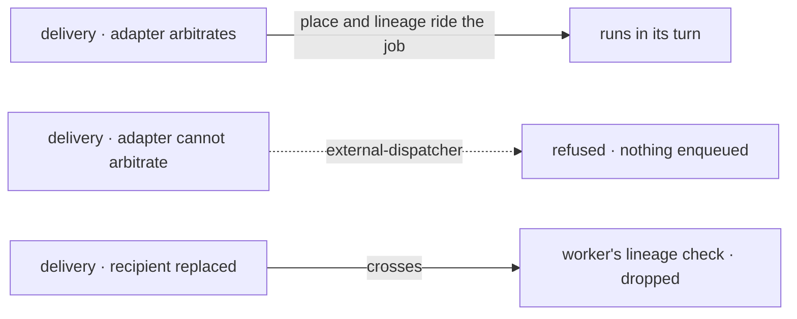

# FIX-1634 · Business rules

[Spec](SPEC.md) · [Decisions](DECISIONS.md) · **Rules** · [Plan](PLAN.md) · [Docs](DOCS.md) · [Evolution](EVOLUTION.md)

The cases, written as rules. "A queue host" is one whose effective dispatcher hands work to an
external queue and whose adapter supplies cross-process arbitration; BullMQ does after this
change. *Proved by* names the check the plan runs; "the case" is the goal check in the shared
HTTP suite.

## Delivering into an existing session

| # | When | Then | Proved by |
|---|---|---|---|
| BR-1 | A flow delivers into an existing session of the same user, on a queue host | Accepted with a request id; the recipient runs in whichever process picks it up | The case · **delivers** |
| BR-2 | A `{ from: true }` reply-to-sender, on a queue host | As BR-1: it is the same path | CI |
| BR-3 | Another user in the tenant delivers into that session by an id learned from a URL | `session-not-found`, nothing enqueued, no place taken. The owner's session and requests unchanged | The case · **other-user** |
| BR-4 | A delivery names a session of another flow instance or another organization | Refused as in process, `session-not-addressable` | Existing suite |
| BR-5 | The delivery's request record is written at enqueue and adopted by the worker | Both pass FIX-1018's owner check; a delivery never adopts another principal's record | FIX-1018's fences, consumed · CI |

## The recipient's concurrency policy, across processes

| # | When | Then | Proved by |
|---|---|---|---|
| BR-6 | Runs into one session under `queue`, landing in different worker processes: deliveries, HTTP actions, webhooks, schedules | One at a time, in acceptance order | The case · **one-at-a-time** |
| BR-7 | `reject`, and the key is held | A delivery is refused `dispatch-rejected`; an HTTP action gets the 409 naming the in-flight request, as in process. No request record is left for the refused caller | CI |
| BR-22 | `reject` on a webhook, and the key is held, on a queue host | The provider gets `200 { status: "skipped" }`, as in process, so it does not redeliver the duplicate | CI |
| BR-8 | `allow`, or key `none` | No place is taken; the run starts as today | CI |
| BR-9 | More runs wait on one key than a worker has slots, and the holder is still queued (say, in retry backoff) | The holder runs. Waiting never holds a slot. Waiters back off with jitter rather than spin, and a give-back starts the next waiter without it waiting out its delay | CI, real Redis, a stress case |
| BR-10 | A run waits on its session's key longer than the flow's wait budget | It fails `ConcurrencyQueueTimeoutError`, its record terminal, as in process. The budget counts only time waiting on the key, from the run's first eligible turn; time queued behind unrelated work in a busy worker never counts | CI, a backlogged worker |
| BR-11 | The process running the holder dies | The key frees once the holder's place stops being renewed, within the stale threshold; the next run starts | CI, a killed worker |
| BR-21 | A run waits on a key longer than the stale threshold, or its job sits in BullMQ retry backoff, or it runs with heartbeats turned off | It keeps its place and its position. Only a place whose job is completed, failed, gone or never enqueued is dropped | CI, real Redis |
| BR-12 | BullMQ retries a failed attempt | It keeps its place; the key frees when the job is done for good | CI |
| BR-13 | A waiting run is cancelled | It never starts; its place is given up and the next run moves | CI |
| BR-14 | A run inside a `worker-only` process delivers into a session | It runs in that process and waits on the same key as every other process | CI, two processes |
| BR-15 | The same session id in two tenants | Two keys; neither waits on the other | CI |
| BR-16 | The arbiter can't be reached when a place is needed | The dispatch is not started and says why; nothing is enqueued. Never runs unarbitrated | CI |
| BR-17 | A job enqueued by a release before this one, with no place | Runs as it would have, unarbitrated, once (BP-030) | CI |
| BR-23 | During a rollout, a new dispatcher's job is taken by a worker from the release before | It runs unarbitrated once, and the key it held frees within the stale threshold. Upgrading workers before dispatchers avoids it; the release note says so | CI, an old-shape processor |

## The incarnation guard

| # | When | Then | Proved by |
|---|---|---|---|
| BR-18 | The recipient is deleted and recreated between acceptance and the worker's run | The worker drops the delivery and deletes its request record: `request.get(id)` returns `undefined`. The replacement's history is unchanged. Its place is given up | POC P2; graduated only by PLAN VP, on the real `{ id }` path |
| BR-19 | A job carries no approved lineage (older release) | The owner, tenant and org guards alone, as today | Existing suite |

## What is still refused by name

| # | When | Then | Proved by |
|---|---|---|---|
| BR-20 | An external dispatcher whose adapter supplies no cross-process arbitration | `{ id }` and `{ from: true }` refused `external-dispatcher`, nothing enqueued. `{ key }` and transport dispatch enqueue as today, unarbitrated, as documented | The case · **refusal-kept** · the existing stub test |

Left of the line is the sending process, right is the worker. One path crosses and runs; the
other two are stopped, one before the queue and one after.

## Failure taxonomy

Refusals (`session-not-found`, `session-not-addressable`, `dispatch-rejected`,
`external-dispatcher`) are decided before anything is enqueued and leave nothing behind. An
unreachable arbiter is a not-started dispatch, never a run. A wait past the budget is a terminal
failure of that one request, its record settled. A delivery dropped for a replaced recipient
leaves no record at all (BR-18). A dead
holder degrades to a delay no longer than the stale threshold. BullMQ's own retries are
unchanged and keep their place.

## Acceptance criteria this issue owns

- [The goal](SPEC.md#the-goal-and-how-well-know-its-met): the case passes on a BullMQ host with
  a web runtime and two worker runtimes on real Redis, and fails under both controls. Its
  commit is recorded in the PR ([ER-16](../../epics/FIX-1635/BUSINESS-RULES.md#what-no-child-may-do)).
- [ER-11](../../epics/FIX-1635/BUSINESS-RULES.md) holds, and [ER-14](../../epics/FIX-1635/BUSINESS-RULES.md#what-no-child-may-do)
  is met: the two guarantees are named (BR-6, BR-18) and the refusal is narrowed, not deleted
  (BR-20).
- [ER-13](../../epics/FIX-1635/BUSINESS-RULES.md#what-no-child-may-do): nothing in core, engine or
  bullmq names a channel, seat, specialist or roster.
