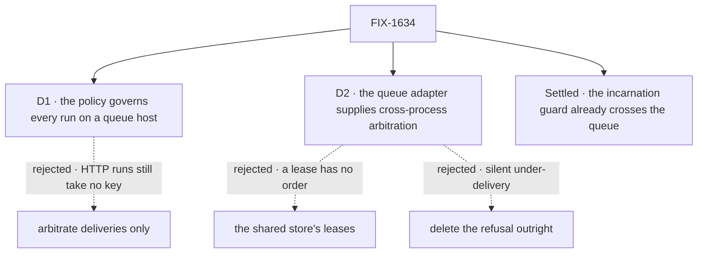

# FIX-1634 · Decisions

[Spec](SPEC.md) · **Decisions** · [Rules](BUSINESS-RULES.md) · [Plan](PLAN.md) · [Docs](DOCS.md) · [Evolution](EVOLUTION.md)

What was considered, what was chosen, and what each choice locks in. Two decisions are the
sign-off. The rest is recorded so nobody re-derives it.

## The tree

Solid edges are what you're signing. The settled node is recorded with evidence, not asked.

## D1 · On a queue host, the session's concurrency policy governs every run, not only deliveries

| | |
|---|---|
| **Instead of** | Arbitrating only the new deliveries into an existing session, the issue's literal ask |
| **Because** | A delivery can only wait behind a key that other runs actually hold. Today no run on a queue host takes a key: two `queue` runs into one session overlap ([POC P1](poc/queue-path/README.md)). Arbitrating deliveries alone would line them up behind nothing. Tenet 5: an invariant enforced at one entry point is not enforced |
| **Locks in** | Every BullMQ app that declared `queue` or `reject` gets it enforced on upgrade: bursts into one session serialize, duplicates get 409s. The docs' "not enforced on external workers" limit goes away. An app that wants parallel runs declares `allow`, as it would on one server |

It comes down to what a delivery waits behind: deliveries-only lines up behind runs that hold
no key.

**What would change my mind:** evidence that no real flow mixes deliveries and ordinary runs in
one session. Then deliveries-only is enough, and existing BullMQ apps keep today's behaviour.

## D2 · Cross-process arbitration is a capability the queue adapter supplies; BullMQ supplies it on its Redis; an adapter without it keeps the named refusal

| | |
|---|---|
| **Instead of** | Arbitrating on the shared store's leases, so every host gets it with no adapter work · or deleting the refusal for every external dispatcher |
| **Because** | `queue` promises arrival order, and a queue waiter must be woken rather than poll. Redis gives BullMQ both, and BullMQ already needs it. The store's lease is one holder per request id, with no order, and whether it is shared across processes depends on the store adapter. An adapter that can't arbitrate must still fail loudly ([ER-14](../../epics/FIX-1635/BUSINESS-RULES.md#what-no-child-may-do)) |
| **Locks in** | A public, optional member on the worker-adapter contract, which a third-party queue adapter implements or keeps the refusal. `external-dispatcher` stays in the refusal vocabulary with a narrower meaning. Every process of a deployment arbitrates through the one the adapter supplies, including `worker-only` processes |

It comes down to arrival order: a lease can hold a session but cannot line runs up behind it.

**What would change my mind:** a second queue adapter (the durable-execution spike,
[FIX-830](https://linear.app/fixpoint-labs/issue/FIX-830)) that can't order waiters but whose
store can. Then the store is the better home, and the adapter member becomes a default.

## Decided, not asked

- **One arbiter per process, the adapter's when it supplies one.** The router's host, the
  request-host operations host and the worker's runs all use it. A `worker-only` process, which
  runs its own deliveries in process today, arbitrates on the same key as the web process.
- **A place is taken before anything is written.** A `reject` refusal leaves no request record,
  as in process. Under `queue`, the place is taken at acceptance, so order is acceptance order.
- **Waiting never holds a worker slot.** A job whose turn hasn't come goes back to the queue.
  Otherwise N waiters on N slots deadlock behind a holder still in backoff.
- **A retried attempt keeps its place.** The key frees when the job is done for good, so a
  failing run can't be overtaken mid-retry.
- **The wait budget is the in-process one**, counted from acceptance. A run that waits longer
  fails `ConcurrencyQueueTimeoutError`, terminal, as on one server.
- **A dead holder frees the key within the stale threshold.** The place is a lease renewed on the
  run's heartbeat.
- **Fail closed.** If the arbiter can't be reached, the dispatch is not started and says why. It
  never runs unarbitrated.
- **A job enqueued by an older release carries no place and runs as it would have** (BP-030).
- **Workforce docs sentences that state the refusal on BullMQ are narrowed in the same PR.** Docs
  only; no Workforce code. The kitchen-sink README waits for the adopt child's proof.

## Considered and dropped

| Alternative | Why not |
|---|---|
| Route every run for a session to one worker (partitioned queues, BullMQ Pro groups) | Pro-only, or a queue per session. Fixes placement, not the policy: `reject` still needs a holder |
| Take the key at enqueue and release it at enqueue | Frees a `reject` key before the run ends. The arbiter's own note already rejects it |
| Re-approve the recipient in the worker | Approves against a record the sender never saw, the issue's own concern. The carried lineage is stricter |
| Revive the canceled Relay design ([FIX-1230](https://linear.app/fixpoint-labs/issue/FIX-1230), [FIX-1231](https://linear.app/fixpoint-labs/issue/FIX-1231)) | Those add a reply wait and a cross-worker wake channel. A delivery stays fire-and-forget; nothing here waits on a reply |
| A cross-process lock for multi-server deployments with no queue | Not this issue's host. Documented as single-instance |

## Settled

- **The incarnation guard already crosses the queue** — **CONFIRMED** on a real BullMQ host
  (`5886ca846`). A delivery carrying the approved lineage runs; the same delivery with a stale
  one is dropped in the worker, its record reconciled away. So the guarantee is restated, not
  rebuilt. The residual window, a recreate after the worker's check, is the same as in process.
  ([POC P2](poc/queue-path/README.md))
- **A queue host applies no concurrency policy to any run today** — **CONFIRMED**. Two `queue`
  runs into one session overlap on BullMQ and serialize in process. This is D1's premise.
  ([POC P1](poc/queue-path/README.md))

## How it got here

- **Draft** — framed as the refusal guarding two guarantees, one of which a POC showed already
  holds; chose cross-process arbitration for every queue-host run, supplied by the adapter, with
  the refusal kept for adapters that can't; two PRs, engine then BullMQ.

**Open: none.**
