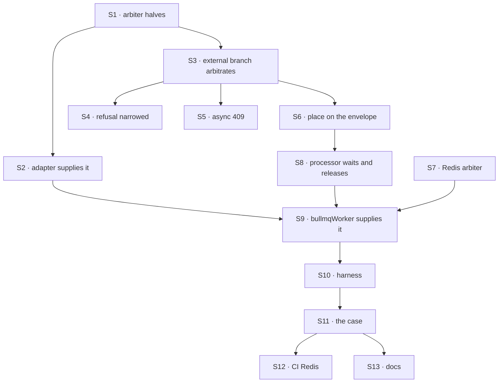

# FIX-1634 · Plan

[Spec](SPEC.md) · [Decisions](DECISIONS.md) · [Rules](BUSINESS-RULES.md) · **Plan** · [Docs](DOCS.md) · [Evolution](EVOLUTION.md)

Written for the implementing agent. IDs cross-reference [BUSINESS-RULES.md](BUSINESS-RULES.md)
(BR-n) and [DECISIONS.md](DECISIONS.md) (D-n). `tdd`. Two PRs; the seam is the arbiter contract.
Both start only after FIX-1018 ([#2377](https://github.com/fixpoint-labs/flow-state-dev/pull/2377))
merges ([D3 of the epic](../../epics/FIX-1635/DECISIONS.md#d3)).

## Surfaces

| ID | Package · role | Change | Rules |
|---|---|---|---|
| S1 | `engine` · the concurrency arbiter contract | Split today's one synchronous gate into three halves that may run in different processes: **take a place** (at dispatch, may be async, `reject` refuses here), **wait for the turn** (at run start), **give the place back** (at run end, or on cancel). The in-memory arbiter implements all three with unchanged behaviour | BR-6 to BR-13, D1 |
| S2 | `engine` · `WorkerAdapter` / `createFlowState` | An optional member through which an adapter supplies a cross-process arbiter. When present, it is the one arbiter for every host in the process: the router's, the request-host operations host, and the worker's runs (D2) | BR-14, D2 |
| S3 | `engine` · the host's external branch (`createInboundTransportHost`) | **Remove** the "external dispatch skips arbitration" passthrough. With a cross-process arbiter: take the place before `admitOwnership`/`materializeOwned` (FIX-1018's fenced writes, kept), carry it on the envelope, release it if the enqueue fails. With none: today's behaviour | BR-5, BR-7, BR-8, BR-16 |
| S4 | `engine` · the dispatch operation | Refuse `delivery: "existing"` only when the host is external **and** its arbiter is not cross-process. Refusal text names the missing capability | BR-1, BR-2, BR-20 |
| S5 | `engine` · the HTTP action and webhook routes | A `ConcurrencyRejectedError` now also arrives through `accepted`; map it to the same 409 as the synchronous throw | BR-7 |
| S6 | `engine` · `DispatchEnvelope` | Carries the place (key + ticket) so the worker can wait on it and give it back. Optional, `== null`-guarded | BR-17 |
| S7 | `bullmq` · a Redis arbiter | Places as a per-key ordered set in Redis, each a lease renewed on the run's heartbeat and expiring within the stale threshold; `reject` is claim-if-empty; turn is "lowest live place"; give-back wakes the next | BR-6, BR-7, BR-11, BR-15 |
| S8 | `bullmq` · the job processor | Before `runAction`: not its turn → back to the queue without holding a slot, wait budget counted from acceptance. Give the place back on completion and on final failure; keep it across retries. A job with no place runs as today | BR-9, BR-10, BR-12, BR-13, BR-17 |
| S9 | `bullmq` · `bullmqWorker` | Supplies S7 through S2 | D2 |
| S10 | `integration-tests` · the two-users harness | A BullMQ variant: a `dispatch-only` web runtime and two `worker-only` runtimes, each with its own in-memory arbiter (separate OS processes are optional; separate arbiters are not), one SQLite file, real Redis from `REDIS_URL` | the goal |
| S11 | `integration-tests` · `queue-delivery.test.ts` | The goal check, in the shared suite | BR-1, BR-3, BR-6, BR-20 |
| S12 | CI | A Redis service on the job that runs the suite; the case fails rather than skips when `CI` is set and Redis is absent | the goal |
| S13 | Docs | [DOCS.md](DOCS.md) | — |

## Sequence



### PR plan

| id | deliverables | depends_on |
|---|---|---|
| PR-A | S1 to S6, with engine tests against a fake cross-process arbiter (two arbiter instances over one backing map, standing in for two processes). No adapter supplies one yet, so no deployed behaviour changes | FIX-1018 merged |
| PR-B | S7 to S13: the Redis arbiter, the processor, the harness, the case, CI Redis, docs | PR-A |

PR-A ships nothing a user sees, which is what makes it a clean seam. PR-B is where D1 and D2
become true, and it carries the goal check and the changeset.

## Checks

| ID | Runs after | Passes when |
|---|---|---|
| V1 | S1 | The existing in-process concurrency suite is green unchanged: behaviour of the in-memory arbiter does not move |
| V2 | S3, S4 | With the fake cross-process arbiter: an `{ id }` delivery is accepted and runs; the existing stub-dispatcher test in `dispatch-delivery-guards.test.ts` still refuses `external-dispatcher` (BR-20, **D2's check**) |
| V3 | S5 | Two HTTP actions under `reject` on the fake arbiter: the second gets 409 naming the first, and no record exists for it (BR-7) |
| V4 | S7, S8 | `bullmq` tests on real Redis: BR-9 (N+1 waiters, N slots, holder in backoff), BR-10, BR-11 (kill the holder's worker), BR-12, BR-13, BR-15, BR-16 (Redis stopped) |
| V5 | S8 | POC P2 graduated: a replaced recipient is dropped in the worker and its place given back (BR-18) |
| V6 | S9 | Two HTTP actions into one session on BullMQ serialize; on the commit before S9 they overlap (**D1's check**, the POC's P1 turned around) |
| VG | S11 | [The goal](SPEC.md#the-goal-and-how-well-know-its-met): `packages/integration-tests/src/two-users-one-tenant/queue-delivery.test.ts` PASSES, after FAILING on the commit before the fix (**delivers**, **one-at-a-time**) and under `GOAL_CONTROL=local-arbiter` (**one-at-a-time**). The PR names the commit |
| V7 | S12 | CI runs the case with Redis, and a run with `CI` set and no Redis fails it rather than skipping |

Second path (BP-035): cancel while waiting (BR-13), concurrent-409 (BR-7), multi-tenant (BR-15),
legacy job (BR-17), null place on the envelope (S6).

## Pinned names

| Where | Name | Why pinned |
|---|---|---|
| Refusal | `external-dispatcher` | Public; kept, narrowed (D2). Renaming it breaks every `.rescue()` that branches on it |
| Refusal | `dispatch-rejected` | Public; a delivery refused by `reject` on a queue host gets the one it gets in process |
| Env var | `REDIS_URL` | Read by the case; the closure's leg c sets it |
| Control | `GOAL_CONTROL=local-arbiter` | The case's named control |

The adapter member, the arbiter halves and the job fields are yours to name.

## Guardrails

| Rule | Because |
|---|---|
| One arbiter per process, and every host in it uses the same one (tenet 5) | A second host with its own lock is a second answer to "who holds this session", and the two answers race |
| Take the place before any write, give it back on every exit | A refused caller must leave nothing, and a stranded place blocks a session until its lease runs out |
| Waiting never holds a worker slot | Holding one deadlocks a worker whose slots are all waiters behind a holder in backoff |
| Fail closed when the arbiter is down | An unarbitrated run is the silent under-delivery ER-14 forbids |
| The seam's checks and the worker's lineage check are consumed, not moved or duplicated | They already hold on the queue path (POC P2); a second copy drifts |
| Nothing in core, engine or bullmq names a channel, seat, specialist or roster (ER-13) | Layer 1 only; Workforce adopts later |
| The case imports only package entry points | The closure runs it against installed tarballs |

## Docs

Reconcile [DOCS.md](DOCS.md) against shipped behaviour in PR-B, after V6 and VG pass, through
the `docs-writer` then `docs-editor` agents. PR-A publishes nothing.

## Sketch · pseudocode, illustrative, react to the shape

```
at dispatch (any process):
    decision ← the entry's policy and key            (unchanged)
    if host is external and arbiter is cross-process:
        place ← arbiter.take(decision, requestId)     ← reject refuses here
        write the request record, carrying the place   (FIX-1018's fence)
        enqueue(envelope + place)
    else if external: today's path, and an existing-session delivery is refused
    else: in process, as today

in the worker, before running:
    if job has a place and it is not its turn:
        requeue without holding the slot; fail if the wait budget is spent
    run  (lineage check, as today)
    on completion or final failure: arbiter.giveBack(place)
```

**POC:** [`poc/queue-path/`](poc/queue-path/README.md), a characterization on a real BullMQ host.
It showed both premises: no run on a queue host is arbitrated today (P1), and the incarnation
guard already crosses the queue (P2). The second moved the design: the lineage is consumed, not
rebuilt.

No factual-base checker: the only counted facts are the six doc sentences that state the
refusal (three in `channels.md`, three in the Workforce README), listed by `grep -rn
external-dispatcher` at `5886ca846`.

## At implement time

- FIX-1018 merged: rebase on it and confirm `materializeOwned` still fences the external branch's
  enqueue-time write. Take the place before it.
- The keeping-flows-alive page ([FIX-1639](https://linear.app/fixpoint-labs/issue/FIX-1639)) may
  have published the fence sentence. If so, it is on [DOCS.md](DOCS.md)'s list ([FIX-1637
  ER-14](../../epics/FIX-1637/BUSINESS-RULES.md)).
- Check whether BullMQ's job API in the pinned version moves a running job back to waiting
  without counting an attempt; if not, the processor needs its own requeue.

## Follow-ups

- The Workforce adopt child ([epic plan](../../epics/FIX-1635/PLAN.md#not-children-deliberately)):
  with this merged, channel posts and escalations should run on BullMQ with no Workforce code
  change. Its work is the end-to-end proof under `FSD_BULLMQ_DISPATCH=1`, the kitchen-sink README
  paragraph, and the stale comments in `workforce/src/channel/channel-flow.ts` and
  `channel-post-capability.ts`.
- Several web servers with in-process dispatch and no queue stay single-instance for concurrency.
  Flagged, not filed.
