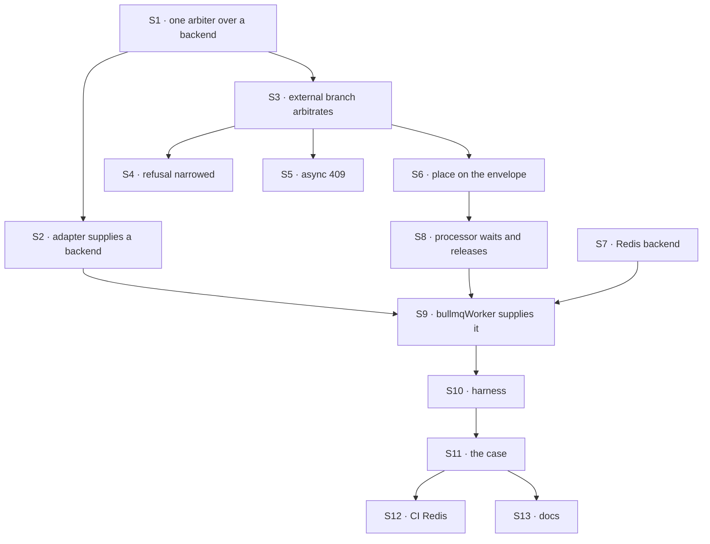

# FIX-1634 · Plan

[Spec](SPEC.md) · [Decisions](DECISIONS.md) · [Rules](BUSINESS-RULES.md) · **Plan** · [Docs](DOCS.md) · [Evolution](EVOLUTION.md)

Written for the implementing agent. IDs cross-reference [BUSINESS-RULES.md](BUSINESS-RULES.md)
(BR-n) and [DECISIONS.md](DECISIONS.md) (D-n). `tdd`. Two PRs; the seam is the arbiter contract.
Both start only after FIX-1018 ([#2377](https://github.com/fixpoint-labs/flow-state-dev/pull/2377))
merges ([D3 of the epic](../../epics/FIX-1635/DECISIONS.md#d3)).

## Surfaces

| ID | Package · role | Change | Rules |
|---|---|---|---|
| S1 | `engine` · the concurrency arbiter | Stays **the one arbiter**: policy, key resolution, `reject`/`queue`, the wait budget, holder naming and `ConcurrencyRejectedError`, all in `transports/concurrency/arbiter.ts` as today. What changes is underneath it: the keyed gate becomes an **ordered-lease backend** with four calls (take, is-my-turn, give back, renew), and today's in-memory gate is the **default backend** with unchanged behaviour. The arbiter also answers a waiting run's "not my turn, now what?" (wait or time out) from its budget. [Contract sketch](#the-public-contract-sketch) | BR-6 to BR-13, D1, D2 |
| S2 | `engine` · `WorkerAdapter` / `createFlowState` | An optional member through which an adapter supplies a backend. `createFlowState` builds its one `#arbiter` over it (or over the in-memory default), and every host in the process gets that arbiter through the existing `createInboundTransportHost({ arbiter })` seam: no new host seam (D2) | BR-14, D2 |
| S3 | `engine` · the host's external branch (`createInboundTransportHost`) | **Remove** the "external dispatch skips arbitration" passthrough. With an adapter-supplied backend: take the place before `admitOwnership`/`materializeOwned` (FIX-1018's fenced writes, kept), carry it on the envelope, release it if the enqueue fails. With none: today's behaviour | BR-5, BR-7, BR-8, BR-16 |
| S4 | `engine` · the dispatch operation | Refuse `delivery: "existing"` only when the host is external **and** its adapter supplied no lease backend. Refusal text names the missing capability | BR-1, BR-2, BR-20 |
| S5 | `engine` · the HTTP action and webhook routes | A `ConcurrencyRejectedError` now also arrives through `accepted`. **One owner maps it, for both the synchronous throw and the async path:** an HTTP action gets the 409 naming the in-flight request; a webhook gets today's `200 { status: "skipped" }` so the provider does not redeliver | BR-7, BR-22 |
| S6 | `engine` · `DispatchEnvelope` | Carries the place (key + ticket) so the worker can wait on it and give it back. Optional, `== null`-guarded | BR-17 |
| S7 | `bullmq` · a Redis lease backend | The four backend calls on Redis: places as a per-key ordered set, each place recording its job id and a lease. `reject`'s claim-if-empty, turn as "lowest live place", renew and give-back are each one Lua script. **Give-back wakes the next waiter explicitly** (`arbiter-give-back.lua`). **Liveness** ([guardrail](#guardrails)): an expired place is reconciled against its job's BullMQ state before it is dropped. No policy lives here | BR-6, BR-7, BR-11, BR-15, BR-21 |
| S8 | `bullmq` · the job processor | Owns only the **wait mechanism**. Before `runAction` it asks the backend whether it is this job's turn. If not, it asks the engine arbiter what to do (wait, or time out), then takes a **delayed requeue with jitter**, holding no slot and counting no attempt. While the job runs, it renews the holder's place **on its own timer**. Gives the place back on completion and on final failure; keeps it across retries. A job with no place runs as today | BR-9, BR-10, BR-12, BR-13, BR-17, BR-21 |
| S9 | `bullmq` · `bullmqWorker` | Supplies S7 through S2 | D2 |
| S10 | `integration-tests` · the two-users harness | A BullMQ variant: a `dispatch-only` web runtime and two `worker-only` runtimes, each with its own in-memory arbiter (separate OS processes are optional; separate arbiters are not), one SQLite file, real Redis from `REDIS_URL` | the goal |
| S11 | `integration-tests` · `queue-delivery.test.ts` | The goal check, in the shared suite | BR-1, BR-3, BR-6, BR-20 |
| S12 | CI | A Redis service on the job that runs the suite; the case fails rather than skips when `CI` is set and Redis is absent | the goal |
| S13 | Docs | [DOCS.md](DOCS.md) | — |

## Sequence



### PR plan

| id | deliverables | depends_on |
|---|---|---|
| PR-A | S1 to S6, with engine tests against a **test backend**: two arbiters over one shared in-memory backend, standing in for two processes. No adapter supplies a backend yet, so no deployed behaviour changes. Carries an **engine patch changeset** for the new public backend contract | FIX-1018 merged |
| PR-B | S7 to S13: the Redis backend, the processor, the harness, the case, the VP graduation test, CI Redis, docs | PR-A |

PR-A changes no deployed behaviour, which is what makes it a clean seam, but it does publish the
backend contract, so it carries its own engine changeset. PR-B is where D1 and D2 become true. It
carries the goal check and the behaviour-change changeset, which **leads with D1**: on upgrade, a
declared `queue` or `reject` is enforced across workers; to keep a flow's runs parallel, declare
`allow` on it; **upgrade workers before dispatchers** ([guardrail](#guardrails)).

## Checks

| ID | Runs after | Passes when |
|---|---|---|
| V1 | S1 | The existing in-process concurrency suite is green unchanged: the arbiter over the in-memory default backend behaves as today |
| V2 | S3, S4 | On the test backend: an `{ id }` delivery is accepted and runs; the existing stub-dispatcher test in `dispatch-delivery-guards.test.ts` still refuses `external-dispatcher` (BR-20, **D2's check**) |
| V3 | S5 | On the test backend, under `reject`: a second HTTP action gets 409 naming the first, and no record exists for it (BR-7); a duplicate webhook gets `200 { status: "skipped" }` on the async path as on the sync one (BR-22) |
| V4 | S7, S8 | `bullmq` tests on real Redis: BR-9 (N+1 waiters, N slots, holder in backoff; the stress case also shows waiters back off rather than spin, and a give-back starts the next waiter without it waiting out its delay), BR-10 (budget counts key-wait only, not worker backlog), BR-11 (kill the holder's worker), BR-21 (a waiter past the stale threshold keeps its position; a holder in retry backoff keeps its place; a run with `heartbeatIntervalMs: 0` keeps its place), BR-12, BR-13, BR-15, BR-16 (Redis stopped) |
| V5 | S8 | A replaced recipient is dropped in the worker and its place given back, through the real `{ id }` path (VP). Asserts the exact outcome: `request.get(id)` returns `undefined` (BR-18) |
| VP | S9 | **The POC graduation gate.** PR-B lands a `REDIS_URL`-gated test in `packages/bullmq` (fails rather than skips when `CI` is set) that drives P1 and P2 through the real `dispatcher()` `{ id }` envelope, not the POC's `delivery: "child"` shortcut. P1 and P2 count as graduated only when it passes; until then [Settled](DECISIONS.md#settled) rests on the POC alone |
| V6 | S9 | Two HTTP actions into one session on BullMQ serialize; on the commit before S9 they overlap (**D1's check**, the POC's P1 turned around) |
| VG | S11 | [The goal](SPEC.md#the-goal-and-how-well-know-its-met): `packages/integration-tests/src/two-users-one-tenant/queue-delivery.test.ts` PASSES, after FAILING on the commit before the fix (**delivers**, **one-at-a-time**) and under `GOAL_CONTROL=local-arbiter` (**one-at-a-time**). The PR names the commit |
| V7 | S12 | CI runs the case with Redis, and a run with `CI` set and no Redis fails it rather than skipping |

**Minimal proof set:** VG, VP, and from V4 BR-9, BR-11, BR-16 and BR-21. PR-B does not merge without
these. The rest of V4 is wanted, but PR-B should not grow into a wall of Redis tests before VG is
green.

Second path (BP-035): cancel while waiting (BR-13), concurrent-409 (BR-7), multi-tenant (BR-15),
legacy job (BR-17), null place on the envelope (S6).

## Pinned names

| Where | Name | Why pinned |
|---|---|---|
| Refusal | `external-dispatcher` | Public; kept, narrowed (D2). Renaming it breaks every `.rescue()` that branches on it |
| Refusal | `dispatch-rejected` | Public; a delivery refused by `reject` on a queue host gets the one it gets in process |
| Env var | `REDIS_URL` | Read by the case; the closure's leg c sets it |
| Control | `GOAL_CONTROL=local-arbiter` | The case's named control |

The adapter member, the four backend calls and the job fields are yours to name.

## The public contract sketch

Illustrative, to pin the **shape** of D2's public surface: one optional adapter member that
supplies a four-call lease backend, and one envelope field. Policy is not on it.

```ts
/** A run's place in one key's line, as the backend issued it. Opaque to callers. */
interface LeasePlace {
  readonly key: string;      // tenant-namespaced concurrency key, resolved by the engine
  readonly ticket: string;
}

/** Ordered leases on a key. Knows nothing about queue/reject, budgets or errors. */
interface ConcurrencyLeaseBackend {
  /** Append a place, or with `ifEmpty` claim only a free key (`reject`).
   *  Returns the current holder instead when `ifEmpty` finds the key held. Unreachable → throws. */
  take(input: { key: string; requestId: string; jobId?: string; ifEmpty?: boolean }):
    Promise<{ place: LeasePlace } | { heldBy: string }>;
  /** True when this place is the lowest live place on its key. */
  isMyTurn(place: LeasePlace): Promise<boolean>;
  /** Remove the place; idempotent. Wakes the next waiter on the key. */
  giveBack(place: LeasePlace): Promise<void>;
  /** Extend the place's lease. */
  renew(place: LeasePlace): Promise<void>;
}

interface WorkerAdapter {
  // ...existing members
  readonly leaseBackend?: ConcurrencyLeaseBackend;   // absent → in-memory default, refusal kept
}

interface DispatchEnvelope {
  // ...existing fields
  readonly leasePlace?: LeasePlace | null;          // == null → legacy job, runs as today (BR-17)
}
```

The engine's arbiter stays the one policy owner. Over any backend it maps `reject` to
`take({ ifEmpty: true })` and `heldBy` to `ConcurrencyRejectedError`, `queue` to a plain take,
and a waiting run's "not my turn" to *wait* or *time out* from the budget. The in-memory default
backend keeps today's promise-chain wake, so V1 holds unchanged. BullMQ's processor imports that
engine decision rather than re-deriving it: its own code is the requeue and the renewal timer.

**BR-14 falls out.** A `worker-only` process that runs a delivery in process goes through the same
engine arbiter, over the adapter's backend, so it waits on the same key as every other process.
Over Redis, an in-process waiter has no job to promote, so it re-checks `isMyTurn` on the same
jittered schedule as a requeued job.

## Guardrails

| Rule | Because |
|---|---|
| One arbiter per process, and every host in it uses the same one (tenet 5). **Policy lives only in the engine arbiter**; a backend stores ordered leases and nothing else | A second host with its own lock is a second answer to "who holds this session". A backend that re-implements `reject`, FIFO or the budget is the same drift one level down |
| Take the place before any write, give it back on every exit. **If the take succeeds and the enqueue then fails, the same call path gives it back** before the error surfaces | A refused caller must leave nothing, and a stranded place blocks a session until its lease runs out |
| Waiting never holds a worker slot | Holding one deadlocks a worker whose slots are all waiters behind a holder in backoff |
| **Not its turn → delayed requeue with jitter**, never an immediate requeue. The delay backs off from a short base to a cap of a few seconds, with full jitter, and is clamped to what is left of the wait budget, so the last requeue lands at the budget's end and fails `ConcurrencyQueueTimeoutError` there. **The budget counts only time spent waiting on the key**, from the job's first eligible turn check (recorded on the job), not from acceptance: worker backlog before that never consumes it (BR-10). A requeue is **not an attempt**: it must not consume BullMQ `attempts` or trigger its backoff (confirm the mechanism in the pinned version; see *At implement time*) | An immediate requeue under one hot key churns Redis and the queue with no useful work, which is the BR-9 scenario. Counting requeues as attempts would fail a healthy waiter as if it had errored |
| **Give-back wakes the next waiter explicitly.** `arbiter-give-back.lua` removes the place, reads the next live place's job id, and promotes that delayed job to waiting in the same script | Without it, the gap between one run ending and the next starting is the waiter's remaining delay, and `queue`'s arrival order holds only in the store, not in when runs start |
| **A place's liveness never depends on the run heartbeat.** Every place has a lease with a TTL safely above the requeue cap (at least three times it). The **holder**'s place is renewed by the bullmq processor on its own timer while the job runs, including when `request.heartbeatIntervalMs` is 0. A **waiter** renews its place on each requeue tick. A place whose lease has expired is **reconciled, not dropped blindly**: whichever caller finds it (a take, a turn check or a give-back, all in `packages/bullmq`) reads the place's job in BullMQ; a job that is waiting, delayed or in retry backoff keeps its place and is renewed; a job that is completed, failed, gone, or never enqueued (no job id) loses it. A job whose place was removed while it was stalled takes a new place at the back when it runs again | A place renewed only by a heartbeat expires during off-slot waits, retry backoff and heartbeat-disabled runs, and later work overtakes or overlaps it (BR-21). Reconciling through BullMQ's own job state is the only place that knows a job is still coming back |
| **Rollout order: upgrade workers before dispatchers.** A new dispatcher's place-bearing job taken by an old worker runs unarbitrated once and its place is never given back; the place's job then completes, so reconciliation removes it, and the stall is bounded by the lease TTL (the stale threshold). No envelope version: an old worker cannot read one, so it would not help this release; the staged rollout plus the bound is enough pre-1.0. The bullmq README and the changeset say so | The reverse of BR-17's legacy case. Naming the order is cheaper than a capability handshake, and the failure is bounded |
| **One owner for the concurrency-refusal response.** The sync throw and the async `accepted` path go through one mapping: HTTP action → 409 naming the in-flight request; webhook → `200 { status: "skipped" }` | Two mappings drift, and a webhook 409 makes providers redeliver the duplicate it was meant to drop |
| Fail closed when the arbiter is down | An unarbitrated run is the silent under-delivery ER-14 forbids |
| The seam's checks and the worker's lineage check are consumed, not moved or duplicated | They already hold on the queue path (POC P2); a second copy drifts |
| Nothing in core, engine or bullmq names a channel, seat, specialist or roster (ER-13) | Layer 1 only; Workforce adopts later |
| The case imports only package entry points | The closure runs it against installed tarballs |

## Docs

Reconcile [DOCS.md](DOCS.md) against shipped behaviour in PR-B, after V6 and VG pass, through
the `docs-writer` then `docs-editor` agents. PR-A publishes nothing.

## Sketch · pseudocode, illustrative, react to the shape

```
at dispatch (any process):
    decision ← arbiter.resolve(entry)                 (unchanged: policy and key)
    if host is external and the adapter supplied a backend:
        place ← arbiter.take(decision, requestId)     ← reject refuses here (backend: take ifEmpty)
        write the request record, carrying the place   (FIX-1018's fence)
        enqueue(envelope + place)  — on failure: giveBack(place), then throw
    else if external: today's path, and an existing-session delivery is refused
    else: in process, as today

in the worker, before running:
    if job has a place and not backend.isMyTurn(place):
        firstEligibleAt ← job's, or now                (budget counts key-wait only)
        step ← engine arbiter: wait or time out         (policy stays in the engine)
        wait → renew(place); requeue delayed + jittered, no slot, no attempt
        time out → ConcurrencyQueueTimeoutError, giveBack(place)
    start the renewal timer (independent of the run heartbeat)
    run  (lineage check, as today)
    on completion or final failure: backend.giveBack(place)   ← wakes the next waiter
```

**POC:** [`poc/queue-path/`](poc/queue-path/README.md), a characterization on a real BullMQ host.
It showed both premises: no run on a queue host is arbitrated today (P1), and the incarnation
guard already crosses the queue (P2). The second moved the design: the lineage is consumed, not
rebuilt. Both graduate only through VP, on the real `{ id }` path.

No factual-base checker: the only counted facts are the six doc sentences that state the
refusal (three in `channels.md`, three in the Workforce README), listed by `grep -rn
external-dispatcher` at `5886ca846`.

## At implement time

- FIX-1018 merged: rebase on it and confirm `materializeOwned` still fences the external branch's
  enqueue-time write. Take the place before it.
- The keeping-flows-alive page ([FIX-1639](https://linear.app/fixpoint-labs/issue/FIX-1639)) may
  have published the fence sentence. If so, it is on [DOCS.md](DOCS.md)'s list ([FIX-1637
  ER-14](../../epics/FIX-1637/BUSINESS-RULES.md)).
- Check how BullMQ's pinned version moves a running job to delayed without counting an attempt
  (move-to-delayed plus its delayed-error signal is the expected route), and how a delayed job is
  promoted from inside a Lua script. If either is missing, the processor needs its own requeue;
  the guardrails still hold.

## Follow-ups

- The Workforce adopt child ([epic plan](../../epics/FIX-1635/PLAN.md#not-children-deliberately)):
  with this merged, channel posts and escalations should run on BullMQ with no Workforce code
  change. Its work is the end-to-end proof under `FSD_BULLMQ_DISPATCH=1`, the kitchen-sink README
  paragraph, and the stale comments in `workforce/src/channel/channel-flow.ts` and
  `channel-post-capability.ts`.
- Several web servers with in-process dispatch and no queue stay single-instance for concurrency.
  Flagged, not filed.

## Notes from review

Recorded verbatim for the implementer to weigh against real code. Not folded into the design.

**Round 1 · Cursor, review 5357984259 (optional trim):**

> SPEC/DECISIONS/PLAN repeat the same guardrails in prose + mermaid + SVG; one canonical list plus
> one figure per decision (D1/D2) would shrink amendment cost. BR table vs V1–VG overlaps — marking
> a **minimal proof set** (goal + BR-9/11/16) vs nice-to-have CI could keep PR-B from becoming
> fifteen Redis tests before VG.

The minimal proof set is marked under [Checks](#checks). The duplicated guardrails are left as
they are.

**Second-look + architecture comment on the PR (issue comment 5898065498).** Arrived in round 1,
triaged in round 2. Kept verbatim below; its dispositions:

| Point | Disposition |
|---|---|
| 1 · waiting places | **Folded** into the liveness guardrail and [BR-21](BUSINESS-RULES.md#the-recipients-concurrency-policy-across-processes); widened in the same round by Codex's retry-backoff and heartbeat-0 cases |
| 2 · give-back wakes | **Already covered** by the round 1 give-back guardrail (`arbiter-give-back.lua` promotes the next place's job) |
| 3 · wait budget | **Folded**: the budget counts key-wait only, from the first eligible turn check ([BR-10](BUSINESS-RULES.md#the-recipients-concurrency-policy-across-processes)); D1's price now names the terminal timeout |
| 4 · D1 opt-out flag | **Not adopted, as the engineering default**: no flag; the changeset leads with the change and says to declare `allow` per flow. Stated in [D1](DECISIONS.md#d1), which the owner can override |
| Split policy from backend | **Adopted**: S1, S2, S7, the contract sketch and D2 re-expressed. The existing `{ arbiter }` host seam is reused |
| 409 mapping owner | **Folded** into S5 and a guardrail, widened by Codex to the webhook's `200 skipped` ([BR-22](BUSINESS-RULES.md#the-recipients-concurrency-policy-across-processes)) |
| `poc/` discovery | **Verified, no change**: every workspace package's vitest and `tsc -p` roots are its own directory (engine lists 227 test files, bullmq's and engine's tsc file lists hold nothing under `specs/`), the root `tsconfig.json` has `files: []` and package references only, and `knip.json` ignores `specs/issues/*/poc/**` |


> **1. A waiting run has no heartbeat, but the place is "a lease renewed on the run's heartbeat"
> (DECISIONS → dead holder; PLAN S7).** A run that is queued or waiting for its turn isn't running,
> so nothing renews its place. Either waiters expire from the ordered set and lose their position
> (breaks BR-6 order under any wait longer than the stale threshold), or the lease is never really
> renewed for waiters and a web process that dies between "take place" and "enqueue" strands a
> place. Pin who keeps a *waiting* place alive (only the holder holds a heartbeat lease and waiters
> are un-leased and removed by job completion/cancel/failure? or waiters renew on each requeue
> tick?). BR-11 only covers the dead *holder*.

> **2. "Back to the queue" reads as polling; D2's own rationale says a waiter must be *woken rather
> than poll*.** S7 says give-back "wakes the next", but S8's requeue has no wake path to the
> specific delayed job. Without one, latency between holder finish and next start is the requeue
> delay, and N waiters each cost a Redis round trip per cycle. Suggest the place carry the
> waiter's job id so give-back can promote the next place's job. That's the concrete meaning of
> "wake" and it makes D2's arrival-order argument true in the mechanism, not just the store. The
> PLAN's open item (does moving a running job back to waiting count an attempt) is the right thing
> to settle first, because BR-12 (keeps its place across retries) and BR-10 (budget) both lean on
> it.

> **3. The wait budget counted "from acceptance" changes meaning on a queue host (DECISIONS →
> decided, BR-10).** In process, acceptance→start is only key wait. On a queue host it also
> includes worker-backlog time that has nothing to do with the session key. Under load, a run can
> hit `ConcurrencyQueueTimeoutError` (terminal) without ever having waited on its session. Count
> only time spent waiting on the key (from first eligible attempt), or say why acceptance is
> intended. This also matters for D1's "if wrong" line: it names slower bursts and 409s but omits
> *terminal timeouts* for existing BullMQ apps that declared `queue` with long runs and a 30s
> default budget. That belongs in the sign-off price, since it's the worst upgrade outcome, not a
> slowdown.

> **4. D1 has no escape hatch beyond editing every flow.** "Declare `allow`" works, but an app
> upgrading gets enforcement silently. Consider whether the release note plus the changeset is
> enough, or whether the adapter member should be opt-in for one release (feature-flagged supply of
> the arbiter). I lean toward flagging: D1 is the one changing existing behaviour and the spec
> already treats it as the weighty call. Your call as product owner; if you keep it as-is, just
> say the changeset must lead with this.

> **Split policy from backend instead of shipping a second arbiter.** S7 ("a Redis arbiter") plus
> S1's three halves means BullMQ reimplements `reject` claim-if-empty, `queue` FIFO, budget and
> holder-naming, which today live once in `engine/src/transports/concurrency/arbiter.ts`
> (`resolve`, `gate`, `holders`, the 30s budget). Two implementations of one policy is the tenet-5
> drift the spec's own guardrail warns about ("a second answer to who holds this session"), just
> moved one level down. Deeper shape: engine keeps the single arbiter (policy, key resolution,
> budget, `ConcurrencyRejectedError`), and the adapter supplies only a small ordered-lease
> *backend* (take / is-my-turn / give-back / renew). The in-memory keyed gate becomes the default
> backend; Redis is the second. Consequences: S2's "optional member" becomes a narrow backend
> contract (easier for a third-party adapter than a full arbiter, which softens D2's "second
> public contract" price), PR-A's fake cross-process arbiter is literally the test backend, and V1
> (existing suite unchanged) covers the shared policy for both. Existing
> `createInboundTransportHost({ arbiter })` injection already gives one seam for this. S2 may not
> need to add a new one.

> - PLAN S5 says a `ConcurrencyRejectedError` "now also arrives through `accepted`". Worth a single
>   owner for the 409 mapping so the sync and async paths can't diverge.
> - Confirm the `poc/` tree is excluded from default vitest/tsc discovery (retention isn't
>   permission to weaken checks); the README's copy-into-`packages/engine/test` run instructions
>   imply it is, but I did not verify the configs.
