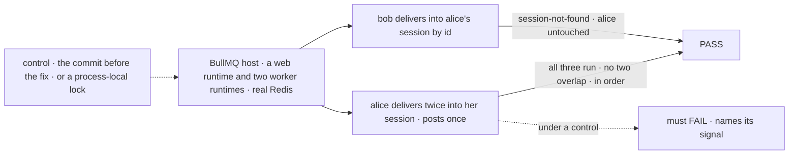
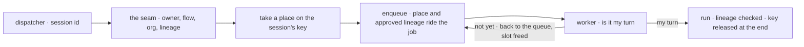

# FIX-1634 · A flow cannot deliver work into an existing session on a BullMQ host

**Spec** · [Decisions](DECISIONS.md) · [Rules](BUSINESS-RULES.md) · [Plan](PLAN.md) · [Docs](DOCS.md) · [Evolution](EVOLUTION.md)

Feature · `engine` + `bullmq` · large · 2 PRs · epic
[FIX-1635](https://linear.app/fixpoint-labs/issue/FIX-1635) · implements after FIX-1018
([#2377](https://github.com/fixpoint-labs/flow-state-dev/pull/2377)) merges · Layer 1 only

## Five people, before and after

| Someone who… | Today | After |
|---|---|---|
| **runs a flow on BullMQ that hands work into a session it already has** | Refused `external-dispatcher` before anything starts. The work never happens | The recipient runs, in whichever worker picks it up |
| **declared `queue` on a chat session, then deployed on BullMQ** | Two messages into one conversation run at once in two workers. The docs say the policy isn't enforced there | They run one at a time, in order, across every worker process |
| **declared `reject` on a webhook, then deployed on BullMQ** | A double-fire runs twice | The duplicate gets the same 409 it gets on one server |
| **is a second user in the tenant who saw the session id in a URL** | Refused | Still refused, `session-not-found`. The first user's session is untouched |
| **ships their own queue adapter** | Every delivery into an existing session refused | Still refused by name, until the adapter says it can arbitrate across processes |

**The crux: the refusal guards two things, and only one is missing.** Past a queue, a
delivery might skip the recipient's concurrency policy and its incarnation guard. A POC on a
real BullMQ host ([`poc/queue-path/`](poc/queue-path/README.md)) shows the guard already
survives: the approved lineage rides the job and the worker drops a replaced recipient. The
policy is missing for **every** run there: two `queue` runs into one session overlap today. Make
the policy hold across processes, and the refusal has nothing left to protect on BullMQ.

## The goal, and how we'll know it's met

**On a BullMQ host, a flow delivers work into an existing session and the recipient runs under
that session's concurrency policy, even when its runs land in different worker processes, while
another user still cannot deliver into it.**

| Is it the right goal? | |
|---|---|
| **The real need** | The issue: *"delivering work into an existing session runs the recipient, under that session's concurrency policy, as it does in process"*. The epic's row: channels and escalations do nothing on a queue host ([ER-11](../../epics/FIX-1635/BUSINESS-RULES.md)) |
| **Smaller, and rejected** | "The refusal is gone and the delivery runs." It runs unarbitrated beside the session's other runs, which is the silent under-delivery the refusal was built to prevent ([ER-14](../../epics/FIX-1635/BUSINESS-RULES.md#what-no-child-may-do)) |
| **Bigger, and not this issue's** | The support desk answering on BullMQ (the Workforce adopt child) · several web servers with no queue · a durable-execution substrate ([FIX-830](https://linear.app/fixpoint-labs/issue/FIX-830)) |
| **Not done if** | The case runs one worker runtime, where an in-memory lock passes · it skips in CI for lack of Redis · deliveries serialize but HTTP runs into the same session still overlap · the refusal is deleted for adapters that can't arbitrate |



The check reads what the server returns over HTTP. The two worker runtimes each hold their own
in-memory lock, so only an arbiter shared across processes can pass.

| How we verify | |
|---|---|
| **Goal check** | `packages/integration-tests/src/two-users-one-tenant/queue-delivery.test.ts`, a case in the epic's shared suite. Keyless. The implementer runs it; the verdict goes in the PR. Closure leg c re-runs it on installed tarballs |
| **Signal** | **delivers**: alice's two deliveries both complete. **one-at-a-time**: across those and one HTTP action into the same session, no two run windows overlap and they finish in acceptance order. **other-user**: bob's delivery naming alice's session comes back `session-not-found`, and alice's request list is unchanged. **refusal-kept**: an adapter with no cross-process arbitration still refuses `external-dispatcher` |
| **Input** | Ids learned from responses and URLs. Run windows come from each handler's output, read over HTTP. A different valid input, a `reject` recipient, refuses its second delivery `dispatch-rejected` |
| **Anti-game** | No in-process dispatcher, no lock shared between runtimes, no store or engine call. At least 2 slots per worker. In CI, no Redis fails the case rather than skipping it |
| **Control that must fail** | The commit before the fix fails **delivers** (refused) and **one-at-a-time** (HTTP runs overlap, POC P1). `GOAL_CONTROL=local-arbiter`, each process locking in memory only, fails **one-at-a-time**. The PR records both and the commit ([ER-16](../../epics/FIX-1635/BUSINESS-RULES.md#what-no-child-may-do)) |

## What changes


Lanes are processes, left to right is time. Today the two runs into S overlap; after, the key
held in Redis puts them in a line, whichever worker each lands in.

A flow author writes nothing new. The same flow, deployed on BullMQ:

```diff
  internal: { actions: { receive: { block: receive, concurrency: "queue" } } },
  // elsewhere, a block in another session:
  dispatcher({ name: "wake", type: "internal", action: "receive", session: { id: (i) => i.to } })
- // on BullMQ: DispatchRefusedError, refused: "external-dispatcher"
+ // on BullMQ: accepted; runs after whatever holds the session's key
```

## How it reaches the worker



The seam's checks don't move. What is new is a place on a key, taken before the enqueue and
honoured by whichever process runs the job.

## What stays as it is

- The in-process arbiter, for a server with no queue.
- The incarnation guard: the check the worker already runs ([Settled](DECISIONS.md#settled)).
- Fire-and-forget: a sender gets an accepted request id, never a reply.
- FIX-1018's owner check on the delivery's request record.
- Every Workforce and kitchen-sink surface (the adopt child's).

## Sign off

**[The goal](#the-goal-and-how-well-know-its-met), at that size:** the policy holds across
worker processes, for every run into the session. If wrong: a delivery that works on a demo and
races a real conversation in production.

1. **[D1](DECISIONS.md#d1) · On a queue host the session's concurrency policy governs every run,
   not only deliveries.** If wrong: BullMQ apps that declared `queue` or `reject` and relied on
   it being ignored get slower bursts or 409s after upgrading.
2. **[D2](DECISIONS.md#d2) · Cross-process arbitration is something the queue adapter supplies;
   BullMQ supplies it on its Redis, and an adapter without it keeps the named refusal.** If
   wrong: two public calls (take a place, give it back) that every queue adapter must
   implement; waiting for the turn stays private to the adapter.

**Open: none.** Number 1 is the one to weigh: it changes behaviour for existing BullMQ apps.
Reasoning: [DECISIONS.md](DECISIONS.md). Cases: [BUSINESS-RULES.md](BUSINESS-RULES.md).
