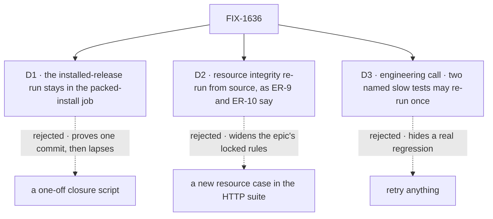

# FIX-1636 · Decisions

[Spec](SPEC.md) · **Decisions** · [Rules](BUSINESS-RULES.md) · [Plan](PLAN.md) · [Docs](DOCS.md)

The [closure rule](../../../docs/contributing/orchestration.md#the-closure-issue-every-epic-ends-in-qa)
fixes what the plan contains and in what order, and the epic's
[ER-19](../../epics/FIX-1635/BUSINESS-RULES.md#the-closure) fixes the done bar. These cards
are the calls left open. D1 and D2 are the sign-off; D3 is an engineering call, recorded so
nobody decides it on the day.

## The tree

Solid edges are what was chosen. Dashed edges lost, and the label says why.

## D1 · The run against the installed release stays in CI after the closure, in the existing packed-install job, with a real Redis

| | |
|---|---|
| **Instead of** | A closure-only script (under `goals/` or `scripts/`) that runs the suite against the tarballs once, on the closure commit, with the report as its only record |
| **Because** | The failure this epic exists for shows only in an install, on whatever commit breaks it, not the one the closure picked. Leg a became a standing job for that reason (epic, round 1), and its header says new checks join its one `CHECKS` list. A one-off would be a second pack path, which the epic's seams table forbids |
| **Locks in** | The packed-install job gains a Redis service container, as the test job already has, and runs the suite after leg a: a few more minutes on every PR. The suite's rule that a case imports only from package entry points becomes enforced, not just documented: a case that reaches into `src` turns that job red |

**What would change my mind:** the job's time becoming a real cost on every PR. Then it moves
to pushes on `main` only, and still runs on the closure commit.

It comes down to when the break lands: after the closure commit, only a standing check sees it.

## D2 · Resource integrity is proved as the epic's rules say: re-run the shipped tests from source. FIX-1510 rides FIX-1261. No new HTTP case

| | |
|---|---|
| **Instead of** | Adding a resource-integrity case to the shared suite (an invalid write, and a write to a read-only collection, over HTTP) so it runs against the installed tarballs, as the Architect's note *"under the installed release"* could be read |
| **Because** | [ER-9 and ER-10](../../epics/FIX-1635/BUSINESS-RULES.md#what-a-team-gets-and-what-it-doesnt), locked at the epic's approval, say *"closure re-runs its test(s)"*, and ER-19 says the closure builds no leg of its own. FIX-1256, FIX-1261 and FIX-1510 shipped before the suite existed and own no case in it. The Architect's open wall leans the same way: FIX-1510 rides FIX-1261's re-run, no third resource-write path |
| **Locks in** | Part 3 re-runs the resource tests the three children shipped (engine and core), on the closure commit. A guard that holds in `src` and not in the packed engine would go unseen; that is the price |

**What would change my mind:** the owner wanting every row of the epic's "what a team gets"
table proved against the install. Then it is an epic amendment adding one case to the suite,
owned by the epic, not a closure-side addition.

It comes down to the locked rules: adding the case is an epic amendment, not a closure call.

## D3 · Engineering call, not asked: only two named slow tests from outside the epic may be re-run, once. The goal check never is

| | |
|---|---|
| **Instead of** | Every check passes first time, or retries allowed anywhere |
| **Because** | Two intermittents seen during the epic, outside its surface, green on re-run: the Postgres session-stream cost test hit its 60 s timeout once (FIX-1609's), and the task-board *claimed promptly* case took 432 ms once. A general retry waves through what a closure exists to catch |
| **Locks in** | Those two alone may be re-run once in part 3; a pass on re-run is reported with the attempt count. Part 4 runs each ten times on the commit and reports the spread. A second failure is filed normally, off the epic ([ER-15](../../epics/FIX-1635/BUSINESS-RULES.md#what-no-child-may-do)), unless it traces to a change in the set, when it is a finding. Nothing in parts 1 and 2 is ever re-run |

## Decided, not asked

- **Part 2 has no journey of its own.** Every team in the epic's table is walked by part 1's
  legs; the mapping sits under part 1 in [PLAN.md](PLAN.md#part-1-walks-every-team), and a team with no
  leg would get one.
- **The run happens in the closure worker's checkout, then again in the PR's CI.** The closure
  rule says a run with findings opens no PR, and CI runs only on pull requests, so the worker
  runs the whole plan on the chosen `main` commit with the runner applied, against a local
  `redis-server`. A clean run opens the closure PR, and its CI, the same job with its own Redis,
  must pass too before the report counts. The branch carries only the runner, so the packages
  under test are that commit's.
- **Part 3 is `pnpm test` on that commit, read against a manifest.** The manifest is every test
  file each child's change added or touched that is still on `main`, derived by
  [the POC](poc/child-manifest/README.md), not hand-listed. The suite's eight cases are skipped
  there only in the sense that part 1 already grades them against the install; the source run
  still runs them.
- **Controls are read, not rebuilt** (epic ER-16). Each hole's child recorded the commit its
  case failed on in its PR; part 3 cites it. A child with no recorded failure is a finding.
- **FIX-1647, FIX-1648 and FIX-1654** joined after this issue's blocked-by list was wired. All
  are Done; their tests are in part 3 like any child's.

## Considered and dropped

| Alternative | Why not |
|---|---|
| A tiered rerun (a packaging fix reruns all, an HTTP-only fix reruns the suite) | The epic says the whole plan re-runs; the runner packs once per run, so a retest costs one pack, not one per finding |
| Open the closure PR as a draft to get CI on every run | The closure rule: a run that files findings opens no PR |
| Fix a small gap inside the closure PR | A gap is a child of the epic, with its own route |
| Run FIX-1665's races as a leg | Not a leg; the owner's question on it is open, and the recommendation is to close the epic without it |

## Open / Settled

**Open: none.**

**Settled:** the factual base. The POC re-derives it on `main` at 71bec56b4 and fails on each of
three planted gaps ([poc/child-manifest](poc/child-manifest/README.md)).

## How it got here

- **Draft** — the epic's missing piece is running the children's HTTP suite against the
  installed tarballs; that run joins the standing packed-install job, the resource rows keep the
  epic's re-run rule, and the closure runs the whole plan on one `main` commit with only the
  runner on top, repeated until it files nothing.
- **Review round 1** — the runner's shape pinned: its own `suite.mjs`, a resolution guard on
  realpaths under the consumer's `node_modules/`, vitest and zod pinned, the case count read at
  runtime, leg c refused without `REDIS_URL`, the 0.1.1 control untouched. Part 4 split into
  required rows and observations; the team mapping folded into part 1. D1 and D2 unchanged.
