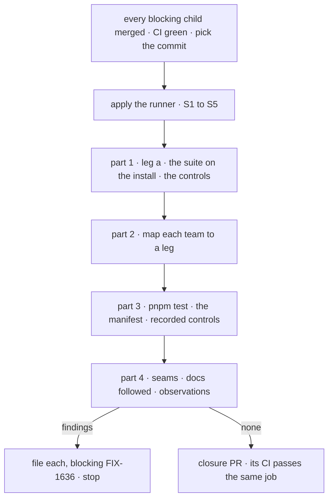

# FIX-1636 · Plan

[Spec](SPEC.md) · [Decisions](DECISIONS.md) · [Rules](BUSINESS-RULES.md) · **Plan** · [Docs](DOCS.md)

Written for the closure worker. It starts when every blocking child has merged (QR-1), which
is now: FIX-1634's last PR merged at `17c7e727a`. Leg a is
[`scripts/packed-install/run.mjs`](../../../scripts/packed-install/run.mjs) and CI's
`packed-install` job, from FIX-1431 and FIX-1334. The shared suite is
`packages/integration-tests/src/two-users-one-tenant/`, started by FIX-1018; its harness header
already says a case imports only from package entry points *"so the same files can run against
installed tarballs"*. This issue makes them.

## Surfaces

| ID | Where | Change |
|---|---|---|
| S1 | `scripts/packed-install/run.mjs` → `CHECKS` | One new check, after the existing four: the shared suite runs against the installed project. The case files and harness are copied into the consumer project unchanged; vitest and zod come from the consumer's install. Reports per case file, with totals |
| S2 | S1's resolution guard | Every `@flow-state-dev/*` specifier the copied cases import resolves inside the consumer project's install, not to the repository by path or symlink. Checked on what the run actually loaded, not on a static read of the files |
| S3 | S1's totality guard | The check fails when any case is skipped or when fewer case files ran than the suite directory holds |
| S4 | `run.mjs --control=workspace-link` | The same check with one installed `@flow-state-dev/*` package replaced by a link to its repository directory. Exits 0 only if S2 names that package, the way `--control` already works for 0.1.1 |
| S5 | `.github/workflows/ci.yml` → `packed-install` | A `redis:7` service and `REDIS_URL`, as the `ci` job has. A step running S4 beside the 0.1.1 control |
| S6 | The closure PR | Only after a run that files nothing: S1 to S5, and the report as its body. No changeset (scripts and CI only) |

**Removed:** nothing. No case, harness or package file changes (guardrails).

## Sequence

## Checks

| ID | Passes when |
|---|---|
| P1a | Leg a: `run.mjs` passes its four existing checks, and `--control` fails against the pinned 0.1.1 tarball with `ERR_MODULE_NOT_FOUND` |
| P1b | Leg b: `request-id`, `session-id`, `re-entry`, `sibling-flow`, `cross-flow-admission`, `run-workspace` and `non-streaming-text` pass against the install. Each asks as the second user with an id learned from the first user's response, and asserts the first user's records unchanged |
| P1c | Leg c: `queue-delivery` passes against the installed `bullmq` and `engine`, with a real Redis |
| P1-resolve | S2 holds for every case |
| P1-total | Eight case files ran, none skipped (S3). The count is re-derived by the POC, not typed |
| P1-control | `--control=workspace-link` fails S2 and names the linked package |
| P3.1 | `pnpm test` passes on the commit with `REDIS_URL` set. Only [D3](DECISIONS.md#d3)'s two tests may be re-run, once |
| P3.2 | Every file the [POC](poc/child-manifest/README.md) lists for a child ran in P3.1, with no skips. Files since removed from `main` (FIX-1256's two `labs/trading-desk` tests) are reported, not run |
| P3.3 | Each child that owns a suite case recorded the commit its case failed on (its PR body or Linear reproduction record, epic ER-16 and ER-17). Cite each; a missing record is a finding |
| P4 | Every row of part 4 holds |

## Part 2 · one journey per team

| The epic's team | Walked by | Journey needed |
|---|---|---|
| installs FSD from npm | P1a: pack, install, import each, start a server, DevTool assets | No |
| puts several users in one tenant | P1b: `request-id`, `session-id`, `run-workspace`, `sibling-flow`'s request-id case | No |
| exposes flows over public HTTP | P1b: `re-entry`, `sibling-flow`, `cross-flow-admission` | No |
| runs work on a queue host | P1c: `queue-delivery` | No |
| calls a generator without streaming | P1b: `non-streaming-text` | No |

If a team row is added to the epic before the run, it gets a journey here or a leg above.

## Part 4 · gap sweep

Only what parts 1 to 3 don't grade. The seams are the epic's
[coordination seams](../../epics/FIX-1635/PLAN.md#coordination-seams-to-watch).

| Check | Passes when |
|---|---|
| **Queue write keeps FIX-1018's guard** (FIX-1018 × FIX-1634) | On the suite's queue deployment, a second user who sends the first user's request id gets their own request, and the first user's record is unchanged. Run as a probe in the sweep, not added to the suite |
| **Session admission** (FIX-1022 × FIX-1046) | Read off the source: the session binding and the flow binding are separate checks in the shared admission path, neither folded into the other; both cases passed in P1b |
| **One not-found shape** (FIX-1022 × FIX-1046 × FIX-1021) | For a second user, another user's session id answers exactly as an unused one on every session route. For request ids, record what each request route answers (stream, status, resume, abort, retry, continue) beside an unused id. A difference the epic's rules forbid is a finding; one they allow is reported |
| **One release build, one leg a job** (FIX-1431 × FIX-1334) | `ci.yml` has one `packed-install` job and one `release:build` step feeding it; no second pack path |
| **One suite** (every child) | The POC's totality assertion passes on the commit |
| **Docs followed as written** | An agent that has not read the specs follows [DOCS.md](DOCS.md)'s pages in a fresh empty project on the installed tarballs, as written. A step that fails is a finding |
| **Controller cleanup on a queued run's finish** (seen in [#2430](https://github.com/fixpoint-labs/flow-state-dev/pull/2430) review; pre-dates the epic) | Establish whether a queued run finishing can remove a newer incarnation's abort controller, since the registry removes by request id alone, so that a fenced cancel then misses. Reachable across users over HTTP: a finding. Covered by FIX-1665's scope: record that. Otherwise: filed off the epic (QR-16) |
| **Known slow tests** ([D3](DECISIONS.md#d3)) | `store-postgres`'s session-stream cost test (60 s budget) and `task-board-resource-wake-stale-ref`'s *claimed promptly* case, ten serial runs each on the commit; the report gives pass count and the slowest time |
| **Late children's blocks** | FIX-1647, FIX-1648 and FIX-1654 are Done, so their missing blocks relations change nothing; the report says so |

A doc gap on a page this epic did not publish is filed normally. The keeping-a-flow-running
guide's worker-queue fence is [FIX-1656](https://linear.app/fixpoint-labs/issue/FIX-1656)'s,
which waits on this issue; its staleness is not a finding here.

## Pinned names

| Where | Name |
|---|---|
| The runner | `scripts/packed-install/run.mjs`, one more entry in `CHECKS` |
| Its new control | `--control=workspace-link` |
| The suite | `packages/integration-tests/src/two-users-one-tenant/`, eight cases, one per owning child ([POC](poc/child-manifest/README.md)) |
| Redis in CI | a `redis:7` service container, `REDIS_URL=redis://127.0.0.1:6379`, as the `ci` job's |

## Guardrails

| Rule | Because |
|---|---|
| No change under `packages/` or `apps/` on the closure branch | The run proves the commit, not a patched copy of it |
| No case or harness edit; the runner adapts to the cases | Each case is its child's (epic seams) |
| Findings are filed, never fixed here | The closure rule |
| No retry beyond D3's two tests | A retry waves through what a closure exists to catch |
| The resolution guard reads what loaded, not what the files say | A static read passes while a symlink resolves to the repository, which is the 0.1.1 blind spot again |

## Docs

No reader-facing changes; the docs the set published are followed in part 4. See
[DOCS.md](DOCS.md).

## POC

[`poc/child-manifest`](poc/child-manifest/README.md) re-derives the factual base: every merged
child is on `main`, each suite case has one owner, and Linear's child set is classified. On
`71bec56b4` it passed and failed each of three planted gaps. It found that FIX-1256's two lab
tests are gone from `main`, and that the three late children never got blocks relations.

## At implement time

- The copied suite runs in the consumer project, so vitest's config there is the runner's. The
  suite's own timeouts (30 s per test) come across with it.
- If the consumer install lacks something a case imports that no published package provides
  (vitest, zod), install it into the consumer project, never from the repository.
- Findings follow QR-14 to QR-17. The report lists every verdict with the commit, the controls'
  failures, part 3's manifest, and part 4's rows.

## Follow-ups

- None filed by this spec. FIX-1658 and FIX-1665 are open and not legs.
