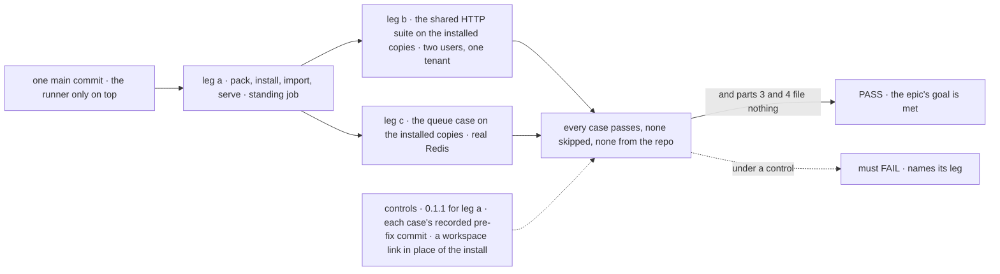

# FIX-1636 · Closure: the published release installs and holds its gates

**Spec** · [Decisions](DECISIONS.md) · [Rules](BUSINESS-RULES.md) · [Plan](PLAN.md) · [Docs](DOCS.md)

Improvement · closure (QA) · CI + `scripts/packed-install/` · medium · 1 PR, opened ready after a clean run ·
epic [FIX-1635](https://linear.app/fixpoint-labs/issue/FIX-1635), closure · required · every
blocking child Done; the last, FIX-1634, merged as [#2507](https://github.com/fixpoint-labs/flow-state-dev/pull/2507)

## Six people, before and after

| Someone who… | Today | After this closes |
|---|---|---|
| **decides whether the epic is done** | Sixteen children Done, each proved on its own commit, from source | One report on one `main` commit: every leg's verdict, each control's recorded failure, every finding and its retest |
| **installs FSD from npm** | Every package imports from a packed install, in a standing CI job | Unchanged, and the same installed copies now also serve every HTTP case below |
| **puts several users in one tenant** | Each hole's case passes against source over a workspace link | The same cases pass against the packed tarballs, as the second user |
| **exposes flows over public HTTP** | Re-entry, sibling-flow and cross-flow cases pass from source | The same, against the installed release |
| **runs work on a queue host** | The queue-delivery case passes from source with a real Redis | The same case, against the installed `bullmq` package, with a real Redis in that job |
| **follows the published docs** | Each page checked by the child that wrote it | The pages the set published, followed as written in an empty project |

## The goal, and how we'll know it's met

**On one `main` commit with every blocking child merged, someone who installs FSD from the
packed tarballs can import every package and run a server, and every hole the epic names stays
closed when asked for over real HTTP as a second user in the same tenant, against those
installed copies. Every child's own test still passes, and the gap sweep files nothing.**

| Is it the right goal? | |
|---|---|
| **The real need** | The [epic's goal](../../epics/FIX-1635/SPEC.md#the-goal-and-how-well-know-its-met) on the assembled set: *"this is the only check that runs the release the way a consumer meets it"* (the issue) |
| **Smaller, and rejected** | "Every child is Done and CI is green." The shared HTTP suite runs from `src` over workspace links, which is exactly how 0.1.1 passed every test and failed on its first import |
| **Bigger, and not this issue's** | FIX-1665's cross-process id-reuse races · FIX-1658's pushed-wake capability · Workforce adopting queue delivery · first-hour DX · the Tier B leftovers |
| **Not done if** | A case resolved a package from the repository instead of the install · a case was skipped, Redis included · the checks ran on different commits · a hole's case has no recorded failure on the commit before its fix · a finding is open |

Leg a exists already; what this issue adds is running the children's cases against what leg a
installed, so a hole that is closed in `src` but open in the release is caught.

| How we verify | |
|---|---|
| **Goal check** | `node scripts/packed-install/run.mjs` on the chosen `main` commit with only the runner on top: leg a, then the shared suite `packages/integration-tests/src/two-users-one-tenant/` against the installed tarballs with a real Redis. Run by the closure worker, then by the closure PR's CI in the packed-install job, where it stays ([D1](DECISIONS.md#d1)) |
| **Model** | Scripted and keyless. FIX-1628's case asserts on text a scripted model wrote |
| **Signal** | The epic's, per leg: [PLAN.md → Checks](PLAN.md#checks) |
| **Input** | Ids the second user learns as an attacker would: from a response header, a URL, a 202 body |
| **Anti-game** | Every `@flow-state-dev/*` import a case makes resolves inside the consumer project's install; the run fails otherwise. Zero skipped cases; the queue case fails, not skips, without Redis |
| **Control that must fail** | Leg a against the pinned 0.1.1 tarball (in the job). Each hole's case, on the commit before its fix, as its child recorded (read, never rebuilt, per epic [ER-16](../../epics/FIX-1635/BUSINESS-RULES.md#what-no-child-may-do)). The runner with one installed package swapped for a workspace link to the repository: the resolution check must fail |

Part 2 needs no journey: part 1 walks every team ([mapping](PLAN.md#part-2--one-journey-per-team)).
Part 3 re-runs every child's tests; part 4 sweeps the seams and follows the docs.

## What changes

Read the dashed box: today the HTTP cases never touch the installed release; after, they run
against it, on the commit that closes the epic, and keep doing so.

## What stays as it is

- **No product change, no case rewritten.** The closure branch touches only the runner and the
  CI job; a gap becomes a child of FIX-1635 that blocks this issue.
- **FIX-1658 and FIX-1665 are not legs** and do not block the run. If the owner admits FIX-1665
  to the done bar, it is wired to block this issue, as the issue already says of a late child.

## Sign off

**[The goal](#the-goal-and-how-well-know-its-met), at that size:** the children's HTTP cases,
run against the installed tarballs, on one commit. If wrong: the epic closes on source tests a
consumer's install never ran, or we carry a runner heavier than what it proves.

1. **[D1](DECISIONS.md#d1) · The run against the installed release stays in CI after the
   closure, in the existing packed-install job, with a real Redis.** If wrong: every PR pays a
   few more CI minutes for a check that could have run once.
2. **[D2](DECISIONS.md#d2) · Resource integrity is proved as the epic's rules say, by re-running
   its shipped tests from source; FIX-1510 rides FIX-1261. No new HTTP case.** If wrong: a
   resource guard that works from source but not in the packed engine ships unseen.

**Open: none.** Engineering calls, including the retry rule for two known slow tests, are in
[DECISIONS.md](DECISIONS.md#decided-not-asked).
